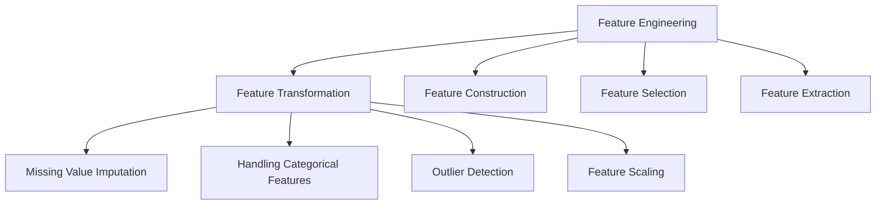

Video link: https://www.youtube.com/watch?v=sluoVhT0ehg&list=PLKnIA16_Rmvbr7zKYQuBfsVkjoLcJgxHH&index=23

---

# Introduction to Feature Engineering

**Feature Engineering** is the process of using domain knowledge to extract or transform features from raw data. These features are then used to improve the performance of machine learning algorithms. While machine learning is often seen as a science, feature engineering is considered an **art** because there is no single "correct" way to do it; it depends on the data scientist’s intuition and experience.

> **Intuition:** Raw data is like crude oil—it is valuable but cannot be used directly. Feature engineering is the refinery process that turns raw data into high-quality fuel (features) that makes your engine (algorithm) run efficiently.

## 1. The Importance of Feature Engineering
The quality of your features is often more important than the complexity of your model. A simple algorithm with **well-engineered features** will frequently outperform a sophisticated algorithm with **poorly processed data**.

## 2. The Four Pillars of Feature Engineering
Feature engineering can be broadly classified into four major categories.

### **I. Feature Transformation**
This involves changing the existing form of a feature to make it more suitable for the model.

*   **Missing Value Imputation:** Most libraries, such as `scikit-learn`, do not accept datasets with missing values. We must either remove rows with missing data or fill them using techniques like **Mean**, **Median**, or **Mode** imputation.
*   **Handling Categorical Features:** Algorithms require numerical input. Techniques like **One-Hot Encoding** transform string categories (e.g., "Dog", "Cat") into binary numerical columns.
*   **Outlier Detection:** Outliers (extreme values) can significantly skew models like **Linear Regression**. Detecting and removing them ensures the model focuses on the general data pattern.
*   **Feature Scaling:** When features have vastly different ranges (e.g., Age 0–100 vs. Salary 0–100,000), distance-based algorithms like **KNN** can become biased toward the larger scale. Scaling (e.g., `Standardization` or `Normalization`) brings them into a comparable range, typically -1 to 1.

> **Key Takeaway:** Feature Transformation ensures your data is mathematically "clean" and compatible with the specific requirements of your chosen algorithm.

### **II. Feature Construction**
Sometimes, the existing columns do not provide enough information on their own. **Feature Construction** involves creating entirely new features based on domain knowledge or intuition.

*   **Example:** In the Titanic dataset, you have columns for `SibSp` (siblings/spouse) and `Parch` (parents/children). A data scientist might combine these to create a new `FamilySize` feature, which might be more predictive of survival than the individual columns.

> **Key Takeaway:** Look for logical relationships between variables to create "super-features" that simplify the learning task for the model.

### **III. Feature Selection**
Not all data is useful. **Feature Selection** is the process of identifying and keeping only the most important features while discarding the redundant or irrelevant ones.

*   **Example:** In the **MNIST** (digit recognition) dataset, images are 28x28 pixels (784 features). However, the pixels at the very edges of the image are almost always white and provide zero information. Removing them reduces **dimensionality**, making the model faster and more accurate.

> **Key Takeaway:** Less is often more. Reducing the number of features can improve both model speed and performance by removing noise.

### **IV. Feature Extraction**
Unlike construction (which is manual), **Feature Extraction** uses mathematical algorithms to transform a high-dimensional feature space into a lower-dimensional one while preserving as much information as possible.

*   **Intuition:** Instead of picking between "Number of Rooms" and "Number of Bathrooms," a mathematical transformation might create a new feature representing "Total Living Space" that captures the essence of both.
*   **Common Techniques:**
    *   **PCA (Principal Component Analysis):** Rotates and projects data to find the most useful "components".
    *   **LDA (Linear Discriminant Analysis):** Used for dimensionality reduction in classification tasks.

> **Key Takeaway:** Feature Extraction is essential when dealing with high-dimensional data where manual construction is impossible.

## 3. General Workflow
Feature engineering should always be performed after the **Train-Test Split** to prevent **Data Leakage**.

1.  **Impute** missing values.
2.  **Encode** categorical data.
3.  **Handle** outliers.
4.  **Scale** features as the final step before modeling.
