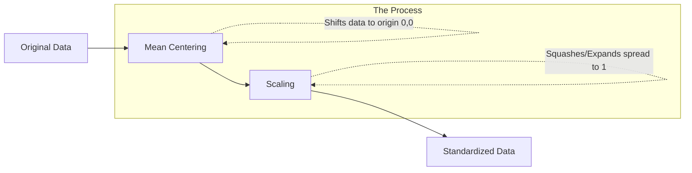

Video Link : https://youtu.be/1Yw9sC0PNwY

---

# Feature Scaling: Standardization (Z-Score Normalization)

**Feature scaling** is the final, essential step in the **Feature Engineering** pipeline before feeding data into a Machine Learning model. It involves transforming independent input features—which often exist in vastly different ranges (e.g., Age 0–100 vs. Salary 0–1,000,000)—into a smaller, unified range.

## 1. Why Do We Need Feature Scaling?
The primary goal is to ensure that no single feature dominates the model's logic simply because of its numerical magnitude.

### **The Distance Problem**
Algorithms like **K-Nearest Neighbors (KNN)** or **K-Means Clustering** rely on calculating the distance between data points. 
*   **The Issue:** If one feature has a range of 1,000 and another has a range of 10, the feature with the larger range will dominate the distance calculation, making the smaller feature almost irrelevant to the model.
*   **The Solution:** By scaling features to a similar range, we give every feature an equal opportunity to influence the model's predictions.

## 2. What is Standardization?
**Standardization**, also known as **Z-Score Normalization**, transforms a feature so that it has a **Mean ($\mu$) of 0** and a **Standard Deviation ($\sigma$) of 1**.

### **The Mathematical Formula**
For every data point $x_i$, the standardized value $x_i'$ is calculated as:
$$x_i' = \frac{x_i - \mu}{\sigma}$$
*   $x_i$: The original value.
*   $\mu$: The mean of the feature column.
*   $\sigma$: The standard deviation of the feature column.

## 3. Geometric Intuition
Standardization can be visualized as a two-step transformation of the data's coordinate system:

1.  **Mean Centering:** The entire data block is shifted so that its center (the mean) aligns perfectly with the origin $(0,0)$.
2.  **Scaling:** The data is "squashed" (if $\sigma > 1$) or "expanded" (if $\sigma < 1$) until the standard deviation on every axis becomes exactly 1.

## 4. Practical Implementation with Scikit-Learn
In Python, we use the `StandardScaler` class. It is vital to follow a strict workflow to avoid **Data Leakage**.

### **The Standard Workflow**
1.  **Train-Test Split:** Always split your data *before* scaling.
2.  **Fit:** Use `scaler.fit(X_train)` to learn the mean and standard deviation **only from the training set**.
3.  **Transform:** Use `scaler.transform()` on both `X_train` and `X_test` to apply the learned parameters.

> [!WARNING]
> **Common Mistake:** Never `fit` the scaler on your test data. It should only "learn" the distribution of the training data to simulate a real-world scenario where the model encounters unseen data.

## 5. Impact on Data and Algorithms

### **The Outlier Reality**
Standardization **does not handle outliers**. If your data has extreme values, they will remain as outliers in the standardized dataset. You must detect and treat outliers separately if they negatively impact your specific model.

### **Algorithm Compatibility**
Not all algorithms require scaling. The necessity depends on the underlying mathematics of the model.

| Required | Not Required |
| :--- | :--- |
| **Distance-Based:** KNN, K-Means | **Tree-Based:** Decision Trees, Random Forests |
| **Gradient Descent:** Logistic/Linear Regression, Neural Networks | **Boosting:** XGBoost, Gradient Boosting |
| **Variance-Based:** Principal Component Analysis (PCA) | |

### **Key Takeaways**
*   **Distribution Shape:** Scaling changes the axis values, but the **shape of the distribution remains identical** to the original data.
*   **Performance:** For algorithms using **Gradient Descent**, standardization ensures faster and more stable convergence toward the optimal solution.
*   **Accuracy:** In an experiment with Logistic Regression, scaling improved model accuracy from **65% to 86%**.
