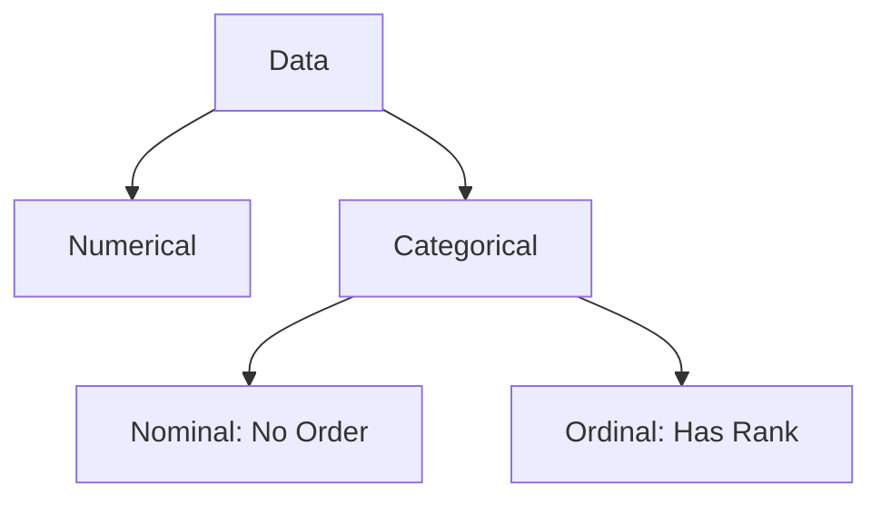

Video Link: https://youtu.be/w2GglmYHfmM

---

# Encoding Categorical Data: Ordinal & Label Encoding

In machine learning, most algorithms are designed to process numerical data. However, real-world datasets often contain **Categorical Data** (strings or labels). **Encoding** is the process of converting these categories into numerical values so that models can interpret them correctly.


## 1. Types of Categorical Data
Before choosing an encoding technique, it is essential to identify the type of categorical data you are handling.



### **Nominal Data**
Categories that have **no inherent order** or relationship between them.
*   **Examples:** Gender (Male/Female), City (New York, London), or Department (HR, IT).
*   **Technique:** Usually handled using **One-Hot Encoding**.

### **Ordinal Data**
Categories that follow a **specific rank or sequence**.
*   **Examples:** Education (High School < Graduate < Post Graduate), or Customer Review (Poor < Average < Good).
*   **Technique:** Handled using **Ordinal Encoding**.

> **Key Takeaway:** Always check if your categories have a logical "greater than" or "less than" relationship. If they do, use Ordinal Encoding.


## 2. Ordinal Encoding
**Ordinal Encoding** is used when the input features ($X$) have a natural ordered relationship.

### **Intuition**
We assign an integer to each category based on its rank. For example, in an "Education" column:
*   High School $\rightarrow$ 0
*   Undergraduate $\rightarrow$ 1
*   Postgraduate $\rightarrow$ 2

### **Implementation with Scikit-Learn**
The `OrdinalEncoder` class is used to transform input features. Unlike automatic methods, you must **manually specify the order** to ensure the model understands the hierarchy.

**Code Example:**
```python
from sklearn.preprocessing import OrdinalEncoder

# Define the manual order for the categories
# Review: Poor (0) < Average (1) < Good (2)
# Education: School (0) < UG (1) < PG (2)
encoder = OrdinalEncoder(categories=[['Poor', 'Average', 'Good'], ['School', 'UG', 'PG']])

# Fit on training data and transform
X_train_encoded = encoder.fit_transform(X_train)
```

**Why manual order?** Without providing the `categories` list, the encoder might assign numbers randomly (e.g., Good=0, Poor=2), which destroys the logical relationship of the data.

> **Key Takeaway:** Use `OrdinalEncoder` only for **input features ($X$)** and always explicitly define the `categories` order.


## 3. Label Encoding
**Label Encoding** is a specialized technique designed specifically for the **Target Variable ($y$)**.

### **The Difference**
While `OrdinalEncoder` is built for multi-column input data, `LabelEncoder` is intended for the single column you are trying to predict (the label).

| Feature | Ordinal Encoding | Label Encoding |
| :--- | :--- | :--- |
| **Used On** | Input Features ($X$) | Target Label ($y$) |
| **Columns** | Handles multiple columns | Handles 1 column at a time |
| **Order** | User-defined (Manual) | Random/Alphabetical |

### **Implementation**
In a classification problem (e.g., predicting "Yes" or "No"), `LabelEncoder` converts labels into numbers like 0 and 1.

**Code Example:**
```python
from sklearn.preprocessing import LabelEncoder

le = LabelEncoder()
y_train_encoded = le.fit_transform(y_train)
```

> **Key Takeaway:** Never use `LabelEncoder` on your input features ($X$); it is strictly for the output labels ($y$).


## 4. Best Practices & Workflow

To ensure a robust machine learning pipeline, follow this standard sequence:

1.  **Train-Test Split:** Always split your data into `X_train` and `X_test` *before* encoding to prevent **data leakage**.
2.  **Fit on Train:** Use the `.fit()` method only on the training set so the encoder "learns" the categories from the training data.
3.  **Transform Both:** Apply the `.transform()` method to both the training and testing sets to ensure consistency.

### **Summary Table**

| Encoding Technique | Category Type | Application | Scikit-Learn Class |
| :--- | :--- | :--- | :--- |
| **Ordinal Encoding** | Ordinal | Input Features ($X$) | `OrdinalEncoder` |
| **Label Encoding** | Target Label | Output Label ($y$) | `LabelEncoder` |
| **One-Hot Encoding** | Nominal | Input Features ($X$) | `OneHotEncoder` |

> **Final Note:** If your input data contains both Nominal and Ordinal columns, you can use a **ColumnTransformer** to apply different encoding techniques to different columns simultaneously.
