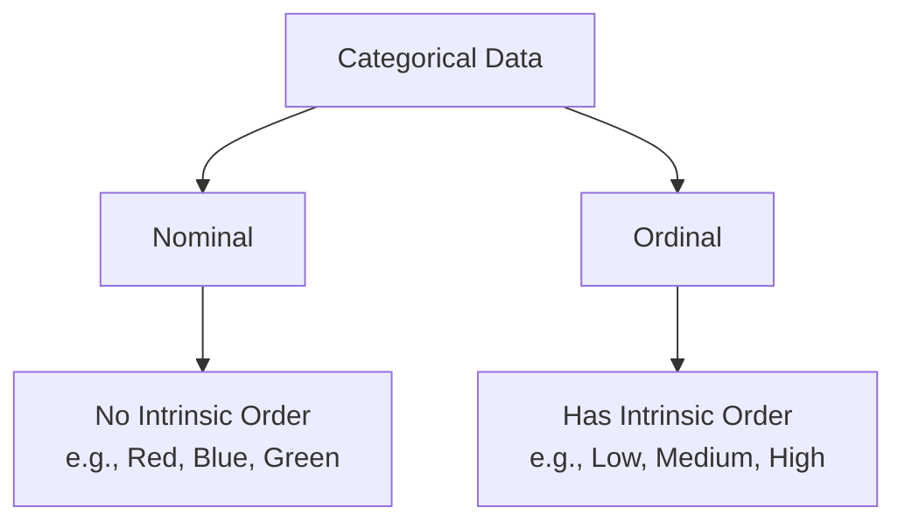

Video Link : https://youtu.be/U5oCv3JKWKA

---

# One-Hot Encoding (OHE): Handling Nominal Categorical Data

In machine learning, features are often provided as strings or categories (e.g., city names, colors, or gender). However, most mathematical models can only process **numerical data**. **One-Hot Encoding** is the standard technique for converting **Nominal Categorical Data** into a format that machine learning algorithms can understand without assuming an artificial order between categories.


## 1. Categorical Data Types
Before applying encoding, it is crucial to distinguish between the two types of categorical variables:



*   **Nominal Data:** Categories where no one value is "greater" than another. 
*   **Ordinal Data:** Categories with a logical rank. While Ordinal data uses **Ordinal Encoding**, Nominal data requires **One-Hot Encoding** to prevent the model from misinterpreting categories as having a mathematical hierarchy.

> **Key Takeaway:** Use One-Hot Encoding specifically for **Nominal** features to ensure the model treats all categories as equally important.


## 2. How One-Hot Encoding Works
The intuition behind OHE is to transform a single categorical column into multiple **binary columns** (also known as **dummy variables**).

### **The Mechanism**
1.  Identify all $n$ unique categories in a column.
2.  Create $n$ new columns, one for each category.
3.  For every row, place a `1` in the column corresponding to its category and `0` in all others.

**Example:**
| Color | $\rightarrow$ | Color_Red | Color_Blue | Color_Yellow |
| :--- | :--- | :--- | :--- | :--- |
| Red | | 1 | 0 | 0 |
| Blue | | 0 | 1 | 0 |
| Yellow | | 0 | 0 | 1 |

This effectively converts each category into a **vector**.

> **Key Takeaway:** OHE creates a sparse representation where only one bit is "hot" (set to 1) for any given record.


## 3. The Dummy Variable Trap
A common issue in OHE is **Multicollinearity**, often referred to as the **Dummy Variable Trap**.

### **The Problem**
Multicollinearity occurs when input features have a strong mathematical relationship. In OHE, if you have 3 categories, the sum of those 3 dummy columns will always equal 1. This mathematical interdependence can confuse linear models like **Linear** or **Logistic Regression**.

### **The Solution: $n-1$ Encoding**
To break this relationship, we drop one of the dummy columns. We can still represent $n$ categories using $n-1$ columns. For example, if "Red" and "Blue" columns are both `0`, the model inherently knows the category must be "Yellow".

> **Key Takeaway:** To avoid the Dummy Variable Trap, always represent $n$ categories using **$n-1$ dummy variables**.


## 4. Handling High Cardinality
When a categorical column has too many unique values (e.g., 40+ different car brands), OHE can significantly increase the **dimensionality** of your dataset, slowing down the model.

### **The "Uncommon" Grouping Strategy**
If certain categories appear very infrequently, you can group them into a single new category called **"Others"** or **"Uncommon"**. 
*   **Step 1:** Set a threshold (e.g., categories appearing fewer than 100 times).
*   **Step 2:** Replace all categories below that threshold with the label "Uncommon".
*   **Step 3:** Apply OHE to the reduced set of categories.

> **Key Takeaway:** Grouping infrequent labels helps reduce the number of columns and prevents the model from overfitting on rare data points.


## 5. Technical Implementation
There are two primary ways to implement OHE in Python:

### **A. Pandas `get_dummies`**
Best for **Exploratory Data Analysis (EDA)**. It is simple but not recommended for production because it does not "remember" the column order or categories from the training set.

```python
# Simple implementation with Pandas
pd.get_dummies(df, columns=['fuel', 'owner'], drop_first=True)
```
*   `drop_first=True`: Automatically implements the $n-1$ encoding to avoid the dummy variable trap.

### **B. Scikit-Learn `OneHotEncoder`**
The preferred method for **Machine Learning Pipelines**. It "fits" on training data and "transforms" test data consistently.

```python
from sklearn.preprocessing import OneHotEncoder

# Initialize the encoder
ohe = OneHotEncoder(drop='first', sparse=False, dtype=np.int32)

# Fit and transform the specific categorical columns
X_train_new = ohe.fit_transform(X_train[['fuel', 'owner']])
```
*   `drop='first'`: Removes the first category to prevent multicollinearity.
*   `sparse=False`: Returns a standard NumPy array instead of a sparse matrix.
*   `dtype=np.int32`: Ensures the output is in integers (0, 1) rather than floats (0.0, 1.0).

> **Key Takeaway:** Use `OneHotEncoder` for production models to ensure your preprocessing steps are repeatable and robust.
