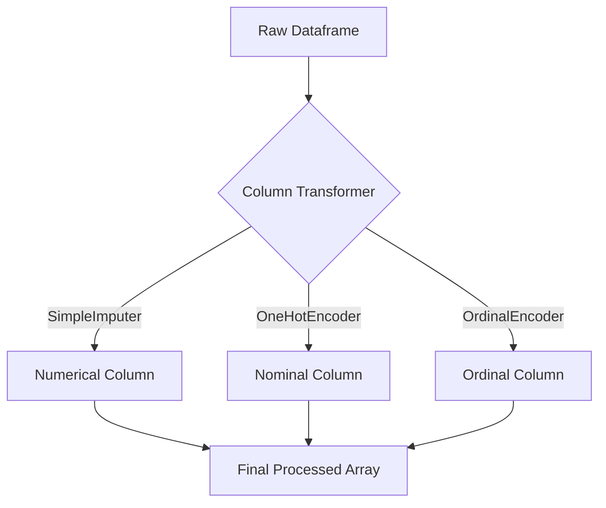

Video Link : https://youtu.be/5TVj6iEBR4I

---

# Column Transformer in Scikit-Learn

In real-world machine learning projects, datasets are rarely uniform. A single dataset often contains a mix of **numerical**, **nominal categorical**, and **ordinal categorical** data, each requiring a different preprocessing technique. **Column Transformer** is a powerful feature in Scikit-Learn that allows you to apply these various transformations to specific columns simultaneously in a single, streamlined step.


## 1. The Challenge: Manual Preprocessing
Before the introduction of Column Transformers, data scientists had to handle each feature type separately.

### **The Problem**
If you have a dataset with missing values in one column, nominal categories in another, and ordinal categories in a third, the manual workflow looks like this:
1.  Apply `SimpleImputer` to the numerical column.
2.  Apply `OneHotEncoder` to the nominal columns.
3.  Apply `OrdinalEncoder` to the ordinal columns.
4.  **Manually concatenate** the resulting separate NumPy arrays into one large array for the model.

This process is highly inefficient, prone to errors, and becomes nearly impossible to manage as the number of features increases.


## 2. The Solution: Column Transformer Intuition
Instead of treating columns as isolated problems, **Column Transformer** acts as a central orchestrator. You define which transformation goes to which column, and the tool handles the execution and merging automatically.



> **Key Takeaway:** Column Transformer converts a complex multi-step preprocessing workflow into a single, clean operation that outputs a ready-to-use NumPy array.


## 3. Technical Implementation
To use this feature, you must import it from the `sklearn.compose` module.

### **The Structure**
The `ColumnTransformer` class takes a list of **transformers**. Each transformer is defined as a **tuple** containing three elements:
1.  **Name:** A string identifier (e.g., `'imputer'`).
2.  **Transformer Object:** The actual Scikit-Learn class instance (e.g., `SimpleImputer()`).
3.  **Columns:** A list of column names or indices to which the transformation should be applied.

### **Code Example**
```python
from sklearn.compose import ColumnTransformer
from sklearn.impute import SimpleImputer
from sklearn.preprocessing import OneHotEncoder, OrdinalEncoder

# Defining the transformer
transformer = ColumnTransformer(transformers=[
    ('tnf1', SimpleImputer(), ['fever']), # Handle missing values
    ('tnf2', OrdinalEncoder(categories=[['Mild', 'Strong']]), ['cough']), # Handle ranks
    ('tnf3', OneHotEncoder(drop='first', sparse=False), ['gender', 'city']) # Handle categories
], remainder='passthrough') # Keep the remaining columns (like 'age') untouched

# Applying the transformation
X_train_transformed = transformer.fit_transform(X_train)
X_test_transformed = transformer.transform(X_test)
```


## 4. The "Remainder" Parameter
A critical part of the `ColumnTransformer` is deciding what happens to columns that **aren't** specified in your transformer list.

*   `remainder='drop'`: (Default) Any column not explicitly mentioned in the transformers list will be deleted from the output.
*   `remainder='passthrough'`: Any column not mentioned will be included in the final array exactly as it was.

> **Key Takeaway:** Use `passthrough` when you have numerical features that are already clean and don't require any scaling or transformation.


## 5. Workflow and Best Practices

To maintain a professional and leak-free machine learning pipeline, always follow this sequence:
1.  **Train-Test Split:** Perform your split before applying any transformations.
2.  **Fit on Training Data:** Use `fit_transform()` on your training set to "learn" the parameters (like mean for imputation or categories for encoding).
3.  **Transform Test Data:** Use only `.transform()` on your test set to ensure consistency and prevent **data leakage**.

### **Common Mistakes**
*   **Column Name Typos:** Ensure the column names in your list match the dataframe exactly (e.g., 'fever' vs 'Fever').
*   **Forgetting `remainder`:** Forgetting to set `remainder='passthrough'` often leads to users accidentally deleting important numerical columns like 'Age'.
*   **Fitting on Test Data:** Never `fit` your Column Transformer on the test set; it should only learn from the training data.


## Summary Table

| Feature | Manual Preprocessing | Column Transformer |
| :--- | :--- | :--- |
| **Complexity** | High (Multiple arrays to merge) | Low (Single object) |
| **Efficiency** | Low | High |
| **Data Leakage Risk** | High | Low |
| **Output Type** | Multiple separate objects | Single unified NumPy array |

> **Final Note:** Column Transformer is often used in conjunction with **Scikit-Learn Pipelines** to create a fully automated and robust end-to-end machine learning workflow.
