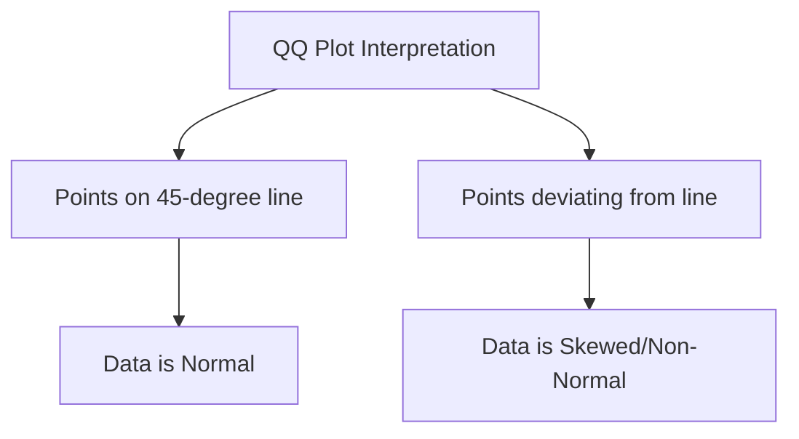

Video Link : https://youtu.be/cTjj3LE8E90

---

# Mathematical Transformations in Feature Engineering

**Mathematical Transformation** is a feature engineering technique where we apply a mathematical formula to a column to change its data distribution. The primary objective is to convert non-normal data into a **Normal Distribution** (or Gaussian Distribution), which is highly favored by many statistical and machine learning algorithms.


## 1. The Core Objective: Achieving Normality
In statistics and machine learning, reaching a normal distribution is often the "Gold Standard". 

*   **Why it matters:** Many algorithms, specifically **Linear Regression** and **Logistic Regression**, assume that the input features are normally distributed. When data follows this distribution, calculations and problem-solving become significantly more reliable.
*   **Algorithm Compatibility:** 
    *   **Required for:** Linear models (Linear/Logistic Regression) and algorithms relying on statistical assumptions.
    *   **Not Required for:** Tree-based models like **Decision Trees**, **Random Forest**, or **XGBoost**, which are indifferent to the data distribution.


## 2. How to Identify Non-Normal Data
Before applying a transformation, you must determine if your data is "skewed" (leaning to one side). There are three primary methods to check this:

1.  **Visual Plots:** Using Seaborn's `displot` to visualize the Probability Density Function (PDF).
2.  **Skewness Score:** Using the Pandas `.skew()` function. A score of **0** indicates perfect normality, while positive or negative values indicate skewness.
3.  **QQ Plot (Quantile-Quantile Plot):** The most reliable method. It plots the quantiles of your data against the quantiles of a theoretical normal distribution.

### **Reading a QQ Plot**

*   If the points fall exactly on the **45-degree diagonal line**, the data is normally distributed.
*   If the points curve away from the line, the data is skewed.

> **Key Takeaway:** Always use a **QQ Plot** to validate normality before and after transformation to confirm if the technique actually improved the distribution.


## 3. Common Mathematical Transformations

| Transformation | Mathematical Formula | Best Use Case |
| :--- | :--- | :--- |
| **Log Transform** | $f(x) = \log(x)$ | **Right Skewed** data. |
| **Reciprocal** | $f(x) = 1/x$ | Inverting scales; large values become small. |
| **Square Transform** | $f(x) = x^2$ | **Left Skewed** data. |
| **Square Root** | $f(x) = \sqrt{x}$ | Moderate right skewness. |

### **The Log Transformation Deep-Dive**
Log transformation is the most widely used technique, especially for data with a heavy **Right Skew** (e.g., the "Fare" column in the Titanic dataset).
*   **Intuition:** It squashes the high-end values of a distribution. For example, it brings values like 10, 100, and 1000 onto a linear, equidistant scale (1, 2, 3), making the distribution appear more normal.
*   **Constraint:** It cannot be applied to **negative values** or **zero**.


## 4. Implementation with `FunctionTransformer`

Scikit-Learn provides the `FunctionTransformer` class to apply these custom mathematical functions within a machine learning pipeline.

### **Basic Usage**
To apply a Log Transform to your entire dataset:
```python
import numpy as np
from sklearn.preprocessing import FunctionTransformer

# np.log1p adds 1 to the value before taking the log to avoid log(0)
transformer = FunctionTransformer(func=np.log1p)
X_train_transformed = transformer.fit_transform(X_train)
```

### **Targeted Transformation (Recommended)**
Often, only one column (like "Fare") is skewed, while another (like "Age") is already normal. In this case, use a `ColumnTransformer` to apply the transformation selectively:

```python
from sklearn.compose import ColumnTransformer

trf = ColumnTransformer([
    ('log', FunctionTransformer(np.log1p), ['Fare'])
], remainder='passthrough')

X_train_transformed = trf.fit_transform(X_train)
```


## 5. Summary & Best Practices

### **Key Takeaways**
*   **Goal:** The ultimate target is to get your data distribution as close to **Normal** as possible.
*   **Customization:** You are not limited to standard formulas; you can pass any custom Python function to `FunctionTransformer` (e.g., `x**2 + 3x`).
*   **Experimentation:** There is no "one-size-fits-all." Try different transforms (Log, Square, etc.) and check the **QQ Plot** and **Accuracy Score** to see which one works best for your specific data.

### **Common Mistakes**
*   **Transforming Normal Data:** Applying a Log transform to data that is already normal can actually make it **skewed** and decrease model performance.
*   **Ignoring the Algorithm:** Don't waste time transforming data for **Tree-based models**; they will not show any performance gain.
*   **Zero Values:** Using `np.log` on columns containing zeros will result in errors or `-inf`. Always prefer `np.log1p` to safely handle zero values.
