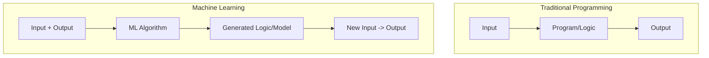

Video Link: https://www.youtube.com/watch?v=ZftI2fEz0Fw&list=PLKnIA16_Rmvbr7zKYQuBfsVkjoLcJgxHH&index=1

---

# Introduction to Machine Learning

This document serves as an introductory guide to **Machine Learning (ML)**, exploring its core definitions, how it differs from traditional programming, and why it has become a dominant force in the modern technology landscape.

## 1. Defining Machine Learning

At its core, **Machine Learning** is a field of computer science that uses **statistical techniques** to provide computer systems the ability to **"learn"** from data without being **explicitly programmed**. 

### **The Intuition**
In traditional software development, a human programmer writes specific rules to handle specific scenarios. In Machine Learning, we provide the computer with data and an algorithm, and the computer **identifies the patterns** itself.

> **Key Takeaway:** Machine Learning is about learning from data rather than following a fixed set of manual instructions.

## 2. Machine Learning vs. Traditional Programming

The fundamental difference lies in how the "logic" of a program is created.

### **The Paradigm Shift**

*   **Traditional Approach:** You write the logic. If you write a program to add two numbers, it only adds two numbers. If you give it four numbers, it fails unless you manually update the code.
*   **Machine Learning Approach:** You provide data containing inputs and their respective outputs (e.g., an Excel file of numbers and their sums). The algorithm recognizes the **pattern of addition**. Once trained, it can handle varying inputs because it understands the underlying logic.

## 3. When to Use Machine Learning?

Machine Learning is superior to traditional programming in three specific scenarios:

### **Scenario 1: Rapidly Changing Environments**
In tasks like **Spam Classification**, traditional programming relies on an `if-else` ladder of keywords (e.g., "discount," "huge"). Spammers can easily bypass this by changing their vocabulary (e.g., using "massive" instead of "huge"). In ML, the model **automatically adapts** as new data is provided, reflecting changes in the logic without manual code updates.

### **Scenario 2: High Complexity (Infinite Cases)**
For tasks like **Image Classification** (e.g., identifying a dog), there are hundreds of breeds, colors, and sizes. It is impossible for a human to write enough `if-else` cases to cover every characteristic of every dog breed. ML mimics the human brain by **tagging and learning** patterns from vast amounts of image data.

### **Scenario 3: Data Mining**
**Data Mining** is the process of using ML algorithms to extract **hidden patterns** that are not visible through standard data analysis or simple graphing. For example, a model might find non-obvious correlations in email content that identify it as spam even when keywords are missing.

> **Key Takeaway:** Use ML when the problem is too complex for manual rules, when the environment changes frequently, or when you need to uncover hidden insights in massive datasets.

## 4. Why is Machine Learning Famous Now?

While the mathematical theory behind ML has existed for 40 to 50 years, it only recently entered the limelight due to two major factors:

1.  **Explosion of Data:** With the rise of the internet and smartphones, we generate more digital data in a single year than in most of human history combined. This data is the "fuel" ML needs to learn.
2.  **Hardware Evolution:** In the past, hardware was inefficient. Today, even mobile devices carry significant **RAM and GPUs**, providing the computational power required to run complex algorithms that were once impossible to execute.

## 5. The Industry & Job Market

The current high demand for Machine Learning engineers is driven by **basic economics**: there is a high demand from companies and a low supply of skilled professionals.

*   **Salary Normalization:** Just as with languages like **Java**, as more people learn ML, salaries will eventually normalize.
*   **The Opportunity:** We are currently in an **upward trajectory**. Learning the "flow" and techniques now—including **preprocessing**, **imputation**, and **deployment**—differentiates proficient engineers from the rest.

## Summary: The Machine Learning Life Cycle

This course (100 Days of Machine Learning) focuses on the **Product Life Cycle** rather than just individual algorithms.

| Concept | Description |
| :--- | :--- |
| **Pre-processing** | Cleaning and preparing data for the model. |
| **Imputation** | Handling missing values in the dataset. |
| **Feature Selection** | Identifying which data points are most important. |
| **Deployment** | Moving the model from a notebook to a live product. |

> **Final Note:** Understanding the complete flow—from analysis to deployment—is what makes a meaningful Machine Learning journey.
