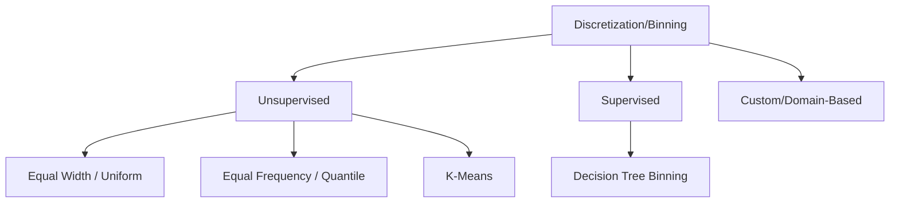

Video Link: https://youtu.be/kKWsJGKcMvo

---

# Encoding Numerical Data: Discretization & Binarization

In feature engineering, we often need to transform **Numerical Data** into **Categorical Data** to simplify representations, handle outliers, or satisfy specific algorithmic requirements. This process is primarily achieved through **Discretization (Binning)** and **Binarization**.


## 1. Discretization (Binning)
**Discretization** is the process of transforming continuous variables into discrete variables by creating a set of contiguous intervals, also known as **bins**.

### **Intuition**
Imagine an "Age" column with values from 1 to 100. Instead of treating every year as a distinct numerical value, we group them into intervals like `0-10`, `10-20`, etc.. This is similar to how a **Histogram** groups data into ranges to show frequency.

### **Why use Binning?**
*   **Outlier Handling:** Extreme values are "squashed" into the final bins, meaning they are treated the same as other values in that range, reducing their negative impact on the model.
*   **Improved Data Spread:** Certain binning techniques can make highly skewed data more uniform.
*   **Simplification:** It can simplify complex relationships, such as converting raw download counts into categories like "1M+" or "10M+".

### **Types of Binning**


#### **A. Equal Width (Uniform) Binning**
The algorithm divides the total range of the data (Max - Min) into $n$ intervals of equal size.
*   **Formula:** $Width = \frac{Max - Min}{Number\ of\ Bins}$.
*   **Characteristics:** Every bin has the same width, but the number of data points in each bin may vary significantly.

#### **B. Equal Frequency (Quantile) Binning**
Each bin contains approximately the same number of observations (population percentage).
*   **Logic:** If you want 10 bins, each bin will contain 10% of the data points.
*   **Benefits:** It creates a more uniform distribution and is generally preferred over Equal Width for most machine learning tasks.

#### **C. K-Means Binning**
This technique uses a **Clustering** approach to group data points into "natural" clusters.
*   **How it works:** It identifies centers (**centroids**) and assigns points to the nearest cluster based on distance.
*   **Best Use Case:** Use this when your data naturally clusters into separate groups with gaps in between.


### **Implementation with Scikit-Learn**
The `KBinsDiscretizer` class is used to implement these unsupervised techniques.

**Key Parameters:**
*   `n_bins`: The number of intervals to create.
*   `strategy`: Choose between `'uniform'`, `'quantile'`, or `'kmeans'`.
*   `encode`: `'ordinal'` (returns integers 0, 1, 2...) or `'onehot'` (returns dummy variables).

**Example:**
```python
from sklearn.preprocessing import KBinsDiscretizer

# Initialize for Quantile Binning
kbins = KBinsDiscretizer(n_bins=10, encode='ordinal', strategy='quantile')

# Fit and Transform data
X_train_binned = kbins.fit_transform(X_train)
```

> [!TIP]
> **Key Takeaway:** Binning is a powerful way to handle outliers and simplify numerical features. **Quantile binning** is the most common choice because it ensures a uniform spread of data across bins.


## 2. Binarization
**Binarization** is a special, extreme case of discretization where numerical values are converted into **Binary (0 or 1)** based on a specific threshold.

### **Intuition**
It is a "Yes/No" transformation. For example, in **Image Processing**, you might convert a color pixel (0–255) into either black (0) or white (1) depending on whether it passes a brightness threshold.

### **Use Case Examples**
*   **Taxation:** If Income > $Threshold$, then Taxable (1), else Not Taxable (0).
*   **Travel:** If Family Members > 0, then Not Alone (1), else Alone (0).

### **Implementation with Scikit-Learn**
The `Binarizer` class handles this transformation.

**Parameters:**
*   `threshold`: The value above which data is set to 1. Values equal to or below the threshold are set to 0.
*   `copy`: If `False`, it modifies the existing column; if `True`, it creates a new one.

**Example:**
```python
from sklearn.preprocessing import Binarizer

# Convert families to 'Traveling Alone' (Threshold 0)
binarizer = Binarizer(threshold=0, copy=False)
X_train['Family'] = binarizer.transform(X_train[['Family']])
```

> [!TIP]
> **Key Takeaway:** Binarization is highly specific. Use it when the mere **presence** or **absence** of a value (above a threshold) is more important than the actual numerical value itself.


## 3. Custom / Domain-Based Binning
Sometimes, mathematical strategies like "Uniform" or "Quantile" don't make sense for a specific business problem. In these cases, you use **Domain Knowledge** to create bins manually.

**Example (Age Groups):**
*   `0 - 18`: Minor
*   `18 - 60`: Adult
*   `60+`: Retired

**Implementation Note:** Scikit-Learn does not have a direct class for this; it is typically handled using **Pandas** logic (e.g., `pd.cut`).


## Summary Comparison

| Technique | Goal | Sklearn Class | Output |
| :--- | :--- | :--- | :--- |
| **Equal Width** | Divide range into equal parts | `KBinsDiscretizer(strategy='uniform')` | $n$ Categories |
| **Quantile** | Equal number of points per bin | `KBinsDiscretizer(strategy='quantile')` | $n$ Categories |
| **K-Means** | Find natural clusters | `KBinsDiscretizer(strategy='kmeans')` | $n$ Categories |
| **Binarization** | Thresholding (0 or 1) | `Binarizer(threshold=x)` | Binary (0 or 1) |

> [!WARNING]
> **Common Mistake:** Applying binning to algorithms like **Decision Trees** or **Random Forests** is often unnecessary, as these models naturally perform their own "splits" during training.
