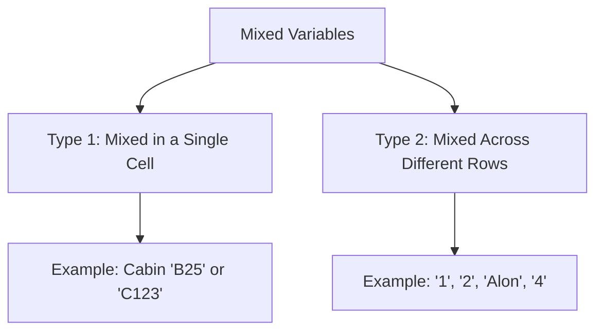

Video Link : https://youtu.be/9xiX-I5_LQY

---

# Handling Mixed Variables in Feature Engineering

In real-world machine learning datasets, you will often encounter **Mixed Variables**. These are columns that contain a combination of **numerical** and **categorical** data. Because standard machine learning algorithms require purely numerical input, these columns represent a significant preprocessing challenge.


## 1. Understanding Mixed Variables
Mixed variables typically appear in two distinct patterns. Understanding which type you are dealing with is the first step toward a solution.



### **Type 1: Mixed within a Single Cell**
Every entry in the column contains both categorical and numerical information combined (e.g., Titanic Cabin numbers like `B5` or `C23`).
*   **The Logic:** Information is hidden in both parts (e.g., 'B' represents the deck/class, and '5' represents the specific room).

### **Type 2: Mixed Across Rows**
A single column contains purely numerical values in some rows and purely categorical strings in others.
*   **The Logic:** Some labels are used as special categories (e.g., a "Family Members" column where `1`, `2`, and `3` are integers, but `Alon` is used to represent a single traveler).


## 2. Handling Values Mixed Across Rows

When numerical and categorical data exist in the same column but in different rows, the best strategy is to **split the column into two separate features**: one for numbers and one for categories.

### **The Intuition**
Instead of forcing a single column to be "half-number/half-string," we create a "Numerical" version of the column and a "Categorical" version. If a row was originally a number, it goes into the numerical column; if it was a label, it goes into the categorical column.

### **Implementation Strategy**
1.  **Extract Numbers:** Use `pd.to_numeric()` with `errors='coerce'`. This converts strings to `NaN` (null), effectively isolating the numbers.
2.  **Extract Categories:** Create a categorical column where you only keep the values that were **not** numbers (the `NaN` values from step 1).

**Code Example:**
```python
# 1. Create a numerical column (coerce errors to NaN)
df['number_numerical'] = pd.to_numeric(df['number'], errors='coerce')

# 2. Create a categorical column (fill numeric rows with NaN)
df['number_categorical'] = np.where(df['number_numerical'].isnull(), df['number'], np.nan)
```

> [!IMPORTANT]
> **Key Takeaway:** For rows that switch between types, splitting ensures you don't lose the mathematical meaning of the numbers or the descriptive power of the categories.


## 3. Handling Values Mixed in a Single Cell

This is common in columns like **Cabin** or **Ticket** numbers, where a single string like `C85` contains both a letter and a number.

### **The Intuition**
We use **Regular Expressions (Regex)** to "extract" the specific patterns. We pull the alphabet part into a "Category" column and the numeric part into a "Number" column.

### **Implementation Strategy**
*   **Numerical Extraction:** Use `.str.extract('(\d+)')` to capture only the digits.
*   **Categorical Extraction:** Use `.str.extract('([a-zA-Z]+)')` to capture only the letters.

**Code Example:**
```python
# Extracting the Letter (Deck) and Number (Room) from Cabin
df['cabin_category'] = df['cabin'].str.extract('([a-zA-Z]+)') # Captures 'C'
df['cabin_number'] = df['cabin'].str.extract('(\d+)')        # Captures '85'
```

### **Handling the Result**
Once split, you can treat these as two standard columns:
*   The **Numerical part** can be imputed with `0` or the `mean`.
*   The **Categorical part** can be labeled as "Missing" or "Unknown" for rows that had no letter.

> [!IMPORTANT]
> **Key Takeaway:** Extracting these values often reduces a column with thousands of unique strings (like individual tickets) into a few manageable categories (like ticket prefixes), making it much easier for the model to learn patterns.


## 4. Final Workflow Summary

| Data Pattern | Transformation Goal | Primary Tool |
| :--- | :--- | :--- |
| **Combined** (e.g., `A123`) | Split into `A` and `123` | `.str.extract()` (Regex) |
| **Switched** (e.g., `1`, `Alon`) | Create two columns; one with `1`, one with `Alon` | `pd.to_numeric(errors='coerce')` |

### **Common Mistakes**
*   **Treating as purely Categorical:** If you treat `C85` as just a string, the model treats `C85` and `C86` as entirely different things, losing the information that they are both in deck 'C'.
*   **Ignoring Missing Values:** After splitting, you will have new `NaN` values in your extracted columns. Always remember to handle these using **Imputation** techniques.
