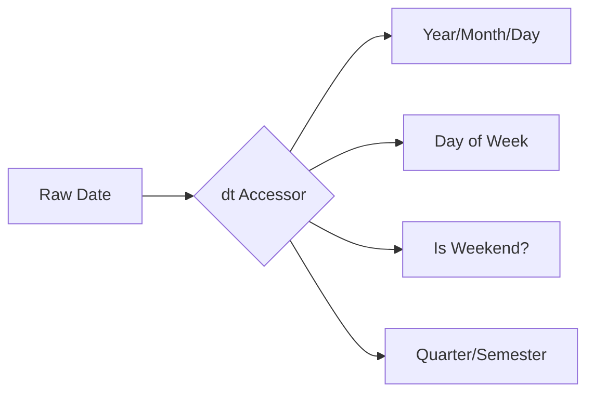

Video Link : https://youtu.be/J73mvgG9fFs

---

# Handling Date and Time Variables in Machine Learning

In feature engineering, **Date and Time** columns are often a goldmine of hidden information. While a raw timestamp might look like a single piece of data, it contains multiple dimensions such as the day of the week, seasonality, and specific time triggers that can significantly influence a machine learning model's predictive power.


## 1. The Core Challenge: Data Types
By default, when you import a dataset using Pandas, date and time columns are often treated as **Object (String)** types. In this format, you cannot perform mathematical operations or extract specific components like "month" or "hour".

### **The Mandatory First Step**
Before any engineering can happen, you must convert the column into a **datetime64** object using the `pd.to_datetime()` function.

```python
# Converting a string column to datetime format
df['date_column'] = pd.to_datetime(df['date_column'])
```

> **Key Takeaway:** Always check your data types using `df.info()`. If your date column is an "object," convert it immediately, or you won't be able to access time-based attributes.


## 2. Extracting Date Features
Once converted, you can use the `.dt` (accessor) to "pull out" specific components of the date. This transforms a single column into multiple specialized features.

### **Common Date Extractions**

| Feature | Code Syntax | Example Result |
| :--- | :--- | :--- |
| **Year** | `df['date'].dt.year` | 2023, 2024 |
| **Month** | `df['date'].dt.month` | 1, 8, 12 |
| **Month Name** | `df['date'].dt.month_name()` | January, August |
| **Day** | `df['date'].dt.day` | 1, 15, 31 |
| **Day of Week** | `df['date'].dt.dayofweek` | 0 (Mon) to 6 (Sun) |
| **Day Name** | `df['date'].dt.day_name()` | Monday, Tuesday |
| **Quarter** | `df['date'].dt.quarter` | 1, 2, 3, 4 |

### **Advanced Date Logic**
*   **Weekend Check:** You can create a boolean feature to check if a date falls on a weekend (Saturday or Sunday), which is often a major driver for consumer behavior.
*   **Semester:** While not built-in, you can derive the semester by checking if the `quarter` is in {1, 2} for the first semester or {3, 4} for the second.



> **Key Takeaway:** Raw dates are rarely useful on their own. Breaking them down into components allows the model to see patterns like "high sales on weekends" or "seasonal peaks in December".


## 3. Extracting Time Features
If your data includes timestamps, you can extract even more granular information. This is particularly useful for tracking user activity or system logs.

### **Time-Based Attributes**
*   **Hours/Minutes/Seconds:** Use `df['date'].dt.hour`, `.minute`, or `.second` to extract the specific time component.
*   **Time Only:** If you want to strip the date and keep only the time for comparison, use `df['date'].dt.time`.

### **Elapsed Time (Time Delta)**
Often, the most important feature is **how much time has passed** since a specific event or compared to the current date.

**Example: Calculating days since an order was placed:**
```python
import datetime
today = datetime.datetime.now()

# Calculate the difference
df['elapsed_time'] = today - df['order_date']

# Extract specific units (e.g., total days)
df['days_passed'] = df['elapsed_time'].dt.days
```

> **Key Takeaway:** Time-based features are essential for projects like expense trackers or chat apps to determine when a user is most active.


## 4. Handling Time Differences in Specific Units
Sometimes you need the difference in **minutes**, **hours**, or **months** rather than just days. You can use `np.timedelta64` to force the difference into a specific unit.

*   **Minutes:** Divide the time delta by `np.timedelta64(1, 'm')`.
*   **Hours:** Divide the time delta by `np.timedelta64(1, 'h')`.
*   **Months:** This requires a more complex calculation involving the difference between today and the target date, divided by the monthly time delta.


## Summary Checklist for Date & Time
1.  **Convert** the column to `datetime64` using `pd.to_datetime()`.
2.  **Extract** basic components (Year, Month, Day, Hour).
3.  **Create** derived features based on domain knowledge (e.g., `is_weekend`, `quarter`, `semester`).
4.  **Calculate** elapsed time or duration if the business problem involves "time passed".
5.  **Validate** your new features by ensuring they are now numerical or clean categories that the model can process.
