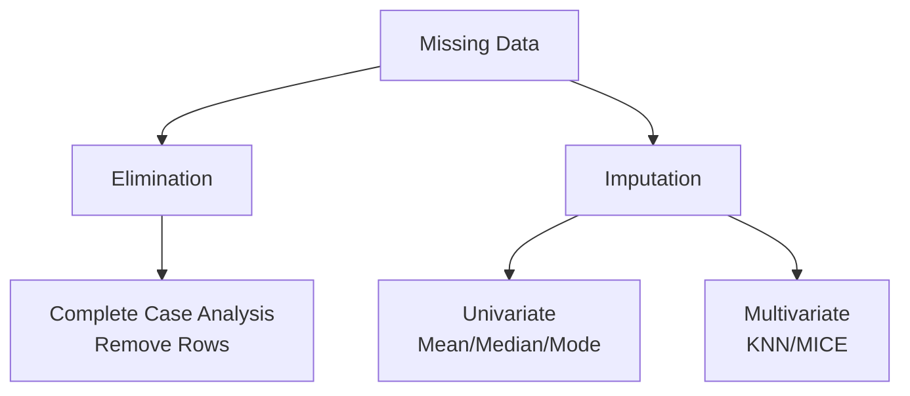

Video Link : https://youtu.be/aUnNWZorGmk

---

# Handling Missing Data: Complete Case Analysis (CCA)

In machine learning, most algorithms are not capable of handling **missing data** (null values). If you attempt to train a model on a dataset containing missing values, the library (e.g., Scikit-Learn) will likely throw an error. As a data scientist, it is your responsibility to handle these gaps before the training phase.


## 1. Strategies for Missing Data
When faced with missing values, you generally have two high-level choices:



*   **Elimination:** Removing the rows or columns that contain missing values.
*   **Imputation:** Filling in the gaps using statistical techniques (Mean, Median, Mode) or predictive models.


## 2. What is Complete Case Analysis (CCA)?
**Complete Case Analysis**, also known as **List-wise Deletion**, is a technique where you discard any observation (row) that has a missing value in *any* of its features.

### **The Intuition**
You decide to only work with "perfect" data. If a row has even one missing piece of information, you ignore the entire row and focus only on the cases where the information is complete across all columns.

> **Key Takeaway:** CCA simplifies the dataset by ensuring every remaining row is fully populated, but it comes at the cost of losing potentially useful data in other columns of the deleted row.


## 3. The Critical Assumption: MCAR
The most important requirement for using CCA is that the data must be **Missing Completely At Random (MCAR)**.

*   **Definition:** Data is MCAR if the probability of a value being missing is the same for all observations. There is no hidden pattern or reason why the data is gone.
*   **Why it matters:** If data is missing randomly, removing those rows will not change the overall **distribution** of the data. The remaining sample will still be a fair representation of the original population.


## 4. Advantages and Disadvantages

| **Advantages** | **Disadvantages** |
| :--- | :--- |
| **Easy to Implement:** Simply requires a single function call (e.g., `dropna()`). | **Data Loss:** Can lead to the deletion of a large fraction of the original dataset. |
| **Preserves Distribution:** If data is MCAR, the statistical properties of the variables remain intact. | **Informative Loss:** You might throw away rows that had valuable information in other columns. |
| **No Manipulation:** Unlike imputation, you aren't "guessing" or creating new values. | **Production Risk:** Models trained only on complete data may not know how to handle missing inputs in a real-world server environment. |


## 5. When to Use CCA?
While CCA is simple, it should only be applied under specific conditions:
1.  **MCAR Requirement:** You must be reasonably sure the data is missing at random.
2.  **The 5% Rule:** Generally, CCA is preferred only if the missing data in a column is **less than 5%** of the total observations.
3.  **High Cardinality/Missingness:** If a column has an extreme amount of missing data (e.g., 90%), it is often better to **remove the entire column** rather than deleting rows.


## 6. Practical Validation Workflow
Before finalizing CCA, you must verify that the transformation didn't distort your data.

### **For Numerical Variables**
Compare the **Distribution (Histogram/PDF)** before and after removing the missing rows.
*   **Check:** The "Before" and "After" plots should almost perfectly **overlap**.
*   **Significance:** If the shape changes significantly, the data was likely not MCAR, and CCA might have biased your dataset.

### **For Categorical Variables**
Check the **Ratio** of each category within the column.
*   **Check:** If "Graduate" represented 60% of your data before CCA, it should still represent approximately 60% after CCA.
*   **Significance:** Consistent proportions confirm that you haven't accidentally deleted a specific subgroup of your data.


## 7. Code Implementation
In Python, CCA is implemented using the Pandas `dropna()` method.

```python
# Check for missing values percentage
df.isnull().mean() * 100

# Apply CCA to specific columns where missing data < 5%
cols = ['city_development_index', 'education_level', 'experience']
df_clean = df.dropna(subset=cols)

# Compare shapes to see how much data was lost
print(df.shape)
print(df_clean.shape)
```


## Summary Checklist
*   [ ] Is the missing data **Missing Completely At Random (MCAR)**?
*   [ ] Is the missing data **less than 5%** per column?
*   [ ] Have you checked that **distributions** (Numerical) and **ratios** (Categorical) remain the same after deletion?
*   [ ] Does your production environment have a strategy for missing data (since the model won't)?

