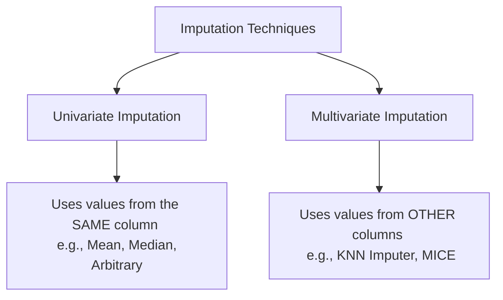

Day 36 | Handling missing data | Numerical Data | Simple Imputer

Video Link : https://youtu.be/mCL2xLBDw8M

---


# Handling Missing Numerical Data: Imputation Techniques

Missing data is a common challenge in real-world datasets. Since most machine learning algorithms cannot handle null values, we must use **Imputation** to fill these gaps. This guide covers **Univariate Imputation** techniques specifically for **Numerical Data**.


## 1. Univariate vs. Multivariate Imputation

Before diving into specific methods, it is essential to understand the two main categories of imputation based on how they use available features.



*   **Univariate Imputation:** To fill a missing value in "Column A," we only use the existing statistical data from "Column A".
*   **Multivariate Imputation:** To fill a missing value in "Column A," we look at the relationships and values in "Column B," "Column C," etc..

> **Key Takeaway:** Univariate imputation is simpler and faster, while multivariate imputation is more sophisticated as it considers cross-feature correlations.


## 2. Mean and Median Imputation

This is the most common technique where missing values are replaced with the **Mean** (average) or **Median** (middle value) of the column.

### **Intuition**
We assume that the missing values are likely close to the "center" of the data distribution. By using the mean or median, we maintain the central tendency of the feature.

### **When to Use Which?**
*   **Mean Imputation:** Best for **Normally Distributed** data (bell curve).
*   **Median Imputation:** Best for **Skewed Distributions**, as the median is more robust to outliers than the mean.

### **Advantages & Disadvantages**
| **Pros** | **Cons** |
| :--- | :--- |
| Extremely **simple** to implement. | **Distorts Variance:** Reduces the variance of the data (shrinks the "spread"). |
| Fast for production/server deployment. | **Changes Distribution:** Can significantly alter the shape of the PDF. |
| Effective if missing data is **< 5%**. | **Alters Covariance:** Changes the relationship between features. |

> **Key Takeaway:** Use Mean/Median imputation only when data is **Missing Completely At Random (MCAR)** and the missingness is minimal.


## 3. Arbitrary Value Imputation

In this technique, missing values are replaced with a specific "flag" value that is outside the normal range of the data, such as **-1, 99, or 999**.

### **Intuition**
The goal is to **capture the importance of missingness**. By using an extreme or unusual value, the machine learning model can distinguish between observations where data was present and where it was missing.

### **Usage**
*   **Categorical Data:** Often replaced with the string "Missing".
*   **Numerical Data:** Use a value the model will recognize as "different" (e.g., Age = -1).

> **Key Takeaway:** This is most useful when the data is **NOT Missing At Random (MNAR)**, and the fact that data is missing provides a signal to the model.


## 4. End of Distribution Imputation

This is an extension of arbitrary value imputation. Instead of picking a random number like 999, we pick a value at the far end of the feature's distribution.

### **Calculation Rules**
*   **For Normal Distribution:** Use $\text{Mean} + 3 \times \text{Standard Deviation}$ or $\text{Mean} - 3 \times \text{Standard Deviation}$.
*   **For Skewed Distribution (IQR Rule):** Use $Q3 + 1.5 \times \text{IQR}$ or $Q1 - 1.5 \times \text{IQR}$.

### **Intuition**
By placing missing values at the extreme "tails" of the distribution, we ensure they do not interfere with the "normal" data while still flagging them as missing.


## 5. Implementation with Scikit-Learn

While Pandas `fillna()` is easy for exploration, Scikit-Learn’s `SimpleImputer` is preferred for **Production Pipelines**.

### **Why use `SimpleImputer`?**
1.  **Pipeline Integration:** It can be part of a `Pipeline` or `ColumnTransformer`.
2.  **Consistency:** It ensures the `test` set is transformed using the `train` set's statistics, preventing **Data Leakage**.

### **Code Example**
```python
from sklearn.impute import SimpleImputer
from sklearn.compose import ColumnTransformer

# Initialize imputers
mean_imputer = SimpleImputer(strategy='mean')
median_imputer = SimpleImputer(strategy='median')
arbitrary_imputer = SimpleImputer(strategy='constant', fill_value=999)

# Apply to specific columns using ColumnTransformer
trf = ColumnTransformer([
    ('impute_age', median_imputer, ['age']),
    ('impute_fare', mean_imputer, ['fare'])
], remainder='passthrough')

# Fit on training data and transform
X_train_transformed = trf.fit_transform(X_train)
```


## Summary: Best Practices

| **Method** | **Best Case** | **Requirement** |
| :--- | :--- | :--- |
| **Mean** | Normal Distribution | Data is MCAR |
| **Median** | Skewed Distribution | Data is MCAR |
| **Arbitrary** | When missingness is informative | Data is NOT at random |
| **End of Dist.** | Capturing outliers as missing | Data is NOT at random |

### **Common Mistakes**
*   **Fitting on Test Data:** Always `fit` the imputer on the **Training Set** and only `transform` the **Test Set**.
*   **Ignoring Distribution Changes:** After imputation, always plot **PDFs** and check **Variance**. If the variance shrinks drastically, consider a more sophisticated technique.
*   **Over-Imputing:** If more than **5%** of data is missing, simple mean/median imputation may become unreliable.
