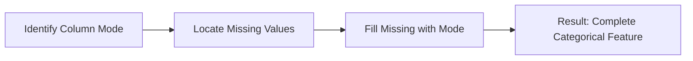

Video Link 

https://www.youtube.com/watch?v=l_Wip8bEDFQ&list=PLKnIA16_Rmvbr7zKYQuBfsVkjoLcJgxHH&index=37

---

# Handling Missing Categorical Data

In machine learning, missing values in categorical columns cannot be handled using numerical statistics like Mean or Median. Instead, we rely on specialized techniques to ensure our models can interpret the data without bias. This guide focuses on the two primary methods: **Most Frequent Imputation** and **Missing Category Imputation**.


## 1. Most Frequent Imputation (Mode Imputation)

**Most Frequent Imputation** involves replacing every missing value in a categorical column with the **Mode** (the most frequently occurring category) of that variable.

### **Intuition**
If you have a column for "City" where "Mumbai" appears 100 times, "Delhi" 50 times, and "Kolkata" 20 times, any missing values are statistically most likely to be "Mumbai." We replace the gaps with the most dominant class to maintain the dataset's existing trend.

### **When to Use**
*   **Missing Completely At Random (MCAR):** There should be no specific reason or pattern behind why the data is missing.
*   **Low Missingness:** Typically used when **less than 5%** of the data is missing.
*   **Dominant Category:** Ideally, one category should appear significantly more often than the others to avoid misrepresenting the distribution.



### **Implementation with Scikit-Learn**
The `SimpleImputer` class is used with the `most_frequent` strategy.

```python
from sklearn.impute import SimpleImputer

# Initialize the imputer for mode imputation
imputer = SimpleImputer(strategy='most_frequent')

# Fit and transform the training data
X_train_imputed = imputer.fit_transform(X_train)
```

> [!TIP]
> **Key Takeaways**
> *   **Pros:** Very easy to implement and deploy in production.
> *   **Cons:** It can distort the original distribution of the data, especially if a large percentage is missing.
> *   **Check:** Always compare the PDF or frequency of categories before and after imputation to ensure the distribution hasn't shifted drastically.


## 2. Missing Category Imputation

When missingness is high or non-random, "guessing" the most frequent category can be dangerous. Instead, we create a completely **New Category** to represent the missing data.

### **Intuition**
Instead of trying to hide the missing values, we explicitly tell the machine learning algorithm that this information was absent. We replace `NaN` with a label like **"Missing"** or **"Unknown"**. This effectively adds one more category to the feature (e.g., "Mumbai", "Delhi", "Kolkata", and "Missing").

### **When to Use**
*   **High Missingness:** Recommended when **more than 10%** of the data is missing.
*   **Informative Missingness:** When the fact that data is missing is itself a signal (e.g., a person not having a "Garage" might be a deliberate omission rather than a random error).

### **Implementation with Scikit-Learn**
We use the `constant` strategy and define the `fill_value` as "Missing".

```python
from sklearn.impute import SimpleImputer

# Replace missing values with a new label 'Missing'
imputer = SimpleImputer(strategy='constant', fill_value='Missing')

# Fit and transform
X_train_imputed = imputer.fit_transform(X_train)
```

> [!TIP]
> **Key Takeaways**
> *   **Pros:** Safest approach when data is not missing at random; it avoids making false assumptions about the data.
> *   **Cons:** Increases the number of categories, which might slightly increase complexity during One-Hot Encoding.


## 3. Comparison & Decision Matrix

Choosing the right technique depends on the nature of your data and the percentage of values lost.

| Feature | Most Frequent (Mode) | Missing Category Imputation |
| :--- | :--- | :--- |
| **Data Type** | Categorical | Categorical |
| **Missing Threshold** | Recommended < 5% | Recommended > 10% |
| **Assumption** | Missing Completely At Random (MCAR) | Missingness is informative/high |
| **Strategy** | `strategy='most_frequent'` | `strategy='constant'` |
| **Impact** | Increases frequency of the mode | Creates a new distinct category |


## 4. Practical Workflow Summary

1.  **Analyze Missingness:** Use `df.isnull().mean()` to find the percentage of missing values per column.
2.  **Evaluate Dominance:** Check if one category dominates. If the top two categories are almost equal, avoid Most Frequent Imputation.
3.  **Choose Technique:**
    *   If missingness is **low (<5%)** and **random**, use **Most Frequent Imputation**.
    *   If missingness is **high** or **intentional**, use **Missing Category Imputation**.
4.  **Validate:** After imputation, ensure the relationship between the feature and the target variable (e.g., Sale Price) remains logical.
