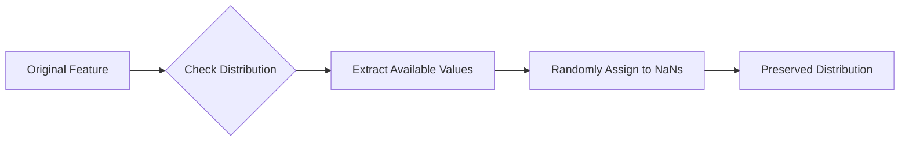

Video Link:

https://youtu.be/Ratcir3p03w

---

# Advanced Univariate Imputation Techniques

In previous modules, we covered basic imputation methods like Mean, Median, and Mode. This guide focuses on completing the univariate imputation toolkit by exploring **Random Sample Imputation**, the **Missing Indicator** technique, and **Automatic Parameter Selection** using pipelines.


## 1. Random Sample Imputation

**Random Sample Imputation** involves replacing missing values in a column by randomly selecting existing values from the same column.

### **The Intuition**
Imagine a column with several gaps. Instead of filling them all with a single average value (which "shrinks" the data's spread), you reach into the bag of existing values in that column and pull out a random one for each gap. Because you are more likely to pull out values that appear frequently, the overall "shape" of the data remains consistent.

### **Key Characteristics**
*   **Versatility:** It can be applied to both **Numerical** and **Categorical** data.
*   **Distribution Preservation:** This is the strongest advantage. Unlike Mean/Median imputation, which creates a "spike" at the center, random sampling keeps the **variance** and **distribution shape** almost identical to the original.
*   **Algorithm Fit:** It is excellent for **Linear Models** (Linear/Logistic Regression) where maintaining the data distribution is critical.



### **Technical Limitations**
*   **Covariance Distortion:** While it preserves the column's individual distribution, it can disturb the relationship (**covariance**) between that column and others.
*   **Memory Intensive:** During deployment, the server must store the entire **Training Set** to pull random values for new incoming missing data.
*   **Randomness in Production:** Without a strategy, the same input could result in different predictions. 
    *   **Solution:** Use a **deterministic random state** based on a stable feature (e.g., `fare`) so that the same user input always receives the same imputed value.

> [!TIP]
> **Key Takeaways**
> *   Use this when you want to **keep the variance intact**.
> *   Avoid using this for **Tree-based models** as introducing random noise rarely helps them.
> *   Always set a `random_state` during production to ensure consistency.


## 2. Missing Indicator

The **Missing Indicator** is a technique where you create a separate binary feature that explicitly flags whether a value was missing in the original column.

### **The Intuition**
Sometimes, the fact that data is missing is a signal in itself. By creating a "flag" column, you allow the machine learning model to distinguish between rows with complete data and rows where imputation occurred. 

**Example:**
| Age | $\rightarrow$ | Age | Age_NA |
| :--- | :--- | :--- | :--- |
| 27 | | 27 | **False** (0) |
| `NaN` | | 29.5 (Mean) | **True** (1) |

### **Technical Implementation**
Scikit-Learn provides two ways to handle this:
1.  **`MissingIndicator` Class:** A standalone transformer that outputs only the binary columns.
2.  **`SimpleImputer` Parameter:** By setting `add_indicator=True`, the imputer automatically concatenates the binary "flag" column to your imputed data.

**Code Example:**
```python
from sklearn.impute import SimpleImputer

# Impute with Mean AND add a binary indicator column automatically
si = SimpleImputer(strategy='mean', add_indicator=True)
X_train_final = si.fit_transform(X_train)
```

> [!TIP]
> **Key Takeaways**
> *   This technique is famous for winning data science competitions by uncovering hidden patterns in missingness.
> *   It often provides a **1-2% boost in accuracy** for models like Logistic Regression.
> *   It is a "low risk, high reward" technique to try if standard imputation isn't performing well.


## 3. Automatic Parameter Selection (GridSearchCV)

Choosing the "best" imputation strategy (Mean vs. Median vs. Mode) for every column manually is time-consuming. We can automate this using **Grid Search Cross-Validation**.

### **The Strategy**
Instead of guessing which imputation works best, we treat the **imputation strategy** as a **hyperparameter** of our machine learning pipeline. 

### **The Workflow**
1.  **Define Pipelines:** Create separate pipelines for numerical and categorical data using `ColumnTransformer`.
2.  **Create Master Pipeline:** Combine the transformers with an estimator (e.g., `LogisticRegression`).
3.  **Define Param Grid:** Specify all combinations you want to test (e.g., `strategy: ['mean', 'median']`).
4.  **Run GridSearchCV:** The system will train the model multiple times with different strategies and tell you which one yields the highest accuracy.

**Code Snippet for Parameter Grid:**
```python
param_grid = {
    'preprocessor__num__imputer__strategy': ['mean', 'median'],
    'preprocessor__cat__imputer__strategy': ['most_frequent', 'constant'],
    'classifier__C': [0.1, 1.0, 10.0]
}
```

> [!IMPORTANT]
> **Key Takeaways**
> *   **Efficiency:** This is the professional way to handle large datasets where manual experimentation is impossible.
> *   **Holistic Optimization:** It finds the best combination of **imputation** and **model parameters** simultaneously.
> *   **Standard Practice:** Scikit-Learn officially recommends this "Pipeline + GridSearch" approach for robust data science projects.


## Summary of Univariate Imputation

| Technique | Best Used When... | Memory Impact |
| :--- | :--- | :--- |
| **Mean/Median** | Data is MCAR and missingness is <5%. | Low |
| **Random Sample** | You need to preserve the distribution shape. | High (requires training set) |
| **Missing Indicator** | The "fact" of missingness might be important. | Low |
| **GridSearch** | You want the absolute best performance automatically. | Moderate (computationally heavy) |

This concludes the study of **Univariate Imputation**. In the next module, we will move toward **Multivariate Imputation** (KNN and MICE).
