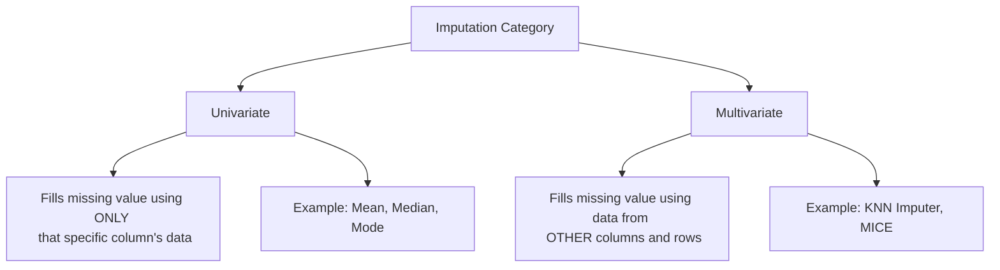

Video Link: https://www.youtube.com/watch?v=-fK-xEev2I8&list=PLKnIA16_Rmvbr7zKYQuBfsVkjoLcJgxHH&index=39

---

# KNN Imputer: Multivariate Imputation

In data preprocessing, handling missing values is a critical step. While **Univariate Imputation** (like Mean or Median) only looks at a single column to fill its gaps, **Multivariate Imputation** utilizes the relationships between multiple features to provide more accurate estimates. The **KNN Imputer** is the first of several advanced multivariate techniques used to handle missing data.


## 1. Univariate vs. Multivariate Imputation

Understanding the difference between these two approaches is essential for choosing the right strategy for your dataset.



*   **Univariate:** If a value is missing in the "Age" column, you fill it using the mean of the remaining values in the "Age" column.
*   **Multivariate:** If a value is missing in "Age," you look at other features like "Salary" or "Education" and find similar rows to estimate the missing value.

> **Key Takeaway:** Multivariate imputation is generally **more accurate** because it captures the mathematical relationships between different variables in your dataset.


## 2. The Intuition Behind KNN Imputer

The **KNN (K-Nearest Neighbors) Imputer** works on a simple principle: **similar rows have similar values**. 

If a row has a missing value, the algorithm finds the **$K$ most similar rows** (neighbors) based on the other available features.
*   If $K=1$, the missing value is replaced with the value from the single closest neighbor.
*   If $K>1$, the missing value is replaced with the **mean** of the values from those $K$ neighbors.

### **Visualizing Similarity**
Rows are treated as points in a multi-dimensional coordinate system. The algorithm calculates the "distance" between the row with the missing value and all other rows to identify the closest ones.


## 3. Technical Mechanics: NaN Euclidean Distance

Standard **Euclidean Distance** measures the straight-line distance between two points ($x, y$). However, if some coordinates are missing, the standard formula fails. To solve this, Scikit-Learn uses **NaN Euclidean Distance**.

### **The Formula**
$$d(x, y) = \sqrt{\text{weight} \times \text{Squared Distance from present coordinates}}$$

### **The Weighting Logic**
To ensure distances are comparable even when features are missing, a weight is applied:
$$\text{Weight} = \frac{\text{Total number of coordinates}}{\text{Number of present coordinates}}$$

**Example:**
Imagine two rows with 3 features, but one feature pair is missing. 
1.  Calculate the squared distance for the **present** pairs only.
2.  Multiply by the weight (e.g., $3$ total features / $2$ present features = $1.5$).
3.  Take the square root of the result.

> **Key Takeaway:** NaN Euclidean Distance allows the algorithm to estimate similarity even when the "neighbor" rows themselves have missing data.


## 4. Implementation in Scikit-Learn

The `KNNImputer` class is found in the `sklearn.impute` module.

### **Essential Hyperparameters**
*   **`n_neighbors` ($K$):** The number of neighbors to consider. Experimenting with different values (e.g., 3, 5, 10) is often necessary to find the best fit for your specific data.
*   **`weights`:**
    *   `'uniform'`: (Default) All $K$ neighbors contribute equally to the mean.
    *   `'distance'`: Closer neighbors have a stronger influence on the final value than neighbors further away.
*   **`add_indicator`:** Creates a binary column to flag which values were originally missing.

### **Code Example**
```python
from sklearn.impute import KNNImputer

# Initialize with 5 neighbors and distance-based weighting
imputer = KNNImputer(n_neighbors=5, weights='distance')

# Fit and transform the data
X_train_imputed = imputer.fit_transform(X_train)
```


## 5. Weighting Strategies: Uniform vs. Distance

Choosing the right weighting strategy can significantly impact accuracy.

| Strategy | Logic | Pros/Cons |
| :--- | :--- | :--- |
| **Uniform** | Simple average of all $K$ neighbors. | Simple, but treats a "far" neighbor the same as a "close" one. |
| **Distance** | Weighted average using the reciprocal of distance ($1/\text{dist}$). | **More logical:** Neighbors that are more similar (closer) have more "say" in the result. |

> **Key Takeaway:** Using `weights='distance'` often yields better results because it respects the degree of similarity between rows.


## 6. Advantages and Disadvantages

| **Pros** | **Cons** |
| :--- | :--- |
| **High Accuracy:** Often outperforms Mean/Median imputation by capturing data relationships. | **Computationally Expensive:** Every missing value requires calculating distances to every other row and sorting them. |
| **Versatile:** Works well for small to medium-sized datasets. | **Memory Intensive:** You must store the **entire training set** on the production server to impute new incoming data. |
| **Logical:** Based on the proven principle that similar entities share similar traits. | **Slow Inference:** Can slow down real-time predictions due to high calculation load. |


## Summary Checklist
*   [ ] Use **KNN Imputer** for better accuracy than simple mean/median.
*   [ ] Split your data into **Train and Test** sets before imputing.
*   [ ] Experiment with different values of **`n_neighbors`**.
*   [ ] Try **`weights='distance'`** to give more importance to closer neighbors.
*   [ ] Be mindful of dataset size; for massive datasets, this technique may be too slow for production.
