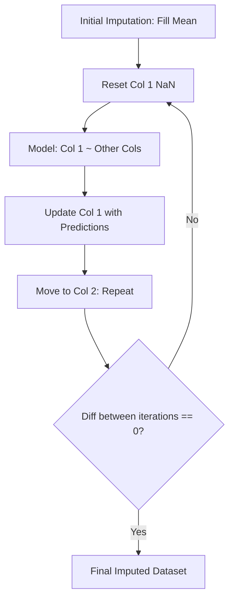

Video Link : https://youtu.be/a38ehxv3kyk


---

# Multivariate Imputation by Chained Equations (MICE)

**Multivariate Imputation by Chained Equations (MICE)**, implemented in Scikit-Learn as `IterativeImputer`, is a sophisticated technique for filling missing data. Unlike univariate methods that only look at one column, MICE models each feature with missing values as a function of other features, capturing complex relationships within the dataset.


## 1. Core Assumptions and Usage
To get the best results from MICE, it is essential to understand how data goes missing.

### **Types of Missing Data**
*   **Missing Completely at Random (MCAR):** There is no relationship between the missing data and any other values (e.g., a sensor failure).
*   **Missing at Random (MAR):** The missingness can be explained by other observed variables. **MICE works best here**, as it uses those other variables to predict the missing values.
*   **Missing Not at Random (MNAR):** The missingness is related to the value itself (e.g., people with very high salaries refusing to disclose them).

> **Key Takeaway:** MICE is the preferred choice when you believe a relationship exists between your missing values and the other features in your dataset.


## 2. The MICE Algorithm: Step-by-Step
The algorithm works through a series of "stages" and "iterations" to refine its predictions.

### **Step 1: Initial Imputation**
All `NaN` values in the dataset are temporarily filled with the **Mean** (or median) of their respective columns.

### **Step 2: The Sequential Process (Stage 1)**
The algorithm moves from left to right across the columns:
1.  **Isolate Feature:** Select the first column with missing values (e.g., $C_1$). Change the originally missing values back to `NaN`.
2.  **Train Model:** Treat $C_1$ as the target variable ($y$) and all other columns as input features ($X$). Train a machine learning model (usually **Linear Regression**) on rows where $C_1$ is not missing.
3.  **Predict:** Predict the missing values for $C_1$ using the trained model and update the column.
4.  **Repeat:** Move to the next column ($C_2$), treat it as the target ($y$), and use the *updated* $C_1$ and other columns as $X$. Repeat until all columns are processed.

### **Step 3: Iteration for Convergence**
This entire sequence is repeated for multiple iterations (Iteration 1, Iteration 2, etc.). After each iteration, we subtract the new values from the old values. 
*   **Stop Condition:** The process continues until the difference between iterations becomes **zero** or near-zero, meaning the model has reached **convergence** and cannot improve further.

### **Visual Workflow**



## 3. Advantages vs. Disadvantages

| **Advantages** | **Disadvantages** |
| :--- | :--- |
| **Highly Accurate:** Captures the true statistical relationships between features. | **Performance Slowdown:** Can be slow as it trains multiple models per iteration. |
| **Robust:** Works exceptionally well for **Missing at Random (MAR)** data. | **Memory Intensive:** Requires keeping the training set available to impute new data. |


## 4. Implementation in Scikit-Learn
In Scikit-Learn, MICE is implemented as the `IterativeImputer`. It is currently an experimental feature and must be enabled explicitly.

### **Code Example**
```python
# Step 1: Enable experimental feature
from sklearn.experimental import enable_iterative_imputer
from sklearn.impute import IterativeImputer
from sklearn.linear_model import LinearRegression

# Step 2: Initialize the imputer
# You can specify the estimator (default is BayesianRidge)
imputer = IterativeImputer(estimator=LinearRegression(), max_iter=10, random_state=0)

# Step 3: Fit and Transform
X_train_imputed = imputer.fit_transform(X_train)
X_test_imputed = imputer.transform(X_test)
```


## 5. Summary and Best Practices

### **Key Takeaways**
*   **Multivariate Power:** Use MICE when features are correlated; it is far more powerful than simple Mean/Median imputation.
*   **Algorithm Choice:** While `LinearRegression` is common, you can use other estimators like `DecisionTreeRegressor` or `RandomForestRegressor` within the imputer.
*   **Convergence:** Monitoring the `lambdas` or difference between iterations ensures your model isn't just fluctuating randomly.

### **Common Mistakes**
*   **Imputing the Target:** Always remove your target column ($y$) before applying `IterativeImputer` to your features ($X$).
*   **Missingness Patterns:** Using MICE on data that is **Missing Not at Random (MNAR)** may not yield significant benefits because the required correlations don't exist in the features.
