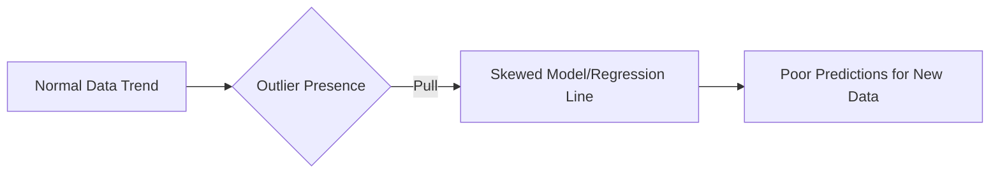

# Outliers in Machine Learning

An **outlier** is a data point or observation that behaves significantly differently from the majority of the other data points in a dataset. Understanding and treating outliers is a critical part of **Feature Engineering** because they can drastically skew your analysis and model performance.

## 1. Understanding Outliers: Intuition
The best way to understand an outlier is through a real-world analogy. Imagine a classroom of students where most individuals earn between \$15,000 and \$20,000 annually. If a billionaire like Bill Gates joins the class, the **Mean (Average) Salary** of the room will jump to millions. 

This average is no longer a true representation of the actual students in the class. In this scenario, Bill Gates is an **outlier**—a point so extreme that it distorts the summary statistics and pulls the system away from reality.

### **The Impact on Models**
In a predictive task, such as a **Linear Regression** model predicting marks based on study hours, outliers can be dangerous. 
*   **The Problem:** Regression models work by trying to minimize the distance between the data points and the regression line. 
*   **The Result:** An extreme outlier (like a student who studies very little but gets 100% marks) will pull the regression line toward itself. This causes the model to fail for the "normal" data points it was meant to represent.

> [!TIP]
> **Key Takeaways**
> *   Outliers are "hidden" dangers that can make model training difficult.
> *   They primarily distort algorithms that rely on **weights** and **distances**.

## 2. When to Keep vs. Remove Outliers
Outliers are not always "errors" that need to be deleted. As a data scientist, you must decide whether the outlier is a mistake or a valuable piece of information.

### **Scenario A: Remove the Outlier**
If the outlier is clearly a **data entry error**, it should be discarded.
*   **Example:** If a dataset tracks human ages and someone enters `300`, it is physically impossible and should be removed. Since there is no way to guess the correct value, deleting the record is the safest path.

### **Scenario B: Keep the Outlier**
Sometimes, the outlier *is* the most important part of the data.
*   **Example: Anomaly Detection.** In credit card fraud detection, your goal is to find the transactions that look "weird" compared to others. If you remove the outliers, you remove the very evidence of fraud you are looking for.

## 3. Algorithm Sensitivity to Outliers
Not all machine learning models are affected by outliers in the same way.

| **Algorithm Type** | **Sensitivity** | **Reasoning** |
| :--- | :--- | :--- |
| **Linear Models** | **High** | Algorithms like `LinearRegression`, `LogisticRegression`, and `SVM` calculate weights; extreme values force large weight adjustments. |
| **Deep Learning** | **High** | Neural networks rely on weight updates via gradient descent, which outliers can disrupt. |
| **Tree-based Models** | **Low (Robust)** | `DecisionTrees`, `RandomForest`, and `XGBoost` split data based on conditions (e.g., $Age > 18$). They don't care how extreme a value is, only which side of the "cut" it falls on. |

> [!TIP]
> **Key Takeaways**
> *   If your dataset has many outliers, **Tree-based** models are naturally more robust.
> *   For linear models, outlier treatment is **mandatory** for good performance.

## 4. How to Detect Outliers
There are three primary mathematical ways to identify outliers depending on the distribution of your data.

### **Method 1: Z-Score (For Normal Distribution)**
If your data follows a **Normal (Gaussian) Distribution**, you can use the standard deviation rule.
*   **Rule:** 99.7% of data falls within 3 standard deviations of the mean.
*   **Outlier Formula:** Any value outside the range `[Mean - 3*Std, Mean + 3*Std]` is considered an outlier.

### **Method 2: IQR Rule (For Skewed Distribution)**
If your data is **Skewed** (not a bell curve), use the **Interquartile Range (IQR)** method commonly seen in **Boxplots**.
*   **Formula:** 
    *   $Lower Limit = Q1 - 1.5 \times IQR$
    *   $Upper Limit = Q3 + 1.5 \times IQR$
*   Any point below the lower limit or above the upper limit is an outlier.

### **Method 3: Percentile-based Approach**
This approach works for any distribution by looking at the extreme ends of the data.
*   **Example:** Anything above the **99th percentile** or below the **1st percentile** is flagged as an outlier.

## 5. How to Treat Outliers
Once detected, there are two main ways to handle them: **Trimming** and **Capping**.

### **1. Trimming**
This involves **completely removing** the rows containing outliers from the dataset. 
*   **Pros:** Fast and simple.
*   **Cons:** If you have many outliers, you might end up losing too much valuable data.

### **2. Capping (Winsorization)**
Instead of deleting data, you set a **limit**.
*   **Intuition:** If the upper limit is 90 and a student scores 100, you "cap" their score at 90. 
*   **Logic:** This keeps the data point in your dataset but stops it from pulling the model's logic to an extreme.

### **Alternative Methods**
*   **Treat as Missing Values:** Mark outliers as `NaN` and use imputation techniques.
*   **Discretization (Binning):** Group values into intervals so the outlier gets merged into a larger bin (e.g., the `90-100` range).

## Summary Checklist
- [ ] Determine if the outlier is an **error** or **meaningful signal**.
- [ ] Check if your algorithm is **sensitive** (e.g., Linear Regression) or **robust** (e.g., Random Forest).
- [ ] Use **Z-Score** for Normal data or **IQR** for Skewed data to detect outliers.
- [ ] Apply **Trimming** for quick removal or **Capping** to preserve data size.
