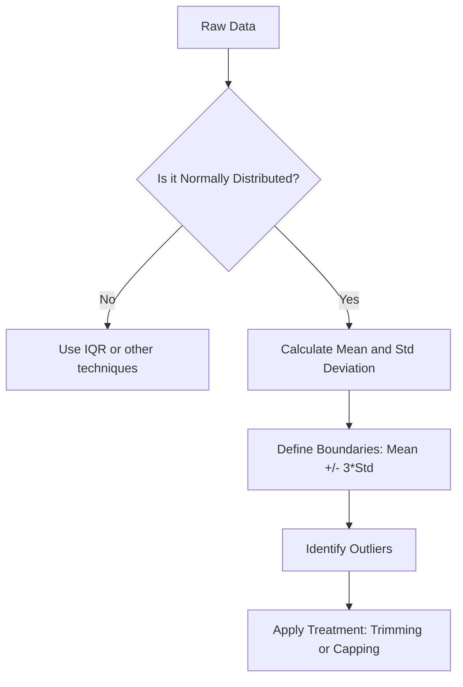

Video Link:https://youtu.be/OnPE-Z8jtqM

---

# Outlier Detection and Removal: The Z-Score Method

Outlier detection is a critical step in data preprocessing. This guide explores the **Z-Score Method**, one of the most popular techniques for identifying and handling outliers in datasets that follow a specific statistical distribution.


## 1. The Core Assumption: Normality
The Z-score method relies on a fundamental assumption: the feature or column you are analyzing must be **Normally Distributed** (or very close to it). 

### **The Intuition**
A **Normal Distribution** (often called a **Bell Curve**) is a distribution where most values are clustered around the center (the mean), and the frequency of values decreases symmetrically as you move toward the edges. Common real-world examples include human height, weights, or exam marks.

### **The Empirical Rule (68-95-99.7)**
In a normal distribution, the spread of data follows a predictable pattern based on the **Standard Deviation ($\sigma$)**:
*   **68%** of the data falls within $1\sigma$ of the mean ($\mu$).
*   **95%** of the data falls within $2\sigma$ of the mean.
*   **99.7%** of the data falls within **$3\sigma$** of the mean.

> **Key Takeaway:** If data is normally distributed, only **0.3%** of the observations should naturally exist outside the $\pm3\sigma$ range. Any value beyond these boundaries is statistically rare and can be treated as an **outlier**.


## 2. Mathematical Foundation: The Z-Score
The **Z-Score** is a numerical value that tells you how many standard deviations a data point is away from the mean.

### **The Formula**
To calculate the Z-score for any value $x_i$:
$$Z = \frac{x_i - \mu}{\sigma}$$
*   **$\mu$**: Mean of the column.
*   **$\sigma$**: Standard Deviation of the column.

### **Detection Rule**
Once transformed into Z-scores, the criteria for outlier detection becomes very simple:
*   If **$Z > 3$**: The point is an outlier on the higher side.
*   If **$Z < -3$**: The point is an outlier on the lower side.


## 3. Implementation Workflow
Before applying this technique, you must validate your data distribution.



### **Step 1: Visual Inspection**
Use a distribution plot (e.g., Seaborn's `displot`) to check for a bell curve. If the data is **skewed** (leaning to one side), the Z-score method is not suitable.

### **Step 2: Define Boundaries**
*   **Upper Limit:** $\mu + 3\sigma$.
*   **Lower Limit:** $\mu - 3\sigma$.

> [!TIP]
> **Key Takeaway:** Always visualize your data first. In a dataset with "CGPA" and "Placement Marks," CGPA might be normally distributed, while Marks might be skewed. You can only apply the Z-score method to the normally distributed CGPA.


## 4. Treatment Strategies: Trimming vs. Capping

Once outliers are detected, you must decide how to handle them.

### **I. Trimming (Removal)**
**Trimming** involves deleting the entire row containing the outlier.
*   **Pros:** It completely removes noise from the dataset.
*   **Cons:** If you have many outliers, you might lose a significant portion of your data (e.g., losing 5 rows out of 1,000).


### **II. Capping (Winsorization)**
**Capping** keeps the rows but replaces the outlier values with the boundary limits.
*   **Logic:** If a value is above the **Upper Limit**, it is changed to equal the Upper Limit. If it is below the **Lower Limit**, it is changed to the Lower Limit.
*   **Pros:** You preserve the size of your dataset (no rows are deleted).


## 5. Practical Code snippets

### **Finding Outliers (Boolean Indexing)**
To identify rows where the value exceeds the limits:
```python
# Identifying outliers
outliers = df[(df['col'] > upper_limit) | (df['col'] < lower_limit)]
```

### **Capping Outliers (Using NumPy)**
The `np.where` function is the most efficient way to "cap" values.
```python
import numpy as np

# Logic: If > upper, use upper; else if < lower, use lower; else keep original
df['col'] = np.where(
    df['col'] > upper_limit, 
    upper_limit, 
    np.where(df['col'] < lower_limit, lower_limit, df['col'])
)
```
*   `np.where(condition, value_if_true, value_if_false)`.


## Summary Checklist
*   [ ] **Validate Normality:** Confirm the column follows a bell curve distribution.
*   [ ] **Calculate Statistics:** Find the Mean ($\mu$) and Standard Deviation ($\sigma$).
*   [ ] **Set Thresholds:** Establish limits at $\pm3\sigma$.
*   [ ] **Choose Strategy:** 
    *   Use **Trimming** to remove data points completely.
    *   Use **Capping** to retain data points but limit their influence.
*   [ ] **Verify Results:** Check if the new `min` and `max` values of your column fall within the expected boundaries.
