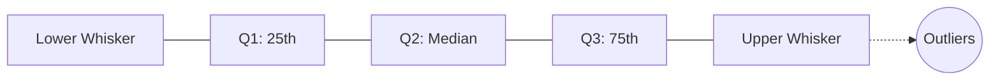

Video Link: https://www.youtube.com/watch?v=Ccv1-W5ilak&list=PLKnIA16_Rmvbr7zKYQuBfsVkjoLcJgxHH&index=43

---

# Outlier Detection and Removal: The IQR Method

The **Interquartile Range (IQR) Method**, also known as the **IQR Proximity Rule**, is a robust statistical technique used to identify and handle outliers. While the Z-score method is ideal for normally distributed data, the IQR method is specifically designed for datasets with a **Skewed Distribution**.


## 1. Core Concepts: Percentiles and the Boxplot
To understand the IQR method, you must first understand how data is divided into **Percentiles**. A percentile indicates the value below which a given percentage of observations fall.

### **Key Percentiles**
*   **$Q1$ (25th Percentile):** The value below which 25% of the data resides.
*   **$Q2$ (50th Percentile / Median):** The middle value of the dataset.
*   **$Q3$ (75th Percentile):** The value below which 75% of the data resides.

### **The Boxplot Anatomy**
A **Boxplot** is a visual representation of these percentiles and is the primary tool for identifying outliers graphically.



> [!TIP]
> **Key Takeaways**
> *   The "box" in a boxplot represents the middle 50% of your data.
> *   Data points falling outside the "whiskers" (limits) are considered **outliers**.


## 2. The Mathematical Framework
The IQR method uses a specific formula to calculate "safe" boundaries for your data. Any value falling outside these boundaries is flagged as an outlier.

### **Step 1: Calculate the IQR**
The **Interquartile Range (IQR)** is the distance between the 75th and 25th percentiles.
$$\text{IQR} = Q3 - Q1$$

### **Step 2: Define the Boundaries**
We calculate the **Minimum** (Lower Limit) and **Maximum** (Upper Limit) allowed values using a multiplier of **1.5**.
*   **Upper Limit:** $Q3 + (1.5 \times \text{IQR})$
*   **Lower Limit:** $Q1 - (1.5 \times \text{IQR})$

> [!NOTE]
> Values greater than the Upper Limit or smaller than the Lower Limit are technically defined as outliers by this rule.


## 3. Implementation Workflow
In a typical machine learning project, the process follows these steps:

1.  **Check Distribution:** Use `df['col'].skew()` or a PDF plot. If the score is far from 0 (e.g., **0.83**), the data is skewed and perfect for the IQR method.
2.  **Calculate Quantiles:** Use the `.quantile()` function to find $Q1$ and $Q3$.
3.  **Identify Outliers:** Apply boolean indexing to find rows outside the boundaries.
4.  **Choose Treatment:** Decide between **Trimming** or **Capping**.

### **Code Example: Finding Boundaries**
```python
# Finding Q1 and Q3
q1 = df['marks'].quantile(0.25)
q3 = df['marks'].quantile(0.75)

# Calculating IQR and Limits
iqr = q3 - q1
upper_limit = q3 + 1.5 * iqr
lower_limit = q1 - 1.5 * iqr
```

## 4. Treatment Strategies

### **I. Trimming (Removal)**
This approach removes the outlier rows entirely. It is best used when the number of outliers is small (e.g., removing 15 rows from a 1,000-row dataset).
*   **Impact:** The distribution might become slightly "flatter" at the ends, but the main data remains intact.

### **II. Capping (Winsorization)**
Instead of deleting rows, **Capping** replaces values exceeding the limits with the limit values themselves.
*   **Implementation:** Use `np.where(condition, value_if_true, value_if_false)`.
*   **Intuition:** If the Upper Limit is 84 and a student scored 100, their score is "capped" at 84.

**Example of Capping Code:**
```python
import numpy as np

# Cap values at Upper and Lower limits
df['marks'] = np.where(
    df['marks'] > upper_limit, 
    upper_limit, 
    np.where(df['marks'] < lower_limit, lower_limit, df['marks'])
)
```

> [!WARNING]
> **Common Mistake:** Capping can cause a "spike" at the boundaries in your distribution plot because many extreme values are now concentrated at the limit.

## Summary: IQR vs. Z-Score

| Feature | Z-Score Method | IQR Method |
| :--- | :--- | :--- |
| **Data Distribution** | **Normal** (Bell Curve) | **Skewed** |
| **Criteria** | Mean $\pm$ 3 Standard Deviations  | $Q1/Q3 \pm 1.5 \times \text{IQR}$ |
| **Tool** | Standard Deviation ($\sigma$)  | Boxplot / Percentiles |

> **Final Note:** The IQR method is the industry standard for cleaning skewed numerical features, ensuring that extreme values do not bias your machine learning models.
