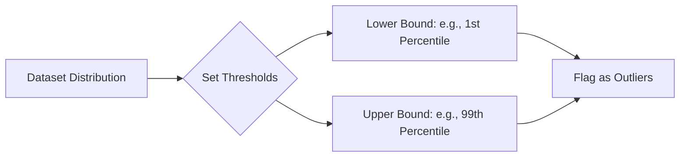

Video Link : https://www.youtube.com/watch?v=bcXA4CqRXvM&list=PLKnIA16_Rmvbr7zKYQuBfsVkjoLcJgxHH&index=44


---

# Outlier Detection and Removal: The Percentile Method

The **Percentile Method** is a straightforward and highly flexible technique for identifying and handling outliers. Unlike the Z-score (which assumes a normal distribution) or the IQR method (which uses fixed quartiles), the percentile method allows you to define your own thresholds for what constitutes an "extreme" value based on the specific needs of your dataset.


## 1. Understanding Percentiles
Before applying the method, it is essential to understand the intuition behind **Percentiles**.

### **The Intuition**
Think of percentiles in terms of exam results. If you are in the **99th percentile**, it means **99% of students scored less than you**, and you are in the top 1%. 
*   **100th Percentile:** The maximum value in the dataset (everyone is behind you).
*   **0th Percentile:** The minimum value in the dataset (no one is behind you).
*   **50th Percentile:** The **Median** (half the data is above, half is below).

> [!TIP]
> **Key Takeaway**
> *   Percentiles provide a relative standing of a data point within the entire distribution.
> *   By defining thresholds at the extreme ends (e.g., the 1st and 99th percentiles), we can effectively flag data points that are statistically "far" from the rest of the population.


## 2. The Percentile Threshold Strategy
The mechanism involves deciding how much of the "tails" of your distribution you want to treat as outliers.

### **Common Thresholds**
While you can choose any values, common industry standards include:
*   **99th and 1st Percentile:** You flag the top 1% and bottom 1% of data as outliers.
*   **95th and 5th Percentile:** A more aggressive approach that flags the top and bottom 5%.
*   **99.5th and 0.5th Percentile:** A conservative approach for very large datasets.



> [!TIP]
> **Key Takeaway**
> *   The percentile method is **distribution-agnostic**—it can be applied effectively even if your data is not perfectly normal (Gaussian).
> *   The choice of threshold depends on the volume of data and how much "noise" you are willing to remove.


## 3. Treatment: Trimming vs. Winsorization (Capping)
Once outliers are detected, there are two primary ways to handle them.

### **I. Trimming (Removal)**
Trimming simply involves deleting the rows where values fall outside the chosen percentile boundaries.
*   **Best for:** Small numbers of outliers where removal won't significantly shrink the dataset.

### **II. Winsorization (Capping)**
Named after Charles Winsor, **Winsorization** involves replacing the outlier values with the nearest "safe" threshold value.
*   **Intuition:** If your 99th percentile for height is 74.8 inches, any height recorded as 78 inches is "capped" and changed to 74.8 inches.
*   **Best for:** Preserving the dataset size and maintaining the statistical power of the sample.


## 4. Technical Implementation

The implementation primarily relies on the Pandas `.quantile()` method and NumPy's `np.where()` logic.

### **Step 1: Define Boundaries**
```python
# Calculating the 1st and 99th percentiles
upper_limit = df['height'].quantile(0.99)
lower_limit = df['height'].quantile(0.01)
```

### **Step 2: Apply Trimming**
```python
# Removing rows outside the limits
new_df = df[(df['height'] <= upper_limit) & (df['height'] >= lower_limit)]
```

### **Step 3: Apply Winsorization (Capping)**
Using `np.where` allows you to replace values exceeding limits while keeping the rest untouched.
```python
import numpy as np

df['height'] = np.where(
    df['height'] >= upper_limit,
    upper_limit,
    np.where(df['height'] <= lower_limit, lower_limit, df['height'])
)
```

> [!IMPORTANT]
> **Key Takeaway**
> *   **Trimming** results in a cleaner distribution but reduces data count.
> *   **Winsorization** keeps all data points but can create a "spike" at the boundaries in your distribution plots.


## 5. Visualizing the Impact
To confirm the effectiveness of the method, always use a **Boxplot** or **Distribution Plot** (PDF) before and after treatment.

| Visual Tool | Before Treatment | After Treatment |
| :--- | :--- | :--- |
| **Boxplot** | Shows individual points (fliers) beyond the whiskers. | The whiskers extend to the new limits; no individual fliers remain. |
| **Distplot** | Often shows thin, long tails stretching to extreme values. | The tails are shortened (Trimming) or slightly raised at the ends (Capping). |


## Summary: Best Practices
1.  **Experiment:** Try different thresholds (e.g., 99.5/0.5 vs 99/1) to see which provides the best balance between data preservation and noise removal.
2.  **Context Matters:** Some practitioners use `Upper Limit + 1` or `Lower Limit - 1` for capping, but standard Winsorization uses the exact threshold values.
3.  **Experimental Nature:** Outlier removal is highly experimental; always validate the final distribution to ensure it improves model performance.
