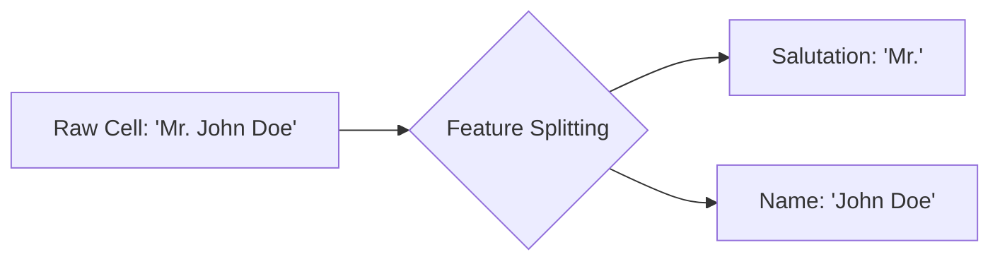

Video Link; https://youtu.be/ma-h30PoFms

---

# Feature Construction and Feature Splitting

**Feature Engineering** is often described as the most critical part of the machine learning pipeline. While many techniques involve automated transformations, **Feature Construction** and **Feature Splitting** are manual, highly intuitive processes where a data scientist uses domain knowledge to create or refine features.


## 1. Feature Construction

**Feature Construction** is the process of manually creating new features from existing data to help a model better understand the underlying patterns.

### **The Intuition**
Unlike automated transformations, there is no fixed mathematical formula for construction. It relies on your **Intuition**, **Domain Knowledge**, and **Experience**. You are essentially creating "super-features" that simplify the learning task for the algorithm.

### **Practical Example: Titanic Family Size**
In the Titanic dataset, the columns `SibSp` (siblings/spouse) and `Parch` (parents/children) are often analyzed separately. However, a model might benefit more from knowing the total number of people traveling together.

**Workflow:**
1.  **Combine Columns:** Add `SibSp` and `Parch` together (plus 1 for the passenger themselves) to create a `FamilySize` feature.
2.  **Categorize:** Group the numeric `FamilySize` into meaningful categories like `Alone`, `Small`, or `Large`.

```python
# Creating a new feature: FamilySize
df['FamilySize'] = df['SibSp'] + df['Parch'] + 1

# Logic for FamilyType
def group_family(size):
    if size == 1: return 'Alone'
    elif 1 < size <= 4: return 'Small'
    else: return 'Large'

df['FamilyType'] = df['FamilySize'].apply(group_family)
```

### **The Impact**
In a practical demonstration, moving from raw columns to a constructed `FamilyType` feature can directly improve model accuracy (e.g., increasing a Logistic Regression score from **65%** to a higher threshold).

> [!TIP]
> **Key Takeaways**
> *   Feature Construction is a **manual art**, not an automated science.
> *   It relies heavily on **domain knowledge**—the more you understand your data, the better features you can build.
> *   Always ask: "Can I combine these features to create something more predictive?".


## 2. Feature Splitting

**Feature Splitting** involves breaking down a single column that contains multiple pieces of information into two or more separate features.

### **The Intuition: "Tidy Data"**
In a "tidy" dataset, every cell should contain an **atomic value** (a single piece of information). Often, raw data is "messy" and packs several insights into one cell, making it difficult for models to find patterns or for humans to plot graphs.



### **Practical Example: Name Salutations**
In the Titanic dataset, the `Name` column contains a passenger's surname, salutation, and first name (e.g., *"Heikkinen, Miss. Laina"*).
*   **The Problem:** The full name is too unique for a model to learn from.
*   **The Solution:** Use **String Splitting** or **Regular Expressions** to extract the **Salutation** (Mr., Mrs., Miss, Master).

### **Why it Matters**
Extracted titles often reveal hidden correlations. For example, analysis shows that passengers with the title **"Mrs."** or **"Miss"** had a significantly higher survival rate (around **70%**) compared to others.

```python
# Extracting the Salutation/Title
df['Title'] = df['Name'].str.split(',').str.get(1).str.split('.').str.get(0).str.strip()
```

> [!TIP]
> **Key Takeaways**
> *   Use Feature Splitting when a single column contains **multiple data points**.
> *   Splitting turns "noisy" text into **clean categories** that models can easily process.
> *   Common targets for splitting include **Names**, **Addresses**, and **Complex IDs**.


## Summary of the Engineering Workflow

| Technique | Goal | Action |
| :--- | :--- | :--- |
| **Feature Construction** | Simplify complexity | Combine multiple columns into one. |
| **Feature Splitting** | Isolate information | Divide one column into multiple atomic columns. |

### **Final Pro-Tip**
The best way to master these techniques is through **Practice**. Take a dataset (like IPL or Housing data) and try to create new features such as "Strike Rate" for a batsman or "Price per Square Foot" for a house using your domain knowledge.
