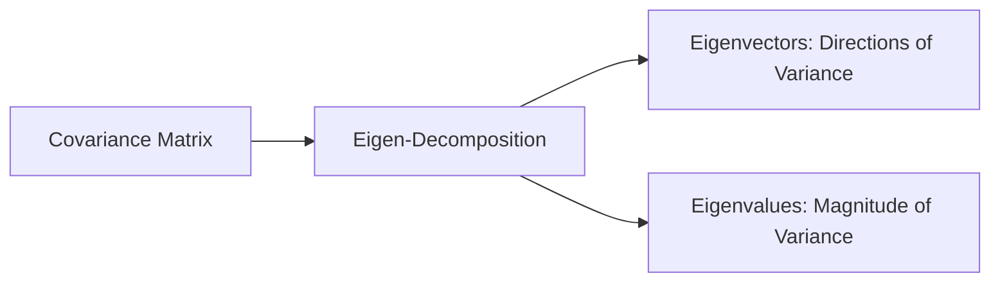

Video Link: https://www.youtube.com/watch?v=tXXnxjj2wM4&list=PLKnIA16_Rmvbr7zKYQuBfsVkjoLcJgxHH&index=48

---

# Principal Component Analysis (PCA): Mathematical Formulation & Solution

**Principal Component Analysis (PCA)** is a dimensionality reduction technique that transforms a high-dimensional dataset into a lower-dimensional form while preserving the "essence" of the data. Mathematically, it solves an optimization problem to find the directions where data variance is maximized.

## 1. The Mathematical Objective
The goal of PCA is to find a **unit vector** (direction) such that when data points are projected onto it, the **variance** of those projections is as high as possible.

### **Intuition: The Best Angle**
Imagine a 2D cloud of data points. To reduce this to 1D, you must find a line (axis) to project the points onto. If you choose an axis where the points are squashed together, you lose information. If you choose an axis where the points remain spread out, you preserve the data's behavior.

### **Technical Explanation: Projections**
If we have a data point represented as a vector $x$ and a unit vector $u$ representing our new axis:
*   **Projection Formula:** The projection of $x$ onto $u$ is calculated as $u^T x$ (assuming $u$ is a unit vector).
*   **Variance of Projections:** PCA seeks to maximize the variance of these projected points across all observations $n$:
    $$\text{Variance} = \frac{1}{n} \sum_{i=1}^{n} (u^T x_i - u^T \bar{x})^2$$
    Where $u^T \bar{x}$ is the mean of the projections.

> [!IMPORTANT]
> **Key Takeaways**
> *   PCA is an **optimization problem** designed to maximize variance.
> *   The **unit vector** $u$ defines the direction of the new Principal Component.
> *   Maximum variance ensures the **essence** of the data is maintained in lower dimensions.

## 2. Understanding the Covariance Matrix
To solve the PCA problem, we must first understand how variables relate to one another through **Covariance**.

### **Variance vs. Covariance**
*   **Variance:** Measures the spread of data along a single axis (e.g., $x$ or $y$).
*   **Covariance:** Measures the relationship between two variables. A positive value means they increase together; a negative value means one increases as the other decreases.

### **The Covariance Matrix Structure**
For a dataset with features $X_1, X_2 ... X_n$, the covariance matrix is a square, symmetric matrix:

| | $X_1$ | $X_2$ |
| :--- | :--- | :--- |
| **$X_1$** | $Var(X_1)$ | $Cov(X_1, X_2)$ |
| **$X_2$** | $Cov(X_2, X_1)$ | $Var(X_2)$ |

*   **Diagonal Elements:** Represent the **variance** of individual features.
*   **Off-Diagonal Elements:** Represent the **covariance** (orientation) between features.

> [!IMPORTANT]
> **Key Takeaways**
> *   The covariance matrix provides a complete map of data **spread** and **orientation**.
> *   It is the mathematical foundation used to identify the directions of maximum variance.

## 3. Eigen-Decomposition: The Engine of PCA
PCA identifies the optimal directions by calculating the **Eigenvectors** and **Eigenvalues** of the covariance matrix.

### **Intuition: Linear Transformations**
A matrix acts as a **transformation** that can rotate or stretch space.
*   **Eigenvectors:** Special vectors that do **not change direction** when a transformation is applied; they only scale.
*   **Eigenvalues:** The factor by which an eigenvector is scaled (stretched or shrunk) during the transformation.

### **The PCA Solution**
Mathematical optimization proves that the **eigenvector with the largest eigenvalue** points exactly in the direction of the **maximum variance** (Principal Component 1).

## 4. Step-by-Step PCA Algorithm
To perform PCA manually or via code (using `numpy`), follow these steps:

### **Step 1: Mean Centering**
Subtract the mean of each feature from every data point. This shifts the data so it is centered at the origin $(0,0)$.
*   `X_centered = X - X.mean()`

### **Step 2: Calculate Covariance Matrix**
Compute the covariance matrix to understand the relationships between all features.
*   `cov_matrix = np.cov(X_centered.T)`

### **Step 3: Eigen-Decomposition**
Calculate the eigenvalues and eigenvectors of the covariance matrix.
*   `eigenvalues, eigenvectors = np.linalg.eig(cov_matrix)`

### **Step 4: Select Principal Components**
Sort eigenvalues in descending order. The eigenvectors corresponding to the top $k$ eigenvalues are your $k$ **Principal Components**.

### **Step 5: Transform Data (Projection)**
Transform the original data points into the new coordinate system by taking the **dot product** of the data and the selected eigenvectors.
*   **Formula:** $X_{new} = X_{centered} \cdot \text{Eigenvectors}^T$.

> [!IMPORTANT]
> **Key Takeaways**
> *   **Mean centering** is a standard preprocessing step that often improves PCA performance.
> *   Data transformation is achieved through a simple **dot product**.
> *   The number of eigenvectors chosen determines the final **dimensionality** of your dataset (e.g., 3D to 2D).

## 5. Summary: From 3D to 2D
In a practical 3D example, PCA follows this flow:
1.  Visualize 3D data (3 features).
2.  Perform **Mean Centering**.
3.  Generate the **Covariance Matrix**.
4.  Extract **3 Eigenvectors** and **3 Eigenvalues**.
5.  Select the **top 2 eigenvectors**.
6.  Project 3D points onto the 2D plane formed by those vectors.
7.  Result: A 2D plot that captures the maximum possible information from the original 3D space.
