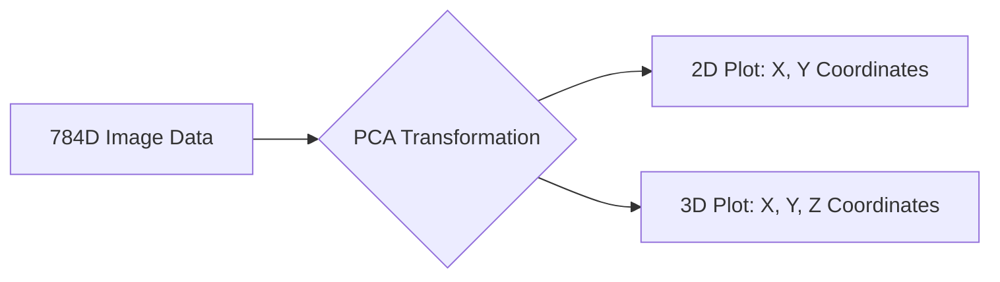

Video Link: https://www.youtube.com/watch?v=tofVCUDrg4M&list=PLKnIA16_Rmvbr7zKYQuBfsVkjoLcJgxHH&index=49

---

# Principal Component Analysis (PCA): Practical Implementation and Visualization

This guide explores the practical application of **Principal Component Analysis (PCA)** using the **MNIST dataset**, demonstrating how to reduce dimensionality for faster computation and data visualization.


## 1. Practical Implementation with MNIST
The **MNIST** dataset is a famous collection of handwritten digit images (0-9) used for classification tasks.

### **The Data Structure**
*   **Images:** Each image is **28x28 pixels**.
*   **Features:** When flattened, each image results in **784 pixels (features)**.
*   **Dataset Size:** Typically contains around 42,000 images.

### **The Problem: High Dimensionality**
Using algorithms like **K-Nearest Neighbors (KNN)** on 784 dimensions is extremely **computationally expensive**. KNN must calculate the distance between a single point and thousands of others across 784 different axes, which leads to slow execution times.

### **The PCA Solution**
By applying PCA, we can reduce the 784 features to a much smaller number (e.g., 100) while retaining most of the predictive information.

**Implementation Steps:**
1.  **Standardization:** Always use `StandardScaler` to center the data before applying PCA.
2.  **Initialization:** Define the number of `n_components`.
3.  **Transformation:** Use `fit_transform` on training data and `transform` on test data.

```python
from sklearn.preprocessing import StandardScaler
from sklearn.decomposition import PCA

# 1. Standardize the data
scaler = StandardScaler()
X_train_scaled = scaler.fit_transform(X_train)

# 2. Apply PCA (reducing to 100 dimensions)
pca = PCA(n_components=100)
X_train_pca = pca.fit_transform(X_train_scaled)
X_test_pca = pca.transform(scaler.transform(X_test))
```

> [!TIP]
> **Key Takeaways**
> *   PCA significantly **speeds up** training and prediction for distance-based models like KNN.
> *   Reducing features from 784 to 100 often results in only a **marginal drop** in accuracy (e.g., from 96% to 95%).
> *   Standardizing data is a mandatory prerequisite for PCA.


## 2. Visualizing High-Dimensional Data
One of PCA's most powerful uses is projecting data into **2D or 3D** so human eyes can perceive patterns and clusters.

### **Intuition**
Since we cannot see in 784 dimensions, we project the "shadow" of the data onto a 2D or 3D plane. This reveals which digits are similar and which are distinct.



### **Observations from MNIST Visualization**
*   **Clusters:** Distinct digits like **0** and **1** usually form clear, separate clusters.
*   **Overlaps:** Digits that look similar—such as **2 and 3**, or **3 and 8**—often overlap in the projected space.
*   **Interactive Tools:** Using libraries like `Plotly` allows you to rotate 3D plots to find the best angle for distinguishing overlapping classes.

> [!TIP]
> **Key Takeaways**
> *   PCA allows for **Exploratory Data Analysis (EDA)** on datasets that would otherwise be impossible to visualize.
> *   Visualization helps identify **classification challenges** (where classes overlap).


## 3. Finding the Optimal Number of Components
Instead of guessing how many components to keep, we use mathematical attributes to find the "sweet spot."

### **The Explained Variance Ratio**
The attribute `explained_variance_ratio_` tells you the percentage of the original dataset's **variance** captured by each individual Principal Component.

### **The Cumulative Variance Rule**
To determine the optimal $n$, we calculate the **Cumulative Sum** of the variance ratios.
*   **Objective:** Retain enough components to explain **90% to 95%** of the total variance.

**Code Example:**
```python
import numpy as np
import matplotlib.pyplot as plt

pca = PCA(n_components=None)
pca.fit(X_train_scaled)

# Calculate cumulative variance
cumulative_variance = np.cumsum(pca.explained_variance_ratio_)

# Plotting the "Elbow" graph
plt.plot(cumulative_variance)
plt.xlabel('Number of Components')
plt.ylabel('Cumulative Explained Variance')
```

### **Mathematical Attributes**
*   `pca.explained_variance_`: These are the **Eigenvalues** (absolute magnitude of variance).
*   `pca.components_`: These are the **Eigenvectors** (the actual directions in the 784D space).

> [!TIP]
> **Key Takeaways**
> *   **90% Variance** is a standard "rule of thumb" for choosing components.
> *   The first few components capture the most information; subsequent components capture progressively less.


## 4. When Does PCA Fail?
PCA is a linear transformation, which means it has limitations in specific scenarios.

| Scenario | Why PCA Fails |
| :--- | :--- |
| **Uniform Variance** | If the variance is equal in all directions (e.g., a circular cluster), PCA cannot find a "best" axis to prioritize. |
| **Non-Linear Patterns** | If the data follows a complex shape like a **sine wave** or **spiral**, projecting it onto a straight line loses the essential pattern. |
| **High Overlap** | In some projections, distinct high-dimensional points collapse onto the same coordinate in low dimensions, losing class separability. |

> [!TIP]
> **Key Takeaways**
> *   PCA assumes **linear relationships**; it may not work well for highly complex, non-linear structures.
> *   If all features have nearly identical variance, dimensionality reduction provides no benefit.
