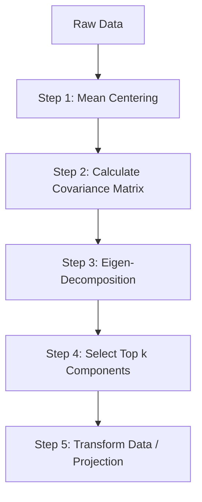

# Principal Component Analysis (PCA): A Comprehensive Guide

**Principal Component Analysis (PCA)** is one of the most reliable and widely used **unsupervised machine learning** techniques for **dimensionality reduction** [26: 1, 2]. By transforming high-dimensional data into a lower-dimensional space, PCA helps eliminate the **Curse of Dimensionality**, speeding up algorithms and enabling data visualization while preserving the data's essential behavior [26: 2, 4].

---

## 1. Geometric Intuition: The Photographer Analogy

To understand PCA, imagine a photographer capturing a 3D soccer match for a 2D newspaper [26: 3].

*   **The Problem:** The match exists in **3D space**, but a photograph is **2D** [26: 3].
*   **The Goal:** The photographer moves around the stadium to find the "best angle"—the one that captures the most "essence" (clarity of players and crowd) without the data points (players) overlapping confusingly [26: 3, 4].
*   **The PCA Solution:** PCA acts as this photographer, finding the best mathematical "angle" (coordinate system) to project data so its **spread (variance)** is maximized [26: 4, 11].

### **Feature Selection vs. Feature Extraction**
PCA is a **Feature Extraction** technique, which is fundamentally different from Feature Selection [26: 2, 7].

| Feature | Feature Selection | Feature Extraction (PCA) |
| :--- | :--- | :--- |
| **Action** | **Keeps** a subset of original columns and drops others [26: 8]. | **Transforms** existing features into a completely **new set** of features [26: 15, 16]. |
| **Logic** | Picks columns with the highest individual **variance** [26: 11]. | Combines correlated features into **Principal Components** [26: 16, 18]. |
| **Limitation** | Fails when multiple features are equally important or correlated [26: 13]. | Succeeds by finding new axes that capture the maximum spread [26: 17, 18]. |

> [!TIP]
> **Key Takeaways**
> *   PCA is **unsupervised**; it only requires input features, not labels [26: 1].
> *   It prioritizes **Variance**, as high variance preserves the relationships and distances between data points [26: 25, 26].
> *   The new axes created are called **Principal Components (PCs)** [26: 18].


## 2. Mathematical Formulation

PCA solves an optimization problem: finding a **unit vector** $u$ such that the **variance** of the data projected onto that vector is maximized [27: 29, 32].

### **The Objective Function**
If we have a data point vector $x$ and a unit vector $u$:
*   **Projection:** The projection of $x$ onto $u$ is $u^T x$ [27: 30].
*   **Goal:** Maximize the variance of these projections: $\text{Var} = \frac{1}{n} \sum (u^T x_i - u^T \bar{x})^2$ [27: 33, 35].

### **The Covariance Matrix**
The **Covariance Matrix** is the foundation of the PCA solution [27: 36, 42].
*   **Diagonal elements:** Represent the **variance** of individual features [27: 40].
*   **Off-diagonal elements:** Represent the **covariance** (relationship and orientation) between features [27: 40, 42].

### **Eigen-Decomposition**
PCA identifies optimal directions by finding the **Eigenvectors** and **Eigenvalues** of the covariance matrix [27: 43, 53].
*   **Eigenvectors:** Represent the **directions** of the Principal Components [27: 50, 52].
*   **Eigenvalues:** Represent the **magnitude** of variance captured by each component [27: 50, 52].
*   **The Solution:** The eigenvector with the largest eigenvalue points in the direction of the largest variance (**PC1**) [27: 53].


## 3. Step-by-Step PCA Algorithm



1.  **Mean Centering:** Subtract the mean of each feature from the data so it centers at the origin [27: 54, 55].
2.  **Covariance Matrix:** Compute the covariance matrix of the centered data [27: 55].
3.  **Eigen-Decomposition:** Find eigenvectors and eigenvalues for the covariance matrix [27: 56].
4.  **Selection:** Sort eigenvalues in descending order and pick the top $k$ eigenvectors [27: 56].
5.  **Transformation:** Project the original data onto the new eigenvectors using a **dot product**: $X_{new} = X_{centered} \cdot \text{Eigenvectors}^T$ [27: 59, 60].


## 4. Practical Implementation (Scikit-Learn)

PCA is commonly used on high-dimensional datasets like **MNIST** (784 features) to speed up distance-based models like **KNN** [28: 68, 71, 72].

### **Code Snippet**
```python
from sklearn.preprocessing import StandardScaler
from sklearn.decomposition import PCA

# 1. Standardizing is mandatory for PCA
scaler = StandardScaler()
X_train_rescaled = scaler.fit_transform(X_train)

# 2. Apply PCA
pca = PCA(n_components=100) # Reduce from 784 to 100 dimensions
X_train_pca = pca.fit_transform(X_train_rescaled)
X_test_pca = pca.transform(scaler.transform(X_test))
```

### **Visualization**
PCA can project high-dimensional data into **2D or 3D** to reveal clusters [28: 79, 81]. For example, in MNIST, digits like `0` and `1` form distinct clusters, while similar digits like `3` and `8` may overlap [28: 82, 83].

> [!TIP]
> **Key Takeaways**
> *   **Standardization** ensures all features contribute equally to the variance calculation [28: 73].
> *   `pca.explained_variance_` contains the **Eigenvalues** [28: 84].
> *   `pca.components_` contains the **Eigenvectors** [28: 85].


## 5. Choosing the Optimal Number of Components

To determine how many components ($n$) to keep, we use the **Cumulative Explained Variance Ratio** [28: 88, 91].

*   **Rule of Thumb:** Retain enough components to explain **90% to 95%** of the total variance [28: 88, 92].
*   **Scree Plot (Elbow Method):** Plot the cumulative variance and look for the "elbow" where adding more components provides diminishing returns [28: 91, 92].


## 6. Limitations: When PCA Fails

PCA may not be effective in the following scenarios:
*   **Equal Variance:** If variance is uniform across all directions (e.g., circular data), PCA cannot find a primary axis to prioritize [28: 93].
*   **Non-Linear Patterns:** PCA is a **linear** transformation; it cannot capture complex patterns like spirals or sine waves [28: 94, 95].
*   **High Overlap:** If distinct classes overlap heavily in the projected lower-dimensional space, critical information is lost [28: 94].

> [!IMPORTANT]
> **Final Takeaway:** PCA is highly effective for datasets with linear correlations where a few components can capture the majority of the information, enabling significant computational gains [28: 92, 95].
