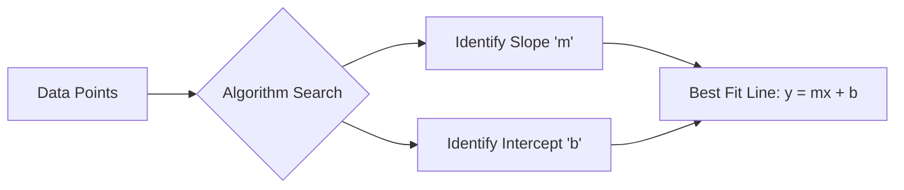

## Simple Linear Regression

Video Link : https://youtu.be/UZPfbG0jNec

---

# Simple Linear Regression: Intuition and Implementation

**Linear Regression** is considered the foundational algorithm in machine learning. It is a **Supervised Machine Learning** algorithm used to solve **Regression** problems where the output variable is a continuous numerical value.

## 1. Types of Linear Regression

Linear regression is categorized based on the number of input features and the nature of the relationship between variables.

| Type | Description | Input Columns |
| :--- | :--- | :--- |
| **Simple Linear Regression** | Relates one input to one output. | 1 |
| **Multiple Linear Regression** | Relates multiple inputs to one output. | >1 |
| **Polynomial Regression** | Used when data relationships are non-linear. | Variable |

> [!TIP]
> **Key Takeaways**
> *   **Simple Linear Regression (SLR)** is the most basic form, focusing on the relationship between a single independent variable (Input) and a dependent variable (Output).
> *   Mastering SLR makes understanding complex variations like Multiple Linear Regression much easier.

## 2. Intuition: The CGPA vs. Package Example

The core idea of Simple Linear Regression is to find a mathematical relationship between an **Input** and an **Output**.

### **The Scenario**
Imagine a dataset from a college placement cell containing two columns:
1.  **CGPA** (The Input/Independent Variable).
2.  **Package in LPA** (The Output/Dependent Variable).

**The Goal:** Build a model that can predict a student's package if their CGPA is provided.

### **Real-World Complexity**
Real-world data is rarely "perfectly linear" (forming a perfectly straight line). Instead, it is **"Sort of Linear"**. This occurs because of **Stochastic Errors**—unpredictable factors like a student’s interview performance or the specific company’s hiring budget that cannot be quantified by a simple formula.

## 3. The Geometry of Linear Regression

Geometrically, the goal of Simple Linear Regression is to find the **Best Fit Line** through the data points.

### **The Best Fit Line**
The algorithm seeks to draw a line that results in the **minimum total error** for all data points. It finds specific values for the slope and intercept that ensure the line passes as close as possible to all points in the dataset.

> [!TIP]
> **Key Takeaways**
> *   The algorithm reduces the problem to finding a line equation: `y = mx + b`.
> *   **Minimizing Error:** The "Best Fit" is the line that makes the fewest mistakes across the entire training set.

## 4. Mathematical Components

The relationship is expressed by the standard line equation:
`y = mx + b`

*   **`y` (Output):** The predicted value (e.g., Package).
*   **`x` (Input):** The feature provided (e.g., CGPA).
*   **`m` (Slope/Weight):** Represents the **Weightage** of the input. It tells us how much the package depends on the CGPA.
*   **`b` (Y-intercept/Offset):** Represents the **Base Value**. It is the predicted output when the input (`x`) is zero.

### **The Human Intuition of m and b**
*   **Weightage (`m`):** If `m` is high, a small change in CGPA leads to a large change in the Package. If `m` is low, the package depends very little on the CGPA.
*   **Offset (`b`):** This represents the "starting point." For example, in a salary model based on experience, `b` would be the salary a fresher (0 years experience) receives.

## 5. Implementation Workflow

In a typical Scikit-Learn implementation, the process follows these standard steps:

1.  **Split Data:** Separate the dataset into **Training** and **Testing** sets using `train_test_split`.
2.  **Model Creation:** Initialize the `LinearRegression` class.
3.  **Training:** Use the `.fit(X_train, y_train)` method. During this stage, the algorithm calculates the optimal values for `m` and `b`.
4.  **Prediction:** Use `.predict(X_test)` to estimate outputs for new data.

### **Accessing the Results**
After training, you can extract the calculated line parameters:
*   `model.coef_`: Returns the **Slope** (`m`).
*   `model.intercept_`: Returns the **Y-intercept** (`b`).

> [!TIP]
> **Key Takeaways**
> *   The `.fit()` method is where the mathematical "learning" happens.
> *   Linear regression is a powerful tool because it doesn't just predict; it provides a clear **Mathematical Relationship** between your variables.

## 6. Summary: When to Use SLR
*   When you have a **continuous numerical** target variable.
*   When there is a **linear trend** visible in a scatter plot of your data.
*   When you need an **interpretable model** where you can explain exactly how much each input affects the output.

