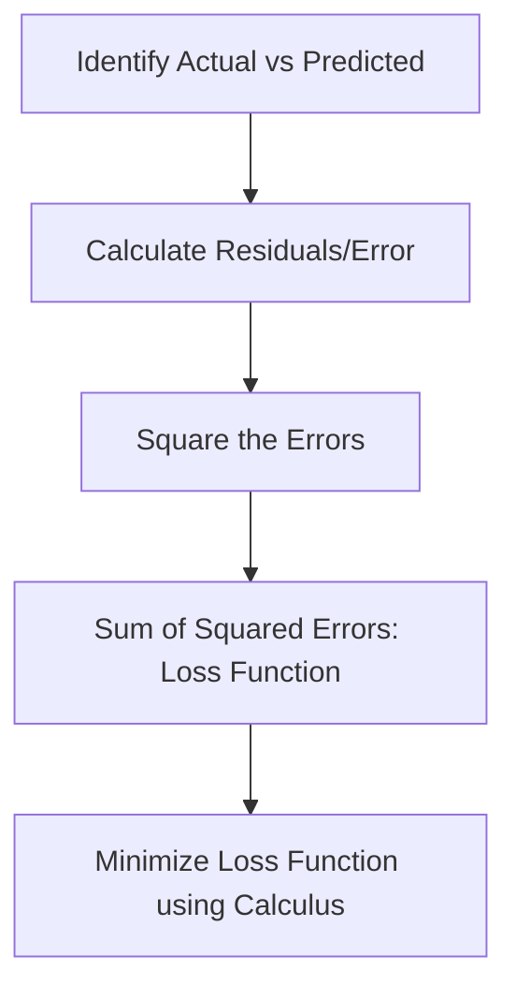

Video Link: https://www.youtube.com/watch?v=dXHIDLPKdmA&list=PLKnIA16_Rmvbr7zKYQuBfsVkjoLcJgxHH&index=51


---


# Simple Linear Regression: Mathematical Formulation & Implementation

**Simple Linear Regression (SLR)** is a foundational supervised learning algorithm used to model the relationship between a single input feature (e.g., **CGPA**) and a continuous output variable (e.g., **Package**). The primary goal is to find a **Best Fit Line** that minimizes the error between actual data points and predicted values.


## 1. The Core Objective: Finding the "Best Fit"

In a dataset where the relationship is somewhat linear, we aim to draw a line $y = mx + b$ that passes as closely as possible to all data points. 

*   **$m$ (Slope/Coefficient):** Determines the steepness and direction of the line.
*   **$b$ (Intercept):** Determines the point where the line crosses the y-axis.

The "Best Fit Line" is defined as the line that results in the **minimum total error** (distance) between the predicted values and the actual observed values.

> [!TIP]
> **Key Takeaways**
> *   The goal is to solve for two variables: **$m$** and **$b$**.
> *   A line is "best fit" if it minimizes the **Loss Function**.


## 2. Two Approaches to Solving SLR

There are two primary ways to calculate the optimal values for $m$ and $b$ in machine learning:

| Solution Type | Technique | Description |
| :--- | :--- | :--- |
| **Closed-Form Solution** | **Ordinary Least Squares (OLS)** | A direct mathematical formula derived using calculus. Used in Scikit-Learn's `LinearRegression` class. |
| **Non-Closed-Form Solution** | **Gradient Descent** | An iterative optimization technique used for high-dimensional data or complex models. Used in `SGDRegressor`. |

### **Why use OLS?**
For low-dimensional data (few features), OLS is faster and mathematically exact. However, as the number of dimensions increases, the computation becomes extremely expensive, making **Gradient Descent** a better choice for high-dimensional spaces.

> [!TIP]
> **Key Takeaways**
> *   **OLS** provides a direct formula and is the default for simple regression.
> *   **Gradient Descent** is preferred for high-dimensional datasets where direct formulas are too slow.


## 3. Mathematical Derivation: The Loss Function

To find the best $m$ and $b$, we must define how to measure "error." This is done through a **Loss Function** (often represented as $E$ or $J$).

### **The Intuition of Error**
For any point, the error is the difference between the **Actual Value** ($y_i$) and the **Predicted Value** ($\hat{y}_i$). To ensure errors don't cancel each other out (positive vs. negative) and to penalize larger errors, we use the **Sum of Squared Errors**:

$$E = \sum_{i=1}^{n} (y_i - \hat{y}_i)^2$$

Substituting the line equation $\hat{y}_i = m x_i + b$, we get:
$$E(m, b) = \sum_{i=1}^{n} (y_i - (m x_i + b))^2$$.



### **The Optimization Step**
To find the minimum value of the Loss Function, we use **Calculus**. We take the **Partial Derivatives** of the Loss Function with respect to $m$ and $b$ and set them to zero.

1.  **Differentiate with respect to $b$:** Leads to the formula for the intercept.
2.  **Differentiate with respect to $m$:** Leads to the formula for the slope.


## 4. The OLS Formulas

Following the derivation, we arrive at the standard formulas used by Scikit-Learn:

### **The Slope ($m$)**
$$m = \frac{\sum_{i=1}^{n} (x_i - \bar{x})(y_i - \bar{y})}{\sum_{i=1}^{n} (x_i - \bar{x})^2}$$.

### **The Intercept ($b$)**
$$b = \bar{y} - m\bar{x}$$.

*Where $\bar{x}$ and $\bar{y}$ are the **means** of the input and output columns, respectively.*

> [!TIP]
> **Key Takeaways**
> *   We must calculate **$m$** first, as the formula for **$b$** depends on it.
> *   These formulas ensure the line captures the maximum variance in the data with minimum error.


## 5. Implementation from Scratch

By creating a Python class, we can replicate the behavior of the Scikit-Learn `LinearRegression` library.

### **The `fit` Method**
This method calculates the mean of $X$ and $Y$, then applies the OLS formulas to find $m$ and $b$.

```python
def fit(self, X_train, y_train):
    num = 0
    den = 0
    
    # Calculate means
    x_mean = X_train.mean()
    y_mean = y_train.mean()
    
    # Iterate through data to apply OLS formula
    for i in range(X_train.shape):
        num = num + ((X_train[i] - x_mean) * (y_train[i] - y_mean))
        den = den + ((X_train[i] - x_mean) ** 2)
        
    self.m = num / den
    self.b = y_mean - (self.m * x_mean)
```

### **The `predict` Method**
Once $m$ and $b$ are known, predicting for a new input $x$ is a simple linear calculation.

```python
def predict(self, X_test):
    return (self.m * X_test) + self.b
```


### Derivation

To derive the optimal values for the slope (**$m$**) and the intercept (**$b$**) in Simple Linear Regression, we use a method called **Ordinary Least Squares (OLS)**. The goal is to find a "Best Fit Line" ($y = mx + b$) that minimizes the total error between the actual data points and the line.

### **1. Define the Loss Function**
The error for any single point is the difference between the **actual value** ($y_i$) and the **predicted value** ($\hat{y}_i$). To ensure all errors are positive and to penalize larger errors, we use the **Sum of Squared Errors (SSE)** as our loss function, denoted as $E$:

$$E = \sum_{i=1}^{n} (y_i - \hat{y}_i)^2$$

Substituting the line equation $\hat{y}_i = mx_i + b$ into the loss function:

$$E(m, b) = \sum_{i=1}^{n} (y_i - (mx_i + b))^2$$
$$E(m, b) = \sum_{i=1}^{n} (y_i - mx_i - b)^2$$

---

### **2. Deriving the Intercept ($b$)**
To find the value of $b$ that minimizes the error, we take the **partial derivative** of the loss function with respect to $b$ and set it to zero:

$$\frac{\partial E}{\partial b} = \sum_{i=1}^{n} 2(y_i - mx_i - b) \cdot \frac{\partial}{\partial b}(y_i - mx_i - b)$$
$$\frac{\partial E}{\partial b} = \sum_{i=1}^{n} 2(y_i - mx_i - b)(-1) = 0$$

Dividing by $-2$ and distributing the summation:

$$\sum y_i - \sum mx_i - \sum b = 0$$
$$\sum y_i - m\sum x_i - nb = 0$$

Now, divide the entire equation by $n$ (the total number of observations):

$$\frac{\sum y_i}{n} - m\frac{\sum x_i}{n} - \frac{nb}{n} = 0$$

Since $\frac{\sum y_i}{n} = \bar{y}$ (mean of $y$) and $\frac{\sum x_i}{n} = \bar{x}$ (mean of $x$):

$$\bar{y} - m\bar{x} - b = 0$$
**$$b = \bar{y} - m\bar{x}$$**

---

### **3. Deriving the Slope ($m$)**
Next, we take the **partial derivative** of the loss function with respect to $m$ and set it to zero:

$$\frac{\partial E}{\partial m} = \sum_{i=1}^{n} 2(y_i - mx_i - b) \cdot \frac{\partial}{\partial m}(y_i - mx_i - b)$$
$$\frac{\partial E}{\partial m} = \sum_{i=1}^{n} 2(y_i - mx_i - b)(-x_i) = 0$$

Dividing by $-2$:

$$\sum (y_i - mx_i - b)x_i = 0$$

Now, substitute the previously derived value of $b = \bar{y} - m\bar{x}$ into the equation:

$$\sum (y_i - mx_i - (\bar{y} - m\bar{x}))x_i = 0$$
$$\sum (y_i - \bar{y} - m(x_i - \bar{x}))x_i = 0$$

By rearranging the terms and solving for $m$, we arrive at the final OLS formula for the slope:

**$$m = \frac{\sum_{i=1}^{n} (x_i - \bar{x})(y_i - \bar{y})}{\sum_{i=1}^{n} (x_i - \bar{x})^2}$$**

---

### **Summary of Final Formulas**
For any dataset, first calculate $m$ and then use it to find $b$:

1.  **Slope ($m$):**
    $$m = \frac{\sum (x_i - \bar{x})(y_i - \bar{y})}{\sum (x_i - \bar{x})^2}$$
2.  **Intercept ($b$):**
    $$b = \bar{y} - m\bar{x}$$


> [!TIP]
> **Key Takeaways**
> *   **Training** (`fit`) is the process of calculating $m$ and $b$ from historical data.
> *   **Prediction** is simply applying the line equation to new data points.
> *   Custom-built SLR classes provide identical results to Scikit-Learn when using the OLS method.
