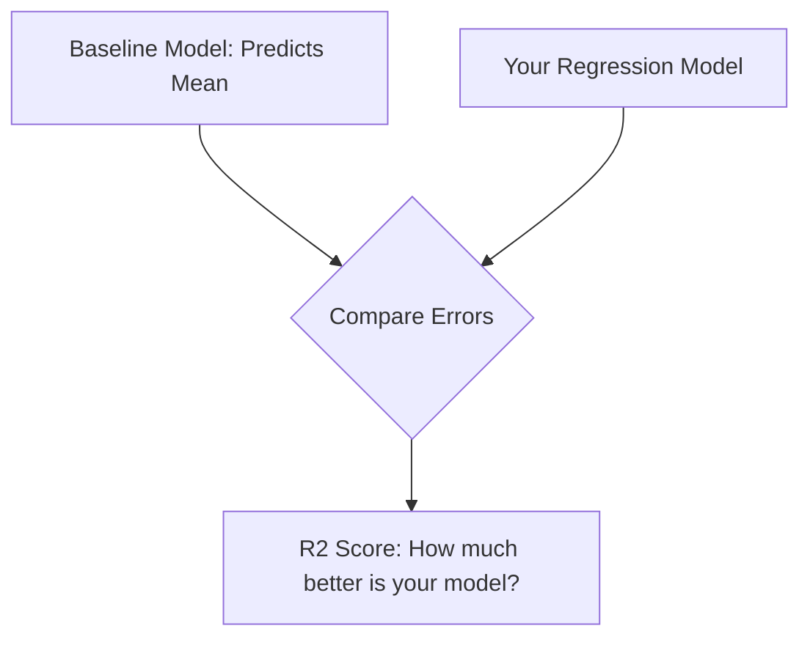

Video Link: https://youtu.be/Ti7c-Hz7GSM

---


# Regression Metrics: Evaluating Model Performance

In machine learning, applying a regression algorithm is only the first step. To understand how well your model is performing, you must use **Regression Metrics**. These metrics quantify the error between your predictions and the actual data points.


## 1. Mean Absolute Error (MAE)

**Mean Absolute Error (MAE)** is the simplest metric, representing the average of the absolute differences between the actual values and the predicted values.

### **The Intuition**
Imagine a scatter plot with a regression line. For every data point, there is a vertical distance between the actual point ($y$) and the line's prediction ($\hat{y}$). MAE calculates these distances, ignores whether they are positive or negative (using absolute values), and finds their average.

### **Mathematical Formula**
$$MAE = \frac{1}{n} \sum_{i=1}^{n} |y_i - \hat{y}_i|$$
*   **$y_i$**: Actual value.
*   **$\hat{y}_i$**: Predicted value.
*   **$n$**: Total number of observations.

### **Pros and Cons**
| **Advantages** | **Disadvantages** |
| :--- | :--- |
| **Same Unit:** The error is in the exact same unit as the output (e.g., if predicting salary in LPA, MAE is in LPA). | **Non-Differentiable:** The absolute function is not differentiable at zero, making it difficult for optimization algorithms like **Gradient Descent**. |
| **Robust to Outliers:** It is relatively robust because it does not square the error. | |

> [!TIP]
> **Key Takeaways**
> *   Use MAE when you want an error metric that is easy to communicate to non-technical stakeholders.
> *   It is the preferred metric when your dataset contains **outliers** that you don't want to over-penalize.


## 2. Mean Squared Error (MSE)

**Mean Squared Error (MSE)** is one of the most popular loss functions. It measures the average of the squares of the errors.

### **The Intuition**
Instead of taking the absolute distance, MSE squares the distance for every point. Geometrically, this is like calculating the **area of a square** formed by the distance between the actual and predicted points.

### **Mathematical Formula**
$$MSE = \frac{1}{n} \sum_{i=1}^{n} (y_i - \hat{y}_i)^2$$

### **Pros and Cons**
| **Advantages** | **Disadvantages** |
| :--- | :--- |
| **Mathematical Efficiency:** The quadratic function is **differentiable** at all points, making it ideal for use as a loss function in training. | **Unit Distortion:** The unit of error is squared (e.g., $LPA^2$), making it difficult to interpret intuitively. |
| | **Sensitive to Outliers:** Because errors are squared, large outliers result in massive penalties, which can pull the model away from the majority of the data. |

> [!TIP]
> **Key Takeaways**
> *   MSE is the standard choice for **Loss Functions** in algorithms like Linear Regression.
> *   It heavily **penalizes** large errors, making it unsuitable for datasets with significant noise or extreme outliers.


## 3. Root Mean Squared Error (RMSE)

**Root Mean Squared Error (RMSE)** is simply the square root of the MSE.

### **The Intuition**
RMSE was designed to solve the "unit problem" of MSE while keeping its mathematical benefits. By taking the square root, we bring the error metric back into the **original units** of the target variable.

### **Mathematical Formula**
$$RMSE = \sqrt{\frac{1}{n} \sum_{i=1}^{n} (y_i - \hat{y}_i)^2}$$

> [!TIP]
> **Key Takeaways**
> *   RMSE is widely used in **Deep Learning** and production environments.
> *   It retains the sensitivity to outliers found in MSE.


## 4. R2 Score (Coefficient of Determination)

While MAE and MSE are "context-dependent" (a loss of 1.5 might be good or bad depending on the scale), the **R2 Score** provides a context-independent value between 0 and 1.

### **The Intuition: Comparing to the Baseline**
The R2 Score compares your model against the "worst-case scenario"—a **Baseline Model** that simply predicts the **Mean** of the output for every input.



### **Mathematical Formula**
$$R^2 = 1 - \frac{SS_{res}}{SS_{tot}}$$
*   **$SS_{res}$ (Sum of Squared Residuals):** The error from your regression line.
*   **$SS_{tot}$ (Total Sum of Squares):** The error from the mean line.

### **Interpreting the Score**
*   **$R^2 = 1$:** Perfect model; your regression line passes through every data point.
*   **$R^2 = 0$:** Your model is no better than simply predicting the mean.
*   **$R^2 < 0$:** Your model is actually **worse** than predicting the mean, often due to applying a linear model to highly non-linear data.

> [!TIP]
> **Key Takeaways**
> *   An $R^2$ of 0.80 means your features (e.g., CGPA) explain **80% of the variance** in the output (e.g., Salary).
> *   R2 score is the "Gold Standard" for evaluating model goodness-of-fit across different datasets.


## 5. Adjusted R2 Score

The **Adjusted R2 Score** addresses a specific flaw in the standard R2 Score: the R2 score will never decrease when you add new features, even if those features are completely irrelevant.

### **The Intuition**
If you add a random feature (like "Outside Temperature") to predict "Salary," the standard R2 score might slightly increase due to random chance. **Adjusted R2** adds a penalty for increasing the number of features.

### **Mathematical Formula**
$$R^2_{adj} = 1 - \left[ \frac{(1 - R^2)(n - 1)}{n - k - 1} \right]$$
*   **$n$**: Number of rows.
*   **$k$**: Number of independent features (input columns).

### **How it Works**
*   **Irrelevant Feature:** If the new feature doesn't improve the model significantly, the penalty term ($k$) will cause the Adjusted R2 to **decrease**.
*   **Relevant Feature:** If the new feature is useful, the improvement in $R^2$ will outweigh the penalty, and the Adjusted R2 will **increase**.

> [!TIP]
> **Key Takeaways**
> *   Always use **Adjusted R2** when performing **Multiple Linear Regression** to ensure you aren't overcomplicating the model with useless features.
> *   If there is a large gap between R2 and Adjusted R2, your model likely contains redundant or irrelevant features.


## 6. Implementation with Scikit-Learn

All these metrics can be easily calculated using the `sklearn.metrics` module.

```python
from sklearn.metrics import mean_absolute_error, mean_squared_error, r2_score
import numpy as np

# Assuming y_test is actual and y_pred is predicted
print("MAE:", mean_absolute_error(y_test, y_pred))
print("MSE:", mean_squared_error(y_test, y_pred))
print("RMSE:", np.sqrt(mean_squared_error(y_test, y_pred)))
print("R2 Score:", r2_score(y_test, y_pred))

# Calculating Adjusted R2 manually
n = X_test.shape # rows
k = X_test.shape # features
r2 = r2_score(y_test, y_pred)
adj_r2 = 1 - ((1 - r2) * (n - 1) / (n - k - 1))
```
