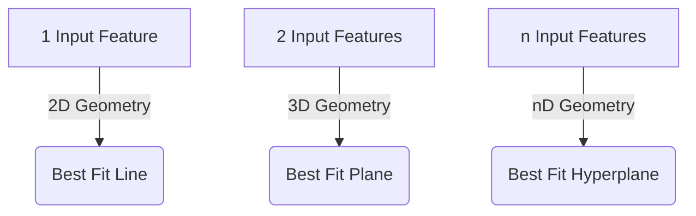

Video Link : https://youtu.be/ashGekqstl8


---

# Multiple Linear Regression: Geometric Intuition and Implementation

**Multiple Linear Regression (MLR)** is an extension of Simple Linear Regression used when a dataset has **more than one input feature** (independent variable) to predict a single continuous output (dependent variable). While Simple Linear Regression deals with a 2D relationship, MLR allows models to capture complex real-world scenarios where multiple factors influence a result.


## 1. From Simple to Multiple Linear Regression

The transition from Simple to Multiple Linear Regression is primarily about **dimensionality**.

| Feature | Simple Linear Regression (SLR) | Multiple Linear Regression (MLR) |
| :--- | :--- | :--- |
| **Input Columns** | Exactly **one**. | **Two or more**. |
| **Example** | Predicting salary based solely on **CGPA**. | Predicting salary based on **CGPA, IQ, and Experience**. |
| **Real-World Use** | Rare, as most outcomes depend on multiple factors. | The standard approach for real-world data science problems. |

> [!TIP]
> **Key Takeaways**
> *   MLR is a mathematical expansion of SLR; the core concepts of "fitting" and "error minimization" remain the same.
> *   If an MLR model is restricted to only one input, it effectively becomes a Simple Linear Regression model.


## 2. Geometric Intuition: Lines, Planes, and Hyperplanes

As we add more input features, the geometric representation of the "Best Fit" changes to accommodate the higher dimensions.

### **The Dimensionality Shift**
*   **2D Space (1 Input):** The model is a **Line** ($y = mx + b$).
*   **3D Space (2 Inputs):** The model becomes a **Plane**. Imagine a flat sheet of paper cutting through a cloud of points in your room, trying to stay as close to all of them as possible.
*   **nD Space ($n$ Inputs):** In dimensions higher than 3, the model is called a **Hyperplane**. While we cannot visualize it, mathematically it functions exactly like the 2D line or 3D plane.



> [!TIP]
> **Key Takeaways**
> *   The "Best Fit" in MLR is the **Hyperplane** that minimizes the total distance from all data points.
> *   Points can exist above or below this plane; the algorithm ensures the plane passes through the "center" of the data distribution.


## 3. Mathematical Formulation

The mathematical equation for MLR expands to include a coefficient (weight) for every input feature.

### **The General Equation**
For $n$ input features, the predicted output $y$ is calculated as:
$$y = \beta_0 + \beta_1x_1 + \beta_2x_2 + \dots + \beta_nx_n$$

*   **$\beta_0$ (Intercept/Offset):** The base value of the output when all inputs are zero.
*   **$\beta_1, \beta_2, \dots, \beta_n$ (Coefficients/Weights):** These represent the **importance** or "contribution" of each feature.
*   **$x_1, x_2, \dots, x_n$:** The input features (e.g., $x_1$ = CGPA, $x_2$ = IQ).

### **Interpreting the Coefficients ($\beta$)**
The coefficients tell us how much the output changes for every unit change in an input, assuming other inputs stay constant.
*   **High Magnitude:** The feature is a **strong predictor** (e.g., if $\beta_1$ is large, CGPA is very important for salary).
*   **Low Magnitude:** The feature has **little impact** on the final prediction.

> [!TIP]
> **Key Takeaways**
> *   In MLR, the goal of training is to find the optimal values for **$n+1$ coefficients** ($\beta_0$ to $\beta_n$).
> *   The **Intercept** ($\beta_0$) ensures the model has a starting point even if inputs are zero.


## 4. Implementation with Scikit-Learn

The `LinearRegression` class in Scikit-Learn handles MLR automatically by detecting the number of columns in your input data.

### **Workflow Summary**
1.  **Data Generation:** Use `make_regression` to create a synthetic dataset with multiple features.
2.  **Splitting:** Divide the data into training and testing sets using `train_test_split`.
3.  **Training:** Call `.fit(X_train, y_train)`. This calculates the **Intercept** and all **Coefficients**.
4.  **Evaluation:** Check the $R^2$ score to see how much of the target's variance is explained by the features.

### **Accessing Model Parameters**
```python
from sklearn.linear_model import LinearRegression

model = LinearRegression()
model.fit(X_train, y_train)

# To see Beta_1, Beta_2, ..., Beta_n
print("Coefficients:", model.coef_) 

# To see Beta_0 (The Intercept)
print("Intercept:", model.intercept_) 
```

> [!TIP]
> **Key Takeaways**
> *   The `.coef_` attribute returns an **array of weights**, one for each input column.
> *   Even in high dimensions, the code remains as simple as it was for Simple Linear Regression.
> *   Visualizing results in 3D (using libraries like **Plotly**) is highly recommended to understand how the plane interacts with the data points.
