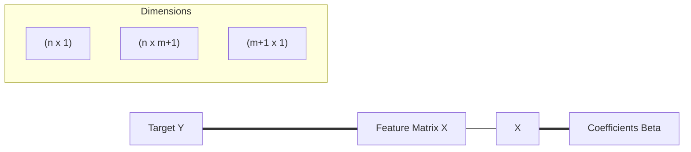

Video Link: https://www.youtube.com/watch?v=NU37mF5q8VE&list=PLKnIA16_Rmvbr7zKYQuBfsVkjoLcJgxHH&index=54

---

# Mathematical Formulation of Multiple Linear Regression

**Multiple Linear Regression (MLR)** is an extension of simple linear regression that models the relationship between a single dependent variable (Output) and multiple independent variables (Inputs). While Simple Linear Regression finds the "Best Fit Line," MLR finds the **Best Fit Hyperplane** in multi-dimensional space.

## 1. The Mathematical Model

The goal of MLR is to determine the values of coefficients (weights) that best predict the output based on given inputs.

### **The Intuition**
In a 2D world, we use $y = mx + b$. In a world with multiple factors—like predicting a student's placement package based on **CGPA**, **IQ**, and **Gender**—we need a separate weight for every factor plus a base starting point (intercept).

### **Technical Equation**
The general equation for MLR is expressed as:
$$y = \beta_0 + \beta_1x_1 + \beta_2x_2 + \dots + \beta_nx_n$$

*   **$y$**: The **Actual/Predicted** output.
*   **$\beta_0$**: The **Intercept** (the value of $y$ when all inputs are 0).
*   **$\beta_1, \beta_2, \dots, \beta_n$**: The **Coefficients** (weights) for each feature.
*   **$x_1, x_2, \dots, x_n$**: The **Input Features**.

> [!TIP]
> **Key Takeaways**
> *   The primary objective is to find the optimal values for the **$\beta$ vector**.
> *   If you have $n$ features, you will have **$n+1$ coefficients** to solve for.

## 2. Matrix Representation

To solve for all data points simultaneously, we represent the data using **Matrix Notation**. This converts a massive set of individual equations into one clean, computable format.

### **The Matrix Equation**
The entire prediction process for all observations is summarized as:
$$\mathbf{Y} = \mathbf{X}\beta$$

### **Component Breakdown**
1.  **$\mathbf{Y}$ (Target Matrix):** An $n \times 1$ matrix containing the actual output values for all observations.
2.  **$\mathbf{X}$ (Feature Matrix):** A matrix containing all input data. **Crucially**, a column of **1s** is added at the beginning to account for the intercept ($\beta_0$).
3.  **$\beta$ (Coefficient Vector):** A $(n+1) \times 1$ matrix containing all the weights we need to find.

> [!TIP]
> **Key Takeaways**
> *   **Mean Centering** is often bypassed by adding the **column of 1s** to the $X$ matrix, allowing the intercept to be calculated alongside other weights.
> *   Matrix notation allows for high-speed computation using linear algebra libraries.

## 3. The Loss Function (Sum of Squared Errors)

To find the "best" coefficients, we must define what "best" means. We use a **Loss Function** to measure the total error between our predictions and actual values.

### **Intuition**
We want the distance between the actual points and our hyperplane to be as small as possible. Since some points are above and some are below the plane, we **square the differences** to ensure all errors are positive and larger mistakes are penalized more heavily.

### **Matrix Form of Loss**
The error matrix $\mathbf{e}$ is defined as $\mathbf{Y} - \mathbf{\hat{Y}}$. In matrix form, the **Sum of Squared Errors (SSE)** is represented as:
$$E = \mathbf{e}^T\mathbf{e} = (\mathbf{Y} - \mathbf{X}\beta)^T(\mathbf{Y} - \mathbf{X}\beta)$$

> [!TIP]
> **Key Takeaways**
> *   $\mathbf{e}^T\mathbf{e}$ is a scalar value representing the total squared error of the model.
> *   Minimizing this function is the core objective of the **Ordinary Least Squares (OLS)** method.

## 4. The Closed-Form Solution (OLS)

To minimize the error, we use calculus to take the derivative of the loss function with respect to $\beta$ and set it to zero.

### **The Derivation Steps**
1.  **Expand the Loss Function:** $(\mathbf{Y} - \mathbf{X}\beta)^T(\mathbf{Y} - \mathbf{X}\beta)$.
2.  **Apply Matrix Calculus:** Differentiate the expanded terms with respect to the vector $\beta$.
3.  **Set to Zero:** Solving the resulting equation $\frac{\partial E}{\partial \beta} = 0$.

### **The Final Formula**
The optimal coefficients are found using the following closed-form equation:
$$\beta = (\mathbf{X}^T\mathbf{X})^{-1}\mathbf{X}^T\mathbf{Y}$$

*   **$\mathbf{X}^T$**: The transpose of the feature matrix.
*   **$(\mathbf{X}^T\mathbf{X})^{-1}$**: The **Matrix Inverse** of the product of $X$ and its transpose.

> [!TIP]
> **Key Takeaways**
> *   This is a **Closed-Form Solution**, meaning it gives the exact mathematical answer in one step without iteration.
> *   This formula is the engine behind Scikit-Learn's `LinearRegression` class.

## 5. OLS vs. Gradient Descent

While the OLS formula is mathematically perfect, it is not always the best choice for practical software implementation.

### **The Computational Bottleneck**
The matrix inversion step $(\mathbf{X}^T\mathbf{X})^{-1}$ has a computational complexity of **$O(n^3)$**. 
*   If your dataset has a massive number of columns (e.g., 10,000+ features), calculating the inverse becomes extremely slow and memory-intensive.

### **Comparison Table**

| Feature | OLS (Closed-Form) | Gradient Descent |
| :--- | :--- | :--- |
| **Technique** | Direct formula calculation. | Iterative approximation. |
| **Speed** | Very fast for small/medium data. | Faster for very high-dimensional data. |
| **Accuracy** | Exact mathematical solution. | Approximate solution (very close). |
| **Sklearn Class** | `LinearRegression`. | `SGDRegressor`. |

> [!TIP]
> **Key Takeaways**
> *   **OLS** is preferred for datasets where the number of features is manageable.
> *   **Gradient Descent** is used when the "Curse of Dimensionality" makes matrix inversion computationally impossible.
