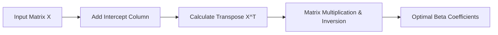

Link Video: https://www.youtube.com/watch?v=VmZWXzxmNrE&list=PLKnIA16_Rmvbr7zKYQuBfsVkjoLcJgxHH&index=55

---

# Implementing Multiple Linear Regression from Scratch

This guide demonstrates how to build a **Multiple Linear Regression (MLR)** model from scratch using **NumPy** and the mathematical **Ordinary Least Squares (OLS)** formula. We will then compare our custom implementation against Scikit-Learn’s version to verify accuracy.


## 1. Mathematical Foundation: The Normal Equation

To solve for the best-fit hyperplane in a multi-dimensional space, we use the **Normal Equation**. This provides a direct mathematical solution (closed-form) for the coefficients.

### **The Intuition**
In Simple Linear Regression, we find a single slope and intercept. In **Multiple Linear Regression**, we must find a **vector of coefficients** ($\beta$) that minimizes the error for all input features simultaneously.

### **The Formula**
$$\beta = (X^T X)^{-1} X^T Y$$
*   **$X$**: The feature matrix (including a column of ones for the intercept).
*   **$X^T$**: The transpose of matrix $X$.
*   **$(X^T X)^{-1}$**: The matrix inverse of the product of $X$ and its transpose.
*   **$Y$**: The target (output) vector.



> [!TIP]
> **Key Takeaways**
> *   The goal of training is to calculate the **$\beta$ vector**.
> *   $\beta_0$ represents the **intercept**, while $\beta_1$ to $\beta_n$ represent the **coefficients** for each feature.
> *   The matrix inversion step is the most computationally intensive part of this formula.


## 2. Data Preprocessing: The Intercept Trick

To calculate the intercept ($\beta_0$) alongside other coefficients using matrix multiplication, we must modify our input feature matrix.

### **Adding the Column of Ones**
By default, the input matrix $X$ only contains feature values. To account for the constant intercept term, we **insert a column of 1s** at the beginning (index 0) of the matrix.

**Example:**
If your input has 100 rows and 3 features, its shape is `(100, 3)`. After adding the intercept column, the shape becomes `(100, 4)`.

### **Code Implementation**
```python
import numpy as np

# Inserting a column of 1s at index 0 for the intercept
X_transformed = np.insert(X_train, 0, 1, axis=1)
```

> [!TIP]
> **Key Takeaways**
> *   Adding a **column of ones** allows the mathematical formula to treat the intercept like any other feature coefficient.
> *   This "trick" simplifies the code, allowing us to solve for all parameters in a single step.


## 3. Building the Custom Linear Regression Class

We can wrap the mathematical logic into a clean, reusable Python class similar to Scikit-Learn's API.

### **The `fit` Method**
This method performs the "training" by applying the Normal Equation to calculate the optimal weights.

```python
def fit(self, X_train, y_train):
    # 1. Preprocess: Add column of 1s
    X_train = np.insert(X_train, 0, 1, axis=1)
    
    # 2. Calculate Beta: (X^T * X)^-1 * X^T * Y
    # np.linalg.inv() handles matrix inversion
    # .dot() handles matrix multiplication
    betas = np.linalg.inv(np.dot(X_train.T, X_train)).dot(X_train.T).y_train
    
    # 3. Separate Intercept from Coefficients
    self.intercept_ = betas
    self.coef_ = betas[1:]
```

### **The `predict` Method**
Once we have the coefficients, predicting the output ($y$) for new data is a matter of calculating the **dot product** of the inputs and coefficients, then adding the intercept.

$$\hat{y} = \beta_0 + (\text{Input Data} \cdot \text{Coefficients})$$

```python
def predict(self, X_test):
    # Dot product of features and coefficients + intercept
    return np.dot(X_test, self.coef_) + self.intercept_
```

> [!TIP]
> **Key Takeaways**
> *   **Training** (`fit`) is the process of finding the optimal $\beta$ values from historical data.
> *   **Prediction** is a simple linear combination of input features and learned weights.


## 4. Performance Comparison

To validate our "from-scratch" model, we test it against the standard **Diabetes dataset** (442 rows, 10 features) and compare it to Scikit-Learn.

| Metric | Scikit-Learn `LinearRegression` | Custom `MyLR` Class |
| :--- | :--- | :--- |
| **$R^2$ Score** | ~0.46 | **~0.46** |
| **Intercept** | 151.18 | **151.18** |
| **Coefficients** | Matches exactly | **Matches exactly** |

### **Verification Code**
```python
from sklearn.metrics import r2_score

# Training our custom model
my_lr = MyLR()
my_lr.fit(X_train, y_train)
y_pred = my_lr.predict(X_test)

# Compare accuracy
print("R2 Score:", r2_score(y_test, y_pred))
```

> [!TIP]
> **Key Takeaways**
> *   Our custom implementation achieves the **exact same results** as Scikit-Learn.
> *   This confirms that Scikit-Learn uses the same **Ordinary Least Squares** math under the hood for its `LinearRegression` class.
> *   This code is a **general solution** and will work for any number of input features.
