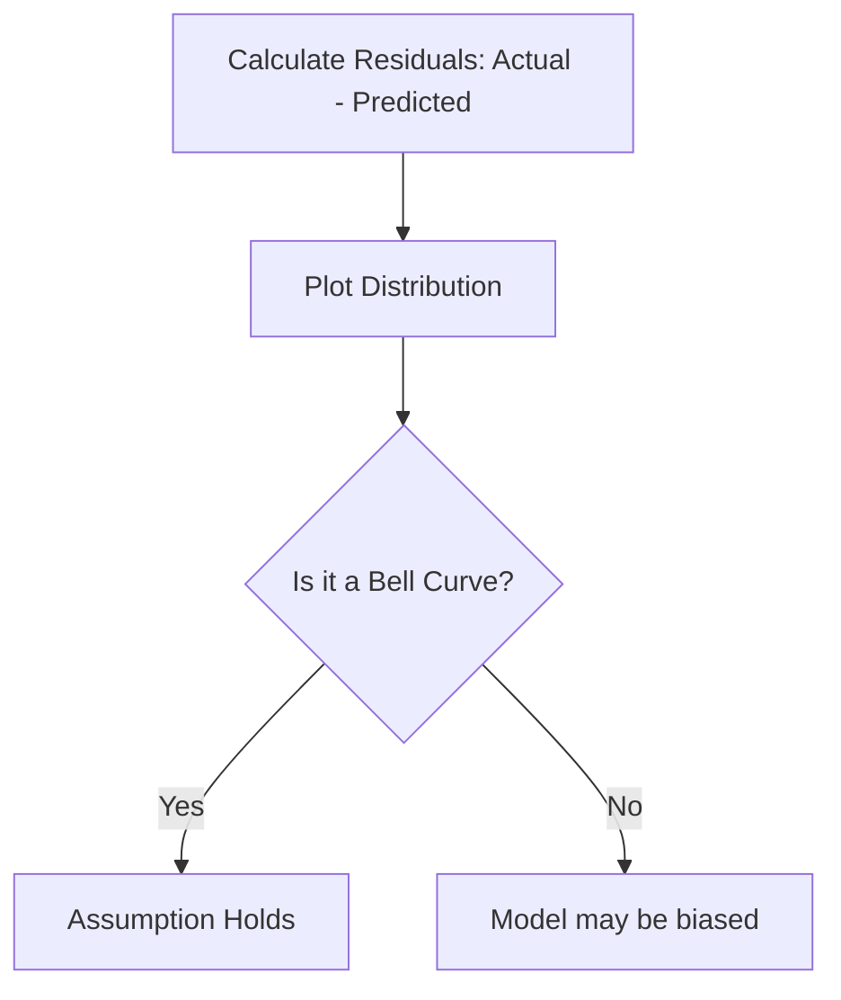

Video Link: https://www.youtube.com/watch?v=EmSNAtcHLm8&list=PLKnIA16_Rmvbr7zKYQuBfsVkjoLcJgxHH&index=56

---

# Assumptions of Linear Regression

Linear Regression is a powerful predictive tool, but its accuracy and reliability depend on several underlying **Assumptions**. If these assumptions are violated, the model's coefficients may be misleading, and its predictions may be unreliable.

## 1. Linear Relationship

### **The Intuition**
The most fundamental requirement is that a **Linear Relationship** must exist between the independent variables (inputs) and the dependent variable (output). In simple terms, as the input increases, the output should either increase or decrease in a somewhat proportional, straight-line fashion.

### **Technical Explanation**
For every input feature $X_i$, the change in the target $Y$ should be constant. If the relationship looks like a curve (e.g., $Y$ increases exponentially as $X$ grows), a linear model will not capture the data's behavior accurately.

*   **How to Test:** Use **Scatter Plots** to visualize each input against the target.
*   **Target Pattern:** Data points should follow a straight line (positive or negative slope); a "U-shape" or "S-shape" indicates a non-linear relationship.

> [!TIP]
> **Key Takeaways**
> *   Linearity is required for **each** individual input column.
> *   Scatter plots are the primary tool for visual verification.

## 2. No Multicollinearity

### **The Intuition**
**Multicollinearity** occurs when input features are highly correlated with each other. Imagine two scientists with identical skill sets working on a project; it becomes impossible to determine which person contributed what. Similarly, if two inputs (like $X_1$ and $X_2$) move together, the model cannot calculate the individual impact of $X_1$ on the output.

### **Technical Explanation**
The goal of regression is to calculate coefficients ($\beta_1, \beta_2, \dots$) which represent the change in $Y$ for a unit change in one $X$, while keeping all other features **constant**. If features are correlated, you cannot change one without changing the other, which breaks the mathematical logic of the model.

*   **How to Test:** 
    1.  **VIF (Variance Inflation Factor):** A `VIF` score greater than **5** indicates problematic multicollinearity.
    2.  **Correlation Heatmap:** Look for high correlation values between input columns.

> [!TIP]
> **Key Takeaways**
> *   Input features must be **independent** of each other.
> *   Use `VIF` or a correlation matrix to detect and remove redundant features.

## 3. Normality of Residuals

### **The Intuition**
In linear regression, **Residuals** (or Errors) are the differences between the actual values and the model's predictions. This assumption states that when you plot these errors, they should follow a **Normal Distribution** (a Bell Curve) centered around zero.

### **Technical Explanation**
If the errors are normally distributed, it suggests that the model has captured the main patterns and only random "noise" remains. If the error distribution is skewed, the model might be missing a systematic pattern in the data.

*   **How to Test:** 
    1.  **KDE / Distplot:** Look for a symmetric bell shape.
    2.  **Q-Q Plot:** Data points should lie closely along a 45-degree diagonal line.

> [!TIP]
> **Key Takeaways**
> *   Residuals should cluster around **zero**.
> *   Visual tests like **Q-Q Plots** are more reliable than simple histograms for checking normality.

## 4. Homoscedasticity

### **The Intuition**
**Homoscedasticity** comes from "Homo" (Same) and "Scedasticity" (Spread). It means that the **Spread** of your errors should be constant across all levels of your predicted values. 

### **Technical Explanation**
If your model is much more accurate for small predictions than for large ones (or vice versa), the error spread is not uniform. This is called **Heteroscedasticity**, and it often appears as a "cone" or "fan" shape in a scatter plot.

*   **How to Test:** Plot **Predicted Values** on the X-axis and **Residuals** on the Y-axis.
*   **Desired Pattern:** A random, uniform cloud of points with no clear shape or trend.

> [!TIP]
> **Key Takeaways**
> *   The error "noise" should be **consistent** throughout the dataset.
> *   A "fan-shaped" plot is a clear sign of a violated assumption.

## 5. No Autocorrelation of Errors

### **The Intuition**
This assumption states that the error for one data point should not provide any information about the error for the next data point. There should be **No Pattern** in the sequence of residuals.

### **Technical Explanation**
Autocorrelation typically occurs in time-series data where errors follow a trend (e.g., if the error is positive today, it’s likely to be positive tomorrow). In a standard regression model, we want the residuals to be completely independent.

*   **How to Test:** Plot the residuals in sequence.
*   **Desired Pattern:** Random fluctuations; any visible "waves" or "cycles" indicate **Autocorrelation**.

> [!TIP]
> **Key Takeaways**
> *   Errors should be **uncorrelated** with each other.
> *   A lack of pattern in the residual plot confirms this assumption.

## Summary Checklist
- [ ] **Linearity:** Is there a straight-line trend between $X$ and $Y$?
- [ ] **Multicollinearity:** Are the input features independent (VIF < 5)?
- [ ] **Normality:** Do the residuals follow a bell curve?
- [ ] **Homoscedasticity:** Is the error spread uniform?
- [ ] **Autocorrelation:** Are the residuals free of any sequential patterns?
