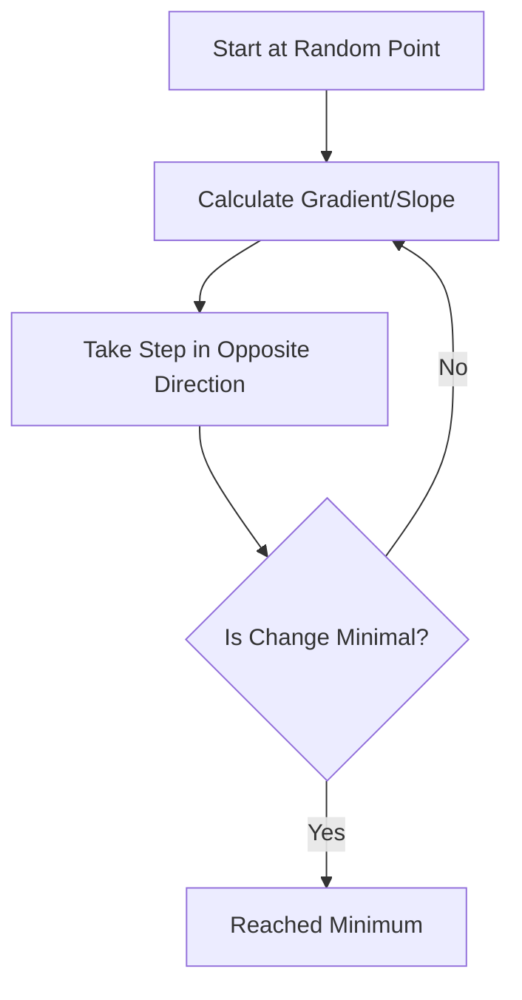

Video Link: https://www.youtube.com/watch?v=ORyfPJypKuU&list=PLKnIA16_Rmvbr7zKYQuBfsVkjoLcJgxHH&index=57

---

# Gradient Descent: An Optimization Foundation

**Gradient Descent** is a first-order iterative **optimization algorithm** used to find the local minimum of a differentiable function. In the context of machine learning, it is the engine used to minimize the **Loss Function**, allowing models to "learn" the optimal parameters (weights and biases).

While direct mathematical solutions like the **Ordinary Least Squares (OLS)** method work for simple problems, they become computationally expensive in high-dimensional datasets due to the need for matrix inversion. Gradient Descent provides a scalable alternative that is the backbone of **Deep Learning** and many modern machine learning algorithms.

## 1. The Intuition: The Blindfolded Descent

Imagine you are standing on a rugged mountain range (representing the **Loss Function** surface) and your goal is to reach the lowest point in the valley (the **Global Minimum**).

*   **The Problem:** You are blindfolded and cannot see the valley.
*   **The Strategy:** You feel the ground with your feet to determine the **slope** (gradient) at your current position.
*   **The Action:** To go down, you take a step in the **opposite direction** of the slope. If the ground slopes upward to your right, you step to your left.
*   **The Goal:** By repeating this process—taking a step, checking the slope, and adjusting—you eventually reach the bottom.

> [!TIP]
> **Key Takeaways**
> *   Gradient Descent is an **iterative** process, not a one-step formula.
> *   It works by repeatedly updating parameters to reduce the total error.
> *   The **gradient** tells the algorithm which direction to move to find the minimum.

## 2. The Core Algorithm: The Update Rule

The mathematical core of Gradient Descent is the **Update Equation**. This formula determines how the model's parameters change in each iteration.

### **The Formula**
$$\theta_{new} = \theta_{old} - \eta \cdot \nabla J(\theta)$$

*   **$\theta$**: The parameter we want to optimize (e.g., slope $m$ or intercept $b$).
*   **$\eta$ (Learning Rate)**: A small positive value that controls the **step size**.
*   **$\nabla J(\theta)$ (Gradient)**: The partial derivative of the loss function with respect to the parameter.

### **Slope and Direction**
*   **If Slope is Negative:** The formula results in $(-) \times (-) = (+)$, so the parameter **increases**, moving you forward toward the minimum.
*   **If Slope is Positive:** The formula results in $(-) \times (+) = (-)$, so the parameter **decreases**, moving you backward toward the minimum.

## 3. Detailed Mathematical Derivation

To implement Gradient Descent for **Simple Linear Regression**, we must calculate the gradients for both the intercept ($b$) and the slope ($m$).

### **Step 1: Define the Loss Function**
We use the **Sum of Squared Errors (SSE)**:
$$E(m, b) = \sum_{i=1}^{n} (y_i - \hat{y}_i)^2$$
Substituting the line equation $\hat{y}_i = mx_i + b$:
$$E(m, b) = \sum_{i=1}^{n} (y_i - (mx_i + b))^2$$

### **Step 2: Partial Derivative for Intercept ($b$)**
Applying the power rule and chain rule:
1.  Bring the exponent down: $2 \sum (y_i - mx_i - b)$
2.  Multiply by the derivative of the inside w.r.t. $b$ (which is $-1$):
$$\frac{\partial E}{\partial b} = -2 \sum_{i=1}^{n} (y_i - mx_i - b)$$

### **Step 3: Partial Derivative for Slope ($m$)**
Applying the power rule and chain rule:
1.  Bring the exponent down: $2 \sum (y_i - mx_i - b)$
2.  Multiply by the derivative of the inside w.r.t. $m$ (which is $-x_i$):
$$\frac{\partial E}{\partial m} = -2 \sum_{i=1}^{n} (y_i - mx_i - b)x_i$$

### **Step 4: The Final Update Rules**
Using these gradients, the parameters are updated in every iteration:
*   $b_{new} = b_{old} - \eta \cdot \left[ -2 \sum (y_i - mx_i - b) \right]$
*   $m_{new} = m_{old} - \eta \cdot \left[ -2 \sum (y_i - mx_i - b)x_i \right]$

## 4. The Role of the Learning Rate ($\eta$)

The **Learning Rate** is a critical hyperparameter that determines the speed and stability of convergence.

| Learning Rate Size | Behavior | Result |
| :--- | :--- | :--- |
| **Too Small** | Takes tiny steps toward the minimum. | Training is very **slow** and computationally expensive. |
| **Optimal** | Efficiently moves toward the minimum. | Converges to the **best solution** in reasonable time. |
| **Too Large** | Overshoots the minimum and may bounce between sides. | The model **fails to converge** or may even diverge. |

> [!TIP]
> **Key Takeaways**
> *   A standard starting point for the learning rate is often **0.01** or **0.001**.
> *   As the model approaches the minimum, the gradient naturally decreases, causing the step sizes to become smaller automatically—this is why a constant learning rate still works well.

## 5. Stopping Criteria: When to Stop?

Gradient Descent is a loop, so we need a condition to break it.

1.  **Fixed Epochs:** Run the loop for a pre-defined number of iterations (e.g., 1000 times).
2.  **Convergence Threshold:** Stop when the change in parameters ($b_{new} - b_{old}$) becomes smaller than a tiny number (e.g., **0.001**), indicating the model is no longer improving.

## 6. Challenges and Considerations

*   **Local Minima vs. Global Minimum:** In non-convex functions (complex surfaces), the algorithm might get stuck in a "local hole" that isn't the absolute lowest point.
*   **Saddle Points:** Flat regions where the slope is zero can stall the algorithm, making it "think" it has reached a minimum.
*   **Feature Scaling:** Gradient Descent converges much faster if all input features are on the same scale (e.g., 0 to 1). If features have different scales, the loss surface becomes an elongated "valley," causing the algorithm to zigzag inefficiently.

> [!IMPORTANT]
> **Final Takeaway:** Gradient Descent's power lies in its **universality**. It doesn't matter what your loss function is; as long as it is **differentiable**, Gradient Descent can find the path to the minimum.
