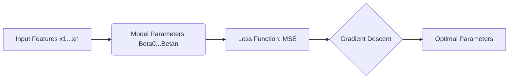

Video Link: https://www.youtube.com/watch?v=Jyo53pAyVAM&list=PLKnIA16_Rmvbr7zKYQuBfsVkjoLcJgxHH&index=58

---

# Batch Gradient Descent (BGD) for Multiple Linear Regression

**Batch Gradient Descent** is an optimization algorithm used to find the optimal coefficients of a machine learning model by calculating the gradient of the loss function with respect to the entire training dataset. It is the standard version of gradient descent where one update to the model parameters occurs only after the algorithm has "seen" every single row in the data.


## 1. Comparing Gradient Descent Variants

Gradient descent is categorized based on how much data is processed before updating the model parameters.

| Type | Data per Update | Speed | Use Case |
| :--- | :--- | :--- | :--- |
| **Batch GD** | Entire Dataset. | Slowest. | Small datasets or convex problems. |
| **Stochastic GD** | Single Row. | Fastest. | Large datasets. |
| **Mini-Batch GD** | Small Subset (Batch). | Balanced. | Deep Learning/General Purpose. |

> [!TIP]
> **Key Takeaways**
> *   **BGD** is computationally expensive for large datasets because it requires a full pass of the data for every single step toward the minimum.
> *   It is highly effective when the loss function is **convex**, as it provides a stable path to the global minimum.


## 2. Problem Formulation ($n$-Dimensional Data)

In a real-world scenario, we rarely deal with only one input feature. For **Multiple Linear Regression**, we aim to predict a target $y$ using $n$ features ($x_1, x_2, \dots, x_n$).

### **The Model Equation**
The prediction $\hat{y}$ is a linear combination of the input features and their corresponding weights (coefficients):
$$\hat{y} = \beta_0 + \beta_1x_1 + \beta_2x_2 + \dots + \beta_nx_n$$

*   **$\beta_0$**: The **Intercept**.
*   **$\beta_1 \dots \beta_n$**: The **Coefficients** (weights) for each feature.
*   **$n + 1$**: The total number of parameters to solve for.




## 3. Detailed Mathematical Derivation

To implement BGD, we must derive the update rules for the intercept ($\beta_0$) and every coefficient ($\beta_j$) using the **Mean Squared Error (MSE)** as our loss function.

### **Step 1: The Loss Function**
The MSE is the average of the squared differences between actual values ($y_i$) and predictions ($\hat{y}_i$):
$$L = \frac{1}{n} \sum_{i=1}^{n} (y_i - \hat{y}_i)^2$$
Substitute the model equation:
$$L = \frac{1}{n} \sum_{i=1}^{n} (y_i - (\beta_0 + \beta_1x_{i1} + \dots + \beta_nx_{in}))^2$$

### **Step 2: Deriving the Gradient for Intercept ($\beta_0$)**
To find how the loss changes with $\beta_0$, take the partial derivative:
1.  Apply the Power Rule: $\frac{1}{n} \cdot 2 \sum (y_i - \hat{y}_i)$.
2.  Apply the Chain Rule (derivative of $-\beta_0$ is $-1$):
$$\frac{\partial L}{\partial \beta_0} = \frac{-2}{n} \sum_{i=1}^{n} (y_i - \hat{y}_i)$$.

### **Step 3: Deriving the Gradient for Coefficients ($\beta_j$)**
For any specific coefficient $\beta_j$ (where $j \in \{1 \dots n\}$):
1.  Apply the Power Rule: $\frac{1}{n} \cdot 2 \sum (y_i - \hat{y}_i)$.
2.  Apply the Chain Rule (derivative of $-\beta_jx_{ij}$ with respect to $\beta_j$ is $-x_{ij}$):
$$\frac{\partial L}{\partial \beta_j} = \frac{-2}{n} \sum_{i=1}^{n} (y_i - \hat{y}_i)x_{ij}$$.

### **Step 4: The General Update Rule**
In each iteration, update every parameter simultaneously:
$$\beta_{new} = \beta_{old} - \eta \cdot \frac{\partial L}{\partial \beta}$$
Where $\eta$ is the **Learning Rate**.

> [!TIP]
> **Key Takeaways**
> *   The gradient for $\beta_0$ depends only on the average error.
> *   The gradient for any $\beta_j$ is weighted by its corresponding feature column $x_j$.
> *   If a feature has a high correlation with the error, its coefficient will receive a larger update.


## 4. Vectorization and Matrix Implementation

In a professional implementation, calculating these summations using loops is inefficient. Instead, we use **Matrix Multiplication (Vectorization)** to update all parameters at once.

### **The Vectorized Gradient**
The gradients for all coefficients can be calculated in a single step using the dot product of the transposed feature matrix and the error vector:
$$\nabla L_{\beta} = \frac{-2}{n} \cdot X^T(y - \hat{y})$$

### **Code Logic (Python/NumPy)**
```python
# 1. Calculate Predictions for all rows
y_hat = np.dot(X, self.coef_) + self.intercept_

# 2. Calculate Intercept Gradient (Mean of errors)
intercept_der = -2 * np.mean(y_train - y_hat)

# 3. Calculate Coefficient Gradients (Dot product for all features)
coef_der = -2 * np.dot((y_train - y_hat), X) / X.shape

# 4. Update Parameters
self.intercept_ = self.intercept_ - (self.lr * intercept_der)
self.coef_ = self.coef_ - (self.lr * coef_der)
```


## 5. Summary: The BGD Workflow

1.  **Initialize:** Start $\beta_0$ at 0 and all $\beta_j$ at 1 (or random values).
2.  **Predict:** Calculate $\hat{y}$ for the entire dataset using the current weights.
3.  **Calculate Error:** Find the difference $(y - \hat{y})$.
4.  **Compute Gradients:** Use the derived formulas to find the slope of the loss function for every parameter.
5.  **Update:** Adjust parameters using the learning rate.
6.  **Repeat:** Continue for a set number of **Epochs** until convergence.

> [!IMPORTANT]
> **Final Takeaway:** Batch Gradient Descent is the foundation of parameter optimization. While it can be slow on massive datasets, its mathematical clarity and stable convergence make it an essential tool for understanding how machines learn from data.
