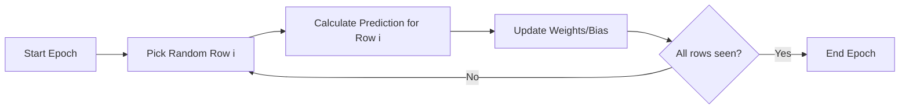

Video Link: https://www.youtube.com/watch?v=V7KBAa_gh4c&list=PLKnIA16_Rmvbr7zKYQuBfsVkjoLcJgxHH&index=59

---

# Stochastic Gradient Descent (SGD)

**Stochastic Gradient Descent (SGD)** is a powerful optimization algorithm designed to overcome the computational limitations of Batch Gradient Descent (BGD), particularly when dealing with large-scale datasets. While BGD updates parameters after processing the entire dataset, SGD updates parameters iteratively after seeing just **one single data point**.


## 1. Motivation: The Problem with Batch GD
In **Batch Gradient Descent**, calculating the derivative of the loss function requires a summation over all $m$ rows in the dataset.

*   **Computational Cost:** For a dataset with $10^5$ rows, 100 columns, and 1000 epochs, BGD requires roughly $10^{10}$ derivative calculations, making it extremely slow.
*   **Hardware Constraints:** BGD requires the entire feature matrix to be loaded into **RAM** simultaneously for vectorization. If the dataset is too large (e.g., several GBs), it can lead to system memory errors.

> [!TIP]
> **Key Takeaways**
> *   BGD is inefficient for **Big Data** (images, text) due to excessive calculations per update.
> *   SGD is the preferred choice in **Deep Learning** because it avoids loading massive datasets into memory at once.


## 2. Intuition: Learning Row-by-Row
The word **"Stochastic"** refers to a system involving a random probability distribution. 

Instead of waiting to see all rows to take one step toward the minimum, SGD picks a **random row** from the dataset, calculates the error for that specific point, and immediately updates the model parameters.



### **Core Differences**
| Feature | Batch Gradient Descent (BGD) | Stochastic Gradient Descent (SGD) |
| :--- | :--- | :--- |
| **Update Frequency** | Once per epoch (after all rows). | $n$ times per epoch (after every row). |
| **Convergence** | Smooth and steady path to the minimum. | Random, "noisy" path toward the solution. |
| **Speed** | Slow on large data. | Significantly faster convergence on big data. |

> [!TIP]
> **Key Takeaways**
> *   SGD achieves **faster convergence** because it takes many steps in a single epoch.
> *   The randomness helps the algorithm reach the vicinity of the solution much quicker.


## 3. Mathematical Derivation
To implement SGD, we derive the update rules for the **intercept** ($\beta_0$) and **coefficients** ($\beta_j$) for a single observation $i$.

### **Step 1: The Loss Function for a Single Point**
In BGD, we minimize the mean of all squared errors. In SGD, we focus on the squared error of a **single point**:
$$E_i = (y_i - \hat{y}_i)^2$$
Where the prediction $\hat{y}_i$ is:
$$\hat{y}_i = \beta_0 + \beta_1x_{i1} + \beta_2x_{i2} + \dots + \beta_nx_{in}$$

### **Step 2: Partial Derivative for Intercept ($\beta_0$)**
We apply the chain rule to the single-point error:
1.  **Power Rule:** $\frac{\partial E_i}{\partial \beta_0} = 2(y_i - \hat{y}_i)^1$.
2.  **Internal Derivative:** Multiply by the derivative of $(y_i - \beta_0 - \dots)$ with respect to $\beta_0$, which is $-1$.
3.  **Result:** 
$$\frac{\partial E_i}{\partial \beta_0} = -2(y_i - \hat{y}_i)$$

### **Step 3: Partial Derivative for Coefficients ($\beta_j$)**
For any feature $j$:
1.  **Power Rule:** $\frac{\partial E_i}{\partial \beta_j} = 2(y_i - \hat{y}_i)$.
2.  **Internal Derivative:** Multiply by the derivative of $(y_i - \dots - \beta_jx_{ij} - \dots)$ with respect to $\beta_j$, which is $-x_{ij}$.
3.  **Result:**
$$\frac{\partial E_i}{\partial \beta_j} = -2(y_i - \hat{y}_i)x_{ij}$$

### **Step 4: The Parameter Update Rules**
In each step, the parameters are updated using the learning rate $\eta$:
*   **Intercept Update:** $\beta_0^{(new)} = \beta_0^{(old)} - \eta \cdot [-2(y_i - \hat{y}_i)]$.
*   **Coefficient Update:** $\beta_j^{(new)} = \beta_j^{(old)} - \eta \cdot [-2(y_i - \hat{y}_i)x_{ij}]$.


## 4. Advanced Concepts and Optimization

### **Non-Convex Functions and Local Minima**
In complex models (like neural networks), the loss function may have multiple "holes" called **local minima**.
*   **BGD Failure:** BGD is smooth and might get stuck in a sub-optimal local minimum.
*   **SGD Strength:** Because SGD is "noisy" and takes random jumps, it has the **momentum** to jump out of a local minimum and continue searching for the **global minimum**.

### **Learning Schedule**
Because SGD is random, it often fluctuates around the minimum without ever perfectly settling. To fix this, we use a **Learning Schedule** to gradually decrease the learning rate $\eta$ as training progresses.
*   **Start:** High $\eta$ for big jumps toward the solution.
*   **End:** Low $\eta$ to stabilize and fine-tune the final parameters.

> [!TIP]
> **Key Takeaways**
> *   SGD is better at escaping **local minima** than BGD.
> *   A **Learning Schedule** helps the model stabilize at the end of training.


## 5. Implementation with Scikit-Learn
In practice, you can use the `SGDRegressor` class, which is flexible and supports various loss functions and regularization techniques.

```python
from sklearn.linear_model import SGDRegressor

# max_iter is the number of epochs
# learning_rate='constant' means eta doesn't change automatically
sgd = SGDRegressor(max_iter=100, learning_rate='constant', eta0=0.01)

sgd.fit(X_train, y_train)
y_pred = sgd.predict(X_test)
```

### **Summary Table: SGD Parameters**
| Parameter | Description |
| :--- | :--- |
| `max_iter` | The maximum number of epochs to run. |
| `tol` | **Tolerance**: Stop early if the improvement is less than this value. |
| `learning_rate` | Strategies like `constant`, `optimal`, or `adaptive` (Learning Schedules). |
| `random_state` | Ensures consistent results across runs despite the stochastic nature. |

> [!IMPORTANT]
> **Final Takeaway:** SGD provides a slightly "imprecise" solution compared to BGD, but the massive gains in speed and the ability to handle giant datasets make it a cornerstone of modern machine learning.
