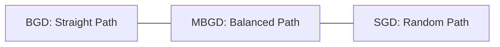

Video Link:  https://www.youtube.com/watch?v=_scscQ4HVTY&list=PLKnIA16_Rmvbr7zKYQuBfsVkjoLcJgxHH&index=60

---

# Mini-Batch Gradient Descent (MBGD)

**Mini-Batch Gradient Descent** is a variation of the gradient descent algorithm that splits the training dataset into small groups called **batches**. It serves as a "middle ground" between **Batch Gradient Descent (BGD)** and **Stochastic Gradient Descent (SGD)**, combining the stability of the former with the speed and memory efficiency of the latter.


## 1. The Intuition: Balancing Speed and Stability

To understand MBGD, it is helpful to compare the three primary variants of Gradient Descent based on how frequently they update model parameters:

*   **Batch Gradient Descent (BGD):** Processes the **entire dataset** before making a single update. While stable, it is very slow for large data.
*   **Stochastic Gradient Descent (SGD):** Processes **one row** at a time and updates parameters immediately. It is very fast but its path to the minimum is highly "noisy" or random.
*   **Mini-Batch Gradient Descent (MBGD):** Processes a **small subset** (e.g., 32, 64, or 128 rows) and then updates parameters. 

## The Comparison Table

| Feature | Batch GD | Stochastic GD | Mini-Batch GD |
|----------|----------|---------------|---------------|
| **Updates per Epoch** | 1 (after all rows) | n (after every row) | n / batch_size |
| **Path to Minimum** | Smooth and direct | Highly random/noisy | Moderately noisy |
| **Convergence Speed** | Slowest | Fastest | Balanced / Optimal |
| **Hardware Usage** | Requires high RAM | Low memory footprint | Memory efficient (fits in GPU/CPU cache) |



> [!TIP]
> **Key Takeaways**
> *   MBGD is the **most used** variant in deep learning and complex machine learning tasks.
> *   By tuning the **Batch Size**, you can make the algorithm behave more like BGD (large batches) or SGD (batch size of 1).


## 3. **Python Implementation Logic (Scratch)**

```python
# Select random indices for the mini-batch
idx = random.sample(range(X_train.shape), batch_size)

# Subset the data
X_batch = X_train[idx]
y_batch = y_train[idx]

# Calculate predictions and update
y_hat = np.dot(X_batch, coef) + intercept
intercept_gradient = -2 * np.mean(y_batch - y_hat)
coef_gradient = -2 * np.dot((y_batch - y_hat), X_batch) / batch_size

# Apply Update
intercept = intercept - (learning_rate * intercept_gradient)
coef = coef - (learning_rate * coef_gradient)
```

> [!TIP]
> **Key Takeaways**
> *   MBGD requires **fewer epochs** to converge than BGD because it takes multiple steps in a single epoch.
> *   Vectorized implementation (using `.dot()`) makes calculating gradients for a batch extremely fast on modern hardware.


## 3. Practical Implementation (Scikit-Learn)

In Scikit-Learn, the `SGDRegressor` class is used to perform online/stochastic learning. While it doesn't have a direct `batch_size` parameter, you can simulate MBGD using the `.partial_fit()` method.

### **The `.partial_fit()` Approach**
1.  Initialize `SGDRegressor`.
2.  Divide your data into batches manually.
3.  Loop through your batches and call `model.partial_fit(X_batch, y_batch)`.

```python
from sklearn.linear_model import SGDRegressor

sgd = SGDRegressor(learning_rate='constant', eta0=0.01)
batch_size = 35

for i in range(epochs):
    # Manually shuffle and create batches
    for j in range(num_batches):
        idx = random.sample(range(X_train.shape), batch_size)
        sgd.partial_fit(X_train[idx], y_train[idx])
```


## 5. Summary: Why MBGD is the Standard

*   **Noise Reduction:** It reduces the "zigzag" behavior of SGD, leading to more stable convergence.
*   **Hardware Efficiency:** GPUs are optimized for matrix calculations on small batches, making MBGD faster than updating row-by-row.
*   **Optimization:** Using a **Learning Schedule** (gradually reducing the learning rate) can help MBGD settle perfectly at the global minimum without fluctuating at the end.

> [!IMPORTANT]
> **Final Takeaway:** Mini-Batch Gradient Descent offers the best of both worlds—it provides a stable update path like Batch GD while remaining fast and memory-efficient like Stochastic GD.
