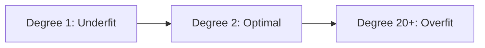

Video Link https://youtu.be/BNWLf3cKdbQ

---


# Polynomial Regression: Handling Non-Linear Relationships

**Polynomial Regression** is a form of regression analysis in which the relationship between the independent variable $x$ and the dependent variable $y$ is modeled as an $n^{th}$ degree polynomial. It is an essential tool when the data distribution follows a **curve** rather than a straight line.

## 1. The Intuition: Why Curves Matter?

In **Simple Linear Regression**, we attempt to fit a straight line ($y = mx + c$) through data points. However, real-world data is often **non-linear**. 

*   **The Problem:** If you force a straight line through a curved data distribution, your model will have a high error and a low $R^2$ score.
*   **The Solution:** Instead of a line, we use a **Polynomial Curve**. By increasing the degree of the equation, the model can bend to better fit the underlying pattern of the data.

> [!TIP]
> **Key Takeaways**
> *   Polynomial Regression is used when the relationship between $X$ and $y$ is **non-linear**.
> *   It transforms the input data into a higher-dimensional space to fit a curve.


## 2. Mathematical Formulation

Polynomial Regression is mathematically an extension of **Multiple Linear Regression**. We treat the powers of the original feature as new, independent features.

### **Step-by-Step Derivation**

1.  **Define the Degree ($d$):** Choose the maximum power for your feature (e.g., $d=2$ for a quadratic curve).
2.  **The Hypothesis Function:** For a single input $x$, the predicted output $\hat{y}$ is:
    $$\hat{y} = \beta_0 + \beta_1x + \beta_2x^2 + \dots + \beta_dx^d$$
    Where $\beta_0$ is the intercept and $\beta_1 \dots \beta_d$ are the coefficients for each power of $x$.
3.  **Feature Transformation:** We create a new feature matrix $Z$ by expanding $x$:
    $$Z = [x^0, x^1, x^2, \dots, x^d]$$
    Note that $x^0 = 1$, which corresponds to the intercept term.
4.  **Mapping to Linear Regression:** The equation now looks like Multiple Linear Regression:
    $$\hat{y} = \beta_0(1) + \beta_1(z_1) + \beta_2(z_2) + \dots + \beta_d(z_d)$$
    where $z_1 = x, z_2 = x^2, \dots, z_d = x^d$.
5.  **Solving for Coefficients:** We find the optimal values of $\beta$ by minimizing the **Sum of Squared Errors (SSE)** using the Normal Equation or Gradient Descent:
    $$\beta = (Z^T Z)^{-1} Z^T y$$


## 3. The Linearity Paradox

An important distinction in machine learning is that **Polynomial Regression is still a Linear Regression**. 

*   **Why?** In statistics, "linearity" refers to the relationship between the **output and the coefficients** ($\beta$), not the features ($x$). 
*   Since the equation $y = \beta_0 + \beta_1x + \beta_2x^2$ is linear with respect to $\beta$, it is categorized as a linear model.


## 4. Implementation with Scikit-Learn

To implement this, we use a two-step process: **Feature Transformation** followed by **Linear Regression**.

```python
from sklearn.preprocessing import PolynomialFeatures
from sklearn.linear_model import LinearRegression

# 1. Transform features to include x^2, x^3...
poly = PolynomialFeatures(degree=2, include_bias=True)
X_poly = poly.fit_transform(X_train)

# 2. Apply standard Linear Regression to the transformed features
lr = LinearRegression()
lr.fit(X_poly, y_train)
```

**What happens to the columns?**
If your input has 1 column $[x]$ and you choose `degree=2`, `PolynomialFeatures` generates 3 columns: $[1, x, x^2]$.


## 5. Bias-Variance Tradeoff: Overfitting vs. Underfitting

Choosing the right **degree** is the most critical part of Polynomial Regression.

| Degree Selection | Model State | Behavior |
| :--- | :--- | :--- |
| **Too Low (e.g., Degree 1)** | **Underfitting** | The model is too simple and fails to capture the curve in both training and test data. |
| **Optimal Degree** | **Balanced** | The model captures the "true essence" and general pattern of the data. |
| **Too High (e.g., Degree 50)** | **Overfitting** | The model maps the training data perfectly (including noise) but fails on new (test) data. |



> [!IMPORTANT]
> **Key Takeaways**
> *   **Overfitting** happens when the curve tries to pass through every single training point, losing its ability to **generalize**.
> *   Use **Cross-Validation** or **Learning Curves** to find the right degree.


## 6. Multiple Polynomial Regression

When you have more than one input feature (e.g., $x$ and $y$), the number of terms increases to include **interaction terms**.

For two features $x$ and $y$ with `degree=2`, the model generates:
$$1, x, y, x^2, y^2, xy$$
The $xy$ term captures the relationship between the two variables together. As the degree and number of features increase, the number of terms grows significantly.

---

## 7. Summary Checklist
- [ ] **Check Linearity:** Plot your data; if it's a curve, use Polynomial Regression.
- [ ] **Preprocessing:** Transform features using `PolynomialFeatures`.
- [ ] **Feature Selection:** Apply Linear Regression on the transformed data.
- [ ] **Validation:** Ensure you haven't chosen a degree so high that it causes **overfitting**.
