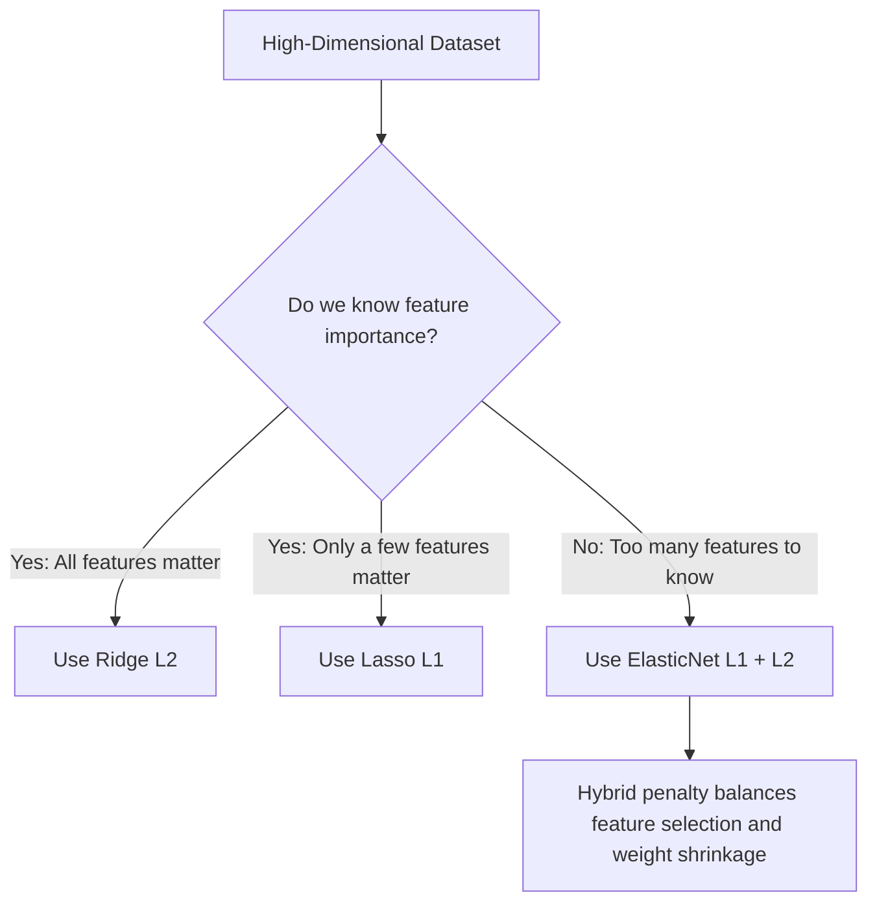

## ElasticNet Regression: Intuition, Mathematical Derivation, and Practical Guide

## 1. The Motivation for ElasticNet

In predictive modeling, we often encounter datasets with a large number of input features (high-dimensional data). Choosing the right regularization technique depends on our prior knowledge of feature importance:
*   **Ridge Regression (L2 Penalty)** shrinks weights close to zero but retains all features. This is ideal when almost all features are important.
*   **Lasso Regression (L1 Penalty)** forces unimportant feature weights to exactly zero, performing automatic **feature selection**. This is ideal when only a small subset of features are actually predictive.

### The Real-World Dilemma
In massive, real-world datasets (e.g., hundreds or thousands of features), we rarely know the true importance of each column beforehand. We cannot easily decide whether to apply Ridge or Lasso. 

**ElasticNet Regression** solves this dilemma by blending both L1 and L2 penalties. It allows the model to learn an optimal combination of both regularization types during training, adapting dynamically to the dataset's characteristics.



### Key Takeaways
*   **Ridge** is for keeping all features; **Lasso** is for sparse feature selection.
*   **ElasticNet** is a hybrid regularizer that is the ideal default choice for large, complex datasets where feature relationships are unknown.

---

## 2. Comparing Regularization Techniques (Ridge vs. Lasso vs. ElasticNet)

To understand ElasticNet, we must compare how these three algorithms handle coefficients:

| Property | Ridge Regression (L2) | Lasso Regression (L1) | ElasticNet Regression (L1 + L2) |
| :--- | :--- | :--- | :--- |
| **Penalty Type** | Quadratic (\\(\sum w_j^2\\)) | Linear (\\(\sum |w_j|\\)) | Combined (\\(\sum w_j^2\\) and \\(\sum |w_j|\\)) |
| **Coefficient Shrinkage** | Shrinks towards zero asymptotically (never exactly zero). | Shrinks to exactly zero. | Shrinks some to exactly zero, others close to zero. |
| **Feature Selection** | None (keeps all columns). | Automatic (retains only a subset). | Selective (retains groupings of useful columns). |
| **Handling Correlated Features** | Distributes weight across correlated features. | Randomly selects one correlated feature, setting others to zero. | Groups and retains correlated features together. |

### Key Takeaways
*   **Ridge** maintains all features but reduces variance.
*   **Lasso** selects a sparse subset of features but can be unstable with correlated inputs.
*   **ElasticNet** provides a robust compromise, combining feature selection with stable coefficient shrinkage.

---

## 3. Mathematical Formulation & Derivation from Scratch

Let us construct the complete loss function of **ElasticNet Regression** step-by-step from foundational principles.

### Step 1: The Ordinary Least Squares (OLS) Loss
Our starting point is the standard Mean Squared Error (MSE), which measures prediction error:
\\[\text{MSE} = \frac{1}{2n} \sum_{i=1}^{n} (y_i - \hat{y}_i)^2\\]

Where:
*   \\(n\\) is the number of training samples.
*   \\(y_i\\) is the actual target value for sample \\(i\\).
*   \\(\hat{y}_i\\) is the predicted value, defined by the linear combination of \\(p\\) features:
    \\[\hat{y}_i = w_0 + \sum_{j=1}^{p} w_j x_{ij}\\]
*   \\(w_0\\) is the intercept (bias).
*   \\(w_j\\) represents the coefficients (weights) for features \\(x_j\\).

### Step 2: The Individual Penalty Terms
1.  **L2 Penalty (Ridge)**: Encourages small weights by penalizing their squared magnitudes:
    \\[\Omega_{L2}(w) = \sum_{j=1}^{p} w_j^2\\]
2.  **L1 Penalty (Lasso)**: Encourages sparsity (zero weights) by penalizing their absolute magnitudes:
    \\[\Omega_{L1}(w) = \sum_{j=1}^{p} |w_j|\\]

### Step 3: Combining into the ElasticNet Objective
ElasticNet blends these three components using two independent coefficients, \\(a\\) and \\(b\\), to control the weight of each penalty:
\\[\text{Loss}_{\text{ElasticNet}} = \text{MSE} + a \cdot \Omega_{L2}(w) + b \cdot \Omega_{L1}(w)\\]

\\[\text{Loss}_{\text{ElasticNet}} = \frac{1}{2n} \sum_{i=1}^{n} (y_i - \hat{y}_i)^2 + a \sum_{j=1}^{p} w_j^2 + b \sum_{j=1}^{p} |w_j|\\]

Where:
*   \\(a \ge 0\\) is the L2 penalty multiplier.
*   \\(b \ge 0\\) is the L1 penalty multiplier.

---

### Step 4: Mapping to Scikit-Learn Parameters (\\(\alpha\\) and \\(\text{l1\_ratio}\\))
In scientific libraries like Python's `scikit-learn`, managing two independent coefficients (\\(a\\) and \\(b\\)) can be computationally inconvenient. Instead, the library re-parameterizes the equation using two main hyperparameters: **overall regularization strength** (\\(\alpha\\) or `alpha`) and **L1 weight ratio** (\\(\rho\\) or `l1_ratio`).

Let us derive this relationship mathematically. We define:
1.  **Overall Regularization Strength (\\(\alpha\\))**:
    \\[\alpha = a + b\\]
2.  **L1 Weight Ratio (\\(\rho\\))**:
    \\[\rho = \frac{a}{a+b}\\] 
    *(Note: In standard Scikit-Learn documentation, \\(\rho\\) represents the ratio of the L1 penalty. The lecture transcript denotes this parameter as \\(\text{L1\_ratio} = \frac{a}{a+b}\\). Let us write out the system of equations using the lecture's exact variables to solve for \\(a\\) and \\(b\\) from scratch).*

#### Solving the System of Equations
We have two equations with two unknowns (\\(a\\) and \\(b\\)):
1)  \\(a + b = \alpha\\)
2)  \\(\frac{a}{a+b} = \rho\\)

Substitute (1) into the denominator of (2):
\\[\frac{a}{\alpha} = \rho \implies a = \alpha \cdot \rho\\]

Now, substitute the expression for \\(a\\) back into (1):
\\[\alpha \cdot \rho + b = \alpha\\]
\\[b = \alpha - \alpha \cdot \rho\\]
\\[b = \alpha (1 - \rho)\\]

#### Re-writing the Regularized Loss Function
Substituting our solved values of \\(a\\) and \\(b\\) back into the original ElasticNet loss function:
\\[\text{Loss}_{\text{ElasticNet}} = \text{MSE} + \left( \alpha \cdot \rho \right) \sum_{j=1}^{p} |w_j| + \left( \frac{\alpha(1 - \rho)}{2} \right) \sum_{j=1}^{p} w_j^2\\]

*(Note: Scikit-learn scales the L2 term by \\(0.5\\) for gradient consistency.)*

#### Analyzing the \\(\text{l1\_ratio}\\) (\\(\rho\\)) Parameter:
*   **\\(\rho = 1\\)**: The L2 term cancels out (\\(1-1=0\\)). The loss simplifies to pure **Lasso Regression**.
*   **\\(\rho = 0\\)**: The L1 term cancels out. The loss simplifies to pure **Ridge Regression**.
*   **\\(0 < \rho < 1\\)**: The loss is a hybrid containing both L1 and L2 penalties. The default in scikit-learn is \\(\rho = 0.5\\), which splits the regularization weight equally.

### Key Takeaways
*   The ElasticNet loss function is: \\(\text{MSE} + a\sum w_j^2 + b\sum|w_j|\\).
*   Scikit-Learn re-parameterizes this with `alpha` (\\(\alpha = a+b\\)) and `l1_ratio` (\\(\rho = \frac{a}{a+b}\\)).
*   Setting `l1_ratio = 1` yields Lasso, while `l1_ratio = 0` yields Ridge.

---

## 4. The Multi-Collinearity Advantage

**Multi-collinearity** occurs when two or more input features in a dataset are highly correlated with each other (e.g., a person's Height and Weight, or Celsius and Fahrenheit temperatures). 

### How Lasso and Ridge Fail Under Multi-Collinearity:
1.  **Lasso's Failure**: If you have three highly correlated features, Lasso's L1 penalty will randomly select **one** feature to keep, and drive the other two coefficients to exactly zero. While this creates a sparse model, this random drop behavior makes the model highly unstable, hurts interpretation, and can discard valuable predictive information.
2.  **Ridge's Behavior**: Ridge retains all three features and distributes the weights among them. However, it cannot perform any feature selection to simplify the model.

### ElasticNet's "Grouping Effect"
ElasticNet solves this by leveraging the combined power of L1 and L2 penalties:
*   The **L2 penalty** forces highly correlated features to share weights and shrink together (the **grouping effect**).
*   The **L1 penalty** allows the entire group of correlated features to either be retained or discarded together.

This prevents the random dropping behavior of Lasso while maintaining the ability to simplify high-dimensional datasets.

```
Correlated Features: [Feature A, Feature B, Feature C]
  │
  ├─► LASSO: Randomly picks one (e.g., Feature B), drops others (A=0, C=0) -> Unstable!
  │
  ├─► RIDGE: Keeps all three, but cannot set any to zero (A=small, B=small, C=small) -> Complex!
  │
  └─► ELASTICNET: Groups them together. Shrinks or removes them as a collective unit -> Stable!
```

### Key Takeaways
*   **Multi-collinearity** causes Lasso to drop correlated variables randomly and unstably.
*   **ElasticNet** creates a **grouping effect**, ensuring correlated features are kept or discarded together, producing highly stable models.

---

## 5. Practical Python Implementation

Scikit-Learn provides a highly optimized implementation of ElasticNet via the `ElasticNet` class.

### 1. Simple Implementation using `ElasticNet`

```python
from sklearn.linear_model import ElasticNet
from sklearn.datasets import load_diabetes
from sklearn.model_selection import train_test_split
from sklearn.metrics import r2_score

# Load standard diabetes dataset (high-dimensional diagnostic measurements)
data = load_diabetes()
X, y = data.data, data.target

# Split data into training and test sets
X_train, X_test, y_train, y_test = train_test_split(X, y, test_size=0.2, random_state=42)

# Instantiate ElasticNet
# 'alpha' controls overall regularization (a + b)
# 'l1_ratio' controls L1 fraction (a / (a + b))
# By default, alpha=1.0 and l1_ratio=0.5
elastic_net = ElasticNet(alpha=0.01, l1_ratio=0.9, random_state=42)

# Fit the model
elastic_net.fit(X_train, y_train)

# Make predictions and evaluate
y_pred = elastic_net.predict(X_test)
print(f"ElasticNet R² Score: {r2_score(y_test, y_pred):.4f}")
print(f"Intercept (w_0): {elastic_net.intercept_:.4f}")
print(f"Number of non-zero coefficients: {sum(elastic_net.coef_ != 0)} / {X.shape}")
```

### 2. Alternative Implementation using SGDRegressor
For extremely large datasets where gradient descent is preferred, you can apply ElasticNet using `SGDRegressor` by setting the `penalty` parameter:

```python
from sklearn.linear_model import SGDRegressor

# SGDRegressor uses stochastic gradient descent
# Set penalty to 'elasticnet' to combine L1 and L2 penalties
sgd_regressor = SGDRegressor(penalty='elasticnet', alpha=0.01, l1_ratio=0.5, max_iter=1000, tol=1e-3)
sgd_regressor.fit(X_train, y_train)

y_pred_sgd = sgd_regressor.predict(X_test)
print(f"SGD ElasticNet R² Score: {r2_score(y_test, y_pred_sgd):.4f}")
```

> 💡 **Tip**: While both options are available in `scikit-learn`, the dedicated `ElasticNet` class is generally preferred because it is specifically optimized for coordinate descent, leading to faster convergence and greater numeric stability.

### Key Takeaways
*   `ElasticNet` in Scikit-Learn is optimized for coordinate descent and is preferred for standard regression tasks.
*   `SGDRegressor(penalty='elasticnet')` is useful for online learning or extremely large datasets that do not fit in memory.
*   Tuning `alpha` and `l1_ratio` via Grid Search (`GridSearchCV`) helps locate the optimal regularization mixture.
