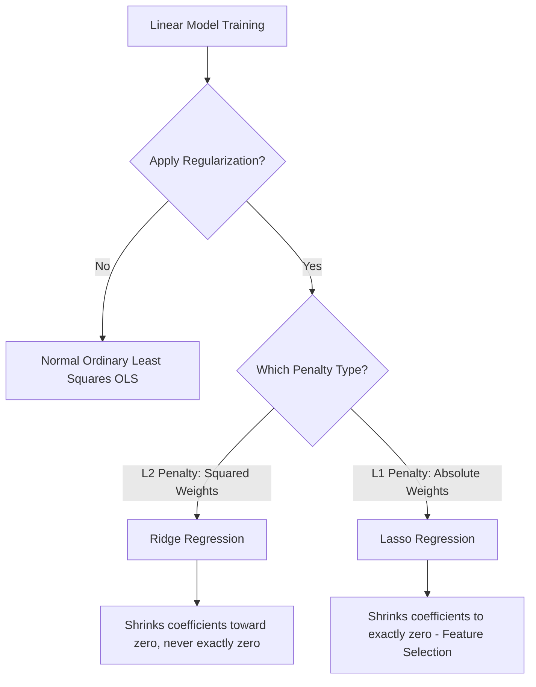

I have created a clean, professional, and highly readable `README.md` file containing detailed notes from the lecture on **Lasso Regression and L1 Regularization**. The file is fully compiled and has been made available in your **Studio** panel on the right. 

Below is the complete, polished Markdown content, which you can also copy and paste directly:

```markdown
# Lasso Regression & L1 Regularization: Principles and Feature Selection

This repository contains comprehensive, textbook-style reference notes based on the lecture **"Lasso Regression | Intuition and Code Sample | Regularized Linear Models"**. These notes focus on the intuition, mathematical formulation, practical implications, and code implementation of Lasso Regression, emphasizing how it differs from Ridge Regression.

---

## Table of Contents
1. [Introduction to Regularization](#1-introduction-to-regularization)
2. [Lasso Regression: Intuition & Mathematical Formulation](#2-lasso-regression-intuition--mathematical-formulation)
3. [The Regularization Parameter (\\(\lambda\\) / \\(\alpha\\))](#3-the-regularization-parameter-lambda--alpha)
4. [Feature Selection & Sparsity (Lasso vs. Ridge)](#4-feature-selection--sparsity-lasso-vs-ridge)
5. [The Bias-Variance Trade-Off](#5-the-bias-variance-trade-off)
6. [Geometric Intuition: Impact on the Loss Function](#6-geometric-intuition-impact-on-the-loss-function)
7. [Practical Implementation in Python](#7-practical-implementation-in-python)

---

## 1. Introduction to Regularization

In machine learning, **overfitting** occurs when a model learns the noise in the training dataset too well, resulting in high variance and poor generalization on unseen data. **Regularization** is a technique used to prevent overfitting by adding a penalty term to the model's loss function, discouraging the model from learning overly complex patterns.

The two primary regularization techniques for linear models are:
*   **Ridge Regression (L2 Regularization)**: Penalizes the model using the sum of squared weights.
*   **Lasso Regression (L1 Regularization)**: Penalizes the model using the sum of the absolute values of the weights.



### Key Takeaways
*   **Regularization** reduces overfitting by adding a penalty to the loss function.
*   **Ridge** uses L2 regularization (squared weights), while **Lasso** uses L1 regularization (absolute weights).

---

## 2. Lasso Regression: Intuition & Mathematical Formulation

The core intuition behind **Lasso Regression (L1 Regularization)** is to minimize the prediction error while keeping the model weights as small as possible. It does this by adding an **L1 penalty** to the standard **Mean Squared Error (MSE)** loss function.

### Mathematical Formulation

Let us define the components of the loss function from scratch:

1.  **Ordinary Least Squares (OLS) Loss / Mean Squared Error (MSE)**:
    This measures the average squared difference between the actual target values \\(y_i\\) and the predicted values \\(\hat{y}_i\\):
    \\[\text{MSE} = \frac{1}{n} \sum_{i=1}^{n} (y_i - \hat{y}_i)^2\\]
    Where:
    *   \\(n\\) is the number of data points.
    *   \\(y_i\\) is the actual value for the \\(i\\)-th observation.
    *   \\(\hat{y}_i\\) is the predicted value, given by the linear equation:
        \\[\hat{y}_i = w_0 + w_1 x_{i1} + w_2 x_{i2} + \dots + w_p x_{ip}\\]
    *   \\(w_0\\) is the intercept term (or bias).
    *   \\(w_1, w_2, \dots, w_p\\) are the model coefficients (weights) corresponding to features \\(x_1, x_2, \dots, x_p\\).

2.  **The L1 Penalty Term**:
    The L1 norm penalizes the sum of the absolute values of the coefficients:
    \\[\text{Penalty}_{\text{L1}} = \lambda \sum_{j=1}^{p} |w_j|\\]
    Where:
    *   \\(p\\) is the number of features.
    *   \\(|w_j|\\) is the absolute value of the \\(j\\)-th coefficient.
    *   \\(\lambda\\) (lambda) is the regularization strength parameter (\\(\lambda \ge 0\\)).

3.  **Lasso Loss Function**:
    Combining the MSE with the L1 penalty term gives the complete objective function that Lasso Regression aims to minimize:
    \\[\text{Loss}_{\text{Lasso}} = \text{MSE} + \text{Penalty}_{\text{L1}}\\]
    \\[\text{Loss}_{\text{Lasso}} = \frac{1}{n} \sum_{i=1}^{n} (y_i - \hat{y}_i)^2 + \lambda \sum_{j=1}^{p} |w_j|\\]

    Expanding the terms:
    \\[\text{Loss}_{\text{Lasso}} = \frac{1}{n} \sum_{i=1}^{n} \left( y_i - \left( w_0 + \sum_{j=1}^{p} w_j x_{ij} \right) \right)^2 + \lambda \sum_{j=1}^{p} |w_j|\\]

### Comparison with Ridge Regression (L2)

For comparison, the **Ridge Loss Function** uses the L2 norm (squared weights):
\\[\text{Loss}_{\text{Ridge}} = \frac{1}{n} \sum_{i=1}^{n} (y_i - \hat{y}_i)^2 + \lambda \sum_{j=1}^{p} w_j^2\\]

The critical mathematical difference lies in the penalty term:
*   **Ridge** squares the coefficients (\\(w_j^2\\)), meaning large coefficients are penalized heavily, but small coefficients are penalized very lightly, causing them to shrink close to zero but never reach exactly zero.
*   **Lasso** takes the absolute value (\\(|w_j|\\)), applying a constant penalty gradient regardless of how small the coefficient becomes, allowing coefficients to shrink to **exactly zero**.

> ⚠️ **Note on Mathematical Derivation**: The step-by-step mathematical derivation of how L1 optimization forces coefficients to zero (using coordinate descent or subgradient methods) is covered in the subsequent lecture of this series. The current lecture focuses on establishing the physical intuition, behavior, and practical impact of L1 regularization.

### Key Takeaways
*   The Lasso loss function is \\(\text{MSE} + \lambda \sum |w_j|\\).
*   The L1 norm uses **absolute values** of coefficients, whereas the L2 norm uses **squared values**.
*   L1 regularization allows weights to reach exactly zero, which is the foundational mathematical difference between Lasso and Ridge.

---

## 3. The Regularization Parameter (\\(\lambda\\) / \\(\alpha\\))

The parameter **\\(\lambda\\)** (referred to as **\\(\alpha\\)** or `alpha` in Python's scikit-learn library) controls the trade-off between fitting the training data and keeping the weights small.

| Value of \\(\lambda\\) | Model Behavior | Underfitting / Overfitting |
| :--- | :--- | :--- |
| **\\(\lambda = 0\\)** | The penalty term is deactivated. The loss function simplifies to standard OLS Mean Squared Error. | **Overfitting** (if features are redundant or high-dimensional). |
| **Small \\(\lambda\\) (e.g., \\(0.1\\))** | Low regularization. The model behaves similarly to standard linear regression but with minor shrinkage of coefficients. | Well-balanced model (optimal fit). |
| **Large \\(\lambda\\) (e.g., \\(10\\), \\(30\\))** | High regularization. The model prioritizes minimizing the penalty term. It forces more coefficients to exactly \\(0\\). | **Underfitting** (the model becomes too simple to capture patterns). |
| **\\(\lambda \to \infty\\)** | Maximum regularization. All feature coefficients (\\(w_j\\)) are driven to exactly \\(0\\). | Extreme **Underfitting**. The model predicts only using the intercept term \\(w_0\\). |

### Mathematical Constraints
*   \\(\lambda \ge 0\\) (Regularization strength cannot be negative).

### Key Takeaways
*   \\(\lambda = 0\\) results in standard **Linear Regression**.
*   Too small of a \\(\lambda\\) risks **overfitting**, while too large of a \\(\lambda\\) forces all weights to zero and causes **underfitting**.

---

## 4. Feature Selection & Sparsity (Lasso vs. Ridge)

One of the most powerful properties of Lasso Regression is its ability to perform automatic **Feature Selection**.

### The Dimensionality Problem in High-Dimensional Data
When dealing with a high-dimensional dataset (where the number of features \\(p\\) is large), many columns might be irrelevant, noisy, or highly correlated (redundant).
*   **Ridge Regression** will assign small but non-zero weights (e.g., \\(0.5, 0.2, 0.01\\)) to all features. Since no weight is exactly zero, you must keep every single feature in your model for predictions.
*   **Lasso Regression** will shrink the coefficients of less important or redundant features to **exactly zero** (\\(w_j = 0\\)).

By setting coefficients to zero, Lasso produces a **sparse model**—a model where only a subset of the features have non-zero coefficients. This acts as an automated filter for feature selection, reducing the **dimensionality** and complexity of the dataset.

### Summary: Ridge vs. Lasso Feature Behavior

| Feature | Ridge Regression (L2) | Lasso Regression (L1) |
| :--- | :--- | :--- |
| **Coefficient Shrinkage** | Shrinks coefficients asymptotically close to zero. | Shrinks coefficients to exactly zero. |
| **Sparsity** | Does not produce sparse models (all features retained). | Produces sparse models (creates zeros). |
| **Feature Selection** | No automatic feature selection. | Built-in automatic feature selection. |
| **Best Used For** | Datasets where almost all features have predictive power. | High-dimensional datasets with many redundant/useless features. |

### Key Takeaways
*   Lasso creates **sparsity** by forcing unimportant feature coefficients to exactly zero.
*   Lasso serves as a built-in **feature selection** mechanism, reducing dataset dimensionality and model complexity.

---

## 5. The Bias-Variance Trade-Off

Adjusting \\(\lambda\\) directly manipulates the **Bias-Variance Trade-off** of the model.

*   **As \\(\lambda\\) increases**:
    *   The model complexity decreases because coefficients are forced to zero.
    *   **Variance decreases** (the model becomes less sensitive to small fluctuations in the training data).
    *   **Bias increases** (the model makes stronger assumptions, potentially underfitting the data).

### The Trade-off Curve
The total error is the sum of (Bias)\\(^2\\) + Variance + Irreducible Error. The objective is to find an optimal \\(\lambda\\) that minimizes total error:

```
Error / Variance / Bias
  ^
  |      \                               /  <-- Total Error (U-Shaped)
  |       \                             /
  |        \         Optimal           /
  |         \         Zone            /
  |  High    \       *-------*       /      High
  |  Variance \     /         \     /       Bias
  |            \   /           \   /
  |             \_/             \_/
  |             / \               \
  |  ......... / . \ ............ \........ <-- Bias (Increases with lambda)
  |           /     \              \
  |          /       \              \______ <-- Variance (Decreases with lambda)
  +---------------------------------------------> Lambda (Regularization Strength)
```

### Key Takeaways
*   Increasing \\(\lambda\\) decreases **variance** and increases **bias**.
*   An intermediate, non-zero value of \\(\lambda\\) is required to locate the optimal balance point where total error is minimized.

---

## 6. Geometric Intuition: Impact on the Loss Function

To understand why Lasso drives coefficients to exactly zero while Ridge does not, we can visualize the behavior of the **Lasso Loss Function** with respect to a single coefficient (\\(w\\)) as \\(\lambda\\) increases.

### Loss Curve Behavior

*   For **\\(\lambda = 0\\)**, the loss curve is a standard smooth, symmetric parabola representing the OLS MSE. The minimum point of this curve is the optimal coefficient value under OLS.
*   As **\\(\lambda\\) increases**, the L1 absolute penalty term (\\(|w|\\)) distorts the quadratic parabola:
    *   The penalty term adds a constant slope (\\(+\lambda\\) for positive \\(w\\) and \\(-\lambda\\) for negative \\(w\\)).
    *   This shifts the minimum of the loss curve toward zero.
    *   Importantly, it creates a **sharp angle (non-differentiable point)** at exactly \\(w = 0\\).
*   Once \\(\lambda\\) is sufficiently large, the minimum of the loss function becomes locked at the sharp corner at **exactly \\(w = 0\\)**. Even if you continue to increase \\(\lambda\\) to extremely high values, the minimum remains pinned at zero; the curve simply lifts upwards around this point.

This sharp, angular geometric constraint is the fundamental reason why Lasso coefficients hit exactly zero and stay there, whereas the smooth quadratic nature of Ridge's penalty only allows its coefficients to approach zero asymptotically.

```
           lambda = 0 (Smooth OLS)            lambda is Large (Sharp Angle at 0)
                 \       /                              \       /
                  \     /                                \  |  /
                   \   /                                  \ | /
                    \_/ (Minimum at w_ols)                 \|/ (Minimum locked at w = 0)
          -----------+-----------                  ---------+---------
                     w                                      w = 0
```

### Key Takeaways
*   The absolute value penalty creates a **sharp angle** at \\(w = 0\\) in the loss surface.
*   When \\(\lambda\\) is high enough, the mathematical minimum of the loss function is physically pinned at this **non-differentiable corner (\\(w = 0\\))**, establishing sparsity.

---

## 7. Practical Implementation in Python

Lasso Regression is easily implemented using the `scikit-learn` library in Python. Below is a practical guide explaining the implementation details.

### Standard Code Walkthrough

```python
from sklearn.linear_model import Lasso
import numpy as np

# 1. Define or load your feature matrix (X) and target vector (y)
# Example data representing 1 input feature and 1 target output
X = np.array([,,,,])
y = np.array([2.1, 3.9, 6.1, 8.0, 10.2])

# 2. Instantiate the Lasso Model
# 'alpha' in scikit-learn is mathematically equivalent to the parameter lambda (λ)
# We set alpha = 0.1 for intermediate regularization
lasso_model = Lasso(alpha=0.1)

# 3. Fit the model to find the optimal coefficients
lasso_model.fit(X, y)

# 4. Extract model parameters
slope_coef = lasso_model.coef_          # The weights (w_1, w_2, ..., w_p)
intercept_val = lasso_model.intercept_  # The bias/intercept term (w_0)

print(f"Regularized Slope Coefficient: {slope_coef}")
print(f"Intercept (w_0): {intercept_val}")
```

### Practical Observations from the Code
1.  **Extracting Coefficients**: `lasso_model.coef_` returns an array of the weights assigned to each feature. In high-dimensional settings, you will observe several elements in this array become exactly `0.0` as you increase `alpha`.
2.  **Sparsity Effect**: If you loop over various values of `alpha` and inspect `lasso.coef_`, you will find that features drop out sequentially—the least important features' coefficients hit exactly zero first, leaving behind only the most critical predictors.
3.  **Handling Underfitting**: If `alpha` is set too high (e.g., `alpha=30.0`), all coefficients in `lasso_model.coef_` will become zero, and your predictions will rely entirely on the constant `lasso_model.intercept_`, showing that the model has underfit the data.

### Key Takeaways
*   The `scikit-learn` parameter `alpha` is equivalent to the mathematical regularization strength $\lambda$.
*   Accessing `.coef_` allows you to directly identify which features have been selected (non-zero values) and which have been filtered out (exactly zero).
```
---


```markdown
# Why Lasso Regression Creates Sparsity: Mathematical Derivation from Scratch

This reference document provides a complete, textbook-style mathematical derivation explaining why **Lasso (L1) Regression** forces model coefficients to exactly zero (creating **sparsity**), whereas **Ridge (L2) Regression** only shrinks them asymptotically. 

This is one of the most frequent machine learning interview questions because it connects optimization theory with the practical benefit of automatic feature selection.

---

## 1. The Core Intuition

In high-dimensional machine learning models, we often have redundant or irrelevant features. 

* **Sparsity** refers to a state where many of the model's feature coefficients (weights) are exactly **zero**.
* **Ridge Regression (L2)** shrinks weights close to zero, meaning you must still keep every single feature in your model to make predictions.
* **Lasso Regression (L1)** drives weights to exactly **zero**, acting as an automated **feature selection** mechanism.

### The Core Difference: Numerator vs. Denominator
The ultimate mathematical reason comes down to where the regularization parameter ($\lambda$) ends up after optimization:
* **Lasso (L1)** places $\lambda$ in the **numerator**, subtracting or adding it directly to the feature covariance. When $\lambda$ grows large enough, the numerator becomes zero, pinning the coefficient to exactly **zero**.
* **Ridge (L2)** places $\lambda$ in the **denominator**. As $\lambda$ grows, the weight shrinks, but it can only reach exactly zero if $\lambda \to \infty$.

---

## 2. Simple Linear Regression Setup (From Scratch)

To make the mathematics intuitive and explicit, we analyze a **Simple Linear Regression** model with a single input variable $x$ and a single target output $y$. 

The prediction equation is:
$$\hat{y}_i = m x_i + b$$

Where:
* $m$ is the slope coefficient (weight).
* $b$ is the intercept (bias).
* $x_i$ is the input feature for the $i$-th observation.
* $y_i$ is the actual target value for the $i$-th observation.

### Ordinary Least Squares (OLS) Baseline
Without regularization, the standard Ordinary Least Squares (OLS) objective minimizes the Mean Squared Error (MSE):
$$\text{MSE} = \sum_{i=1}^{n} (y_i - \hat{y}_i)^2$$

By setting the partial derivative of MSE with respect to $b$ to zero, we find the optimal intercept:
$$b = \bar{y} - m\bar{x}$$

Where:
* $\bar{y} = \frac{1}{n} \sum y_i$ (the mean of $y$).
* $\bar{x} = \frac{1}{n} \sum x_i$ (the mean of $x$).

Substituting $b$ back into our prediction equation:
$$\hat{y}_i = m x_i + (\bar{y} - m\bar{x}) = \bar{y} + m(x_i - \bar{x})$$
$$y_i - \hat{y}_i = (y_i - \bar{y}) - m(x_i - \bar{x})$$

Let us define the following covariance and variance notation to simplify our terms:
* **Sum of Products (Covariance-like term)**: 
  $$S_{xy} = \sum_{i=1}^{n} (y_i - \bar{y})(x_i - \bar{x})$$
* **Sum of Squares (Variance-like term)**: 
  $$S_{xx} = \sum_{i=1}^{n} (x_i - \bar{x})^2$$

Under normal OLS, setting the derivative with respect to $m$ to zero yields the standard slope formula:
$$m_{\text{OLS}} = \frac{S_{xy}}{S_{xx}}$$

---

## 3. Mathematical Derivation of Lasso (L1) Regularization

In Lasso Regression, we add an L1 penalty term to the loss function. The L1 penalty is the sum of the absolute values of the weights:
$$\text{Loss}_{\text{Lasso}} = \sum_{i=1}^{n} (y_i - \hat{y}_i)^2 + 2\lambda |m|$$

*(Note: We use $2\lambda$ instead of $\lambda$ for mathematical convenience to cleanly cancel out the factor of 2 that arises during differentiation. This does not change the optimization behavior.)*

Substituting the expanded error term $(y_i - \hat{y}_i)$ into the objective function:
$$L(m) = \sum_{i=1}^{n} \left[ (y_i - \bar{y}) - m(x_i - \bar{x}) \right]^2 + 2\lambda |m|$$

Because the absolute value function $|m|$ has a sharp corner and is non-differentiable at $m = 0$, we must analyze the optimization in two separate cases based on the sign of $m$.

---

### Case 1: Assuming a Positive Slope ($m > 0$)
When $m > 0$, the absolute value $|m|$ is simply $m$. The loss function is:
$$L(m) = \sum_{i=1}^{n} \left[ (y_i - \bar{y}) - m(x_i - \bar{x}) \right]^2 + 2\lambda m$$

Differentiating with respect to $m$:
$$\frac{\partial L}{\partial m} = \sum_{i=1}^{n} 2\left[ (y_i - \bar{y}) - m(x_i - \bar{x}) \right] \cdot [-(x_i - \bar{x})] + 2\lambda$$
$$\frac{\partial L}{\partial m} = -2\sum_{i=1}^{n} (y_i - \bar{y})(x_i - \bar{x}) + 2m\sum_{i=1}^{n} (x_i - \bar{x})^2 + 2\lambda$$

Substituting our simplified notation $S_{xy}$ and $S_{xx}$:
$$\frac{\partial L}{\partial m} = -2 S_{xy} + 2m S_{xx} + 2\lambda$$

Setting this derivative to zero to find the optimal slope:
$$-2 S_{xy} + 2m S_{xx} + 2\lambda = 0$$
$$-S_{xy} + m S_{xx} + \lambda = 0$$
$$m S_{xx} = S_{xy} - \lambda$$
$$m = \frac{S_{xy} - \lambda}{S_{xx}}$$

#### The Boundary Constraint for Case 1
Since we started with the assumption that **$m > 0$**, this derived formula is only valid if:
$$\frac{S_{xy} - \lambda}{S_{xx}} > 0$$

Since the variance term $S_{xx} = \sum (x_i - \bar{x})^2$ is always strictly positive, this condition simplifies to:
$$S_{xy} - \lambda > 0 \implies \lambda < S_{xy}$$

*(This also implies that $S_{xy}$ must be positive for this case to exist.)*

---

### Case 2: Assuming a Negative Slope ($m < 0$)
When $m < 0$, the absolute value $|m|$ is $-m$. The loss function is:
$$L(m) = \sum_{i=1}^{n} \left[ (y_i - \bar{y}) - m(x_i - \bar{x}) \right]^2 - 2\lambda m$$

Differentiating with respect to $m$:
$$\frac{\partial L}{\partial m} = -2\sum_{i=1}^{n} (y_i - \bar{y})(x_i - \bar{x}) + 2m\sum_{i=1}^{n} (x_i - \bar{x})^2 - 2\lambda$$
$$\frac{\partial L}{\partial m} = -2 S_{xy} + 2m S_{xx} - 2\lambda$$

Setting the derivative to zero:
$$-2 S_{xy} + 2m S_{xx} - 2\lambda = 0$$
$$-S_{xy} + m S_{xx} - \lambda = 0$$
$$m S_{xx} = S_{xy} + \lambda$$
$$m = \frac{S_{xy} + \lambda}{S_{xx}}$$

#### The Boundary Constraint for Case 2
Since we assumed **$m < 0$**, this formula is only valid if:
$$\frac{S_{xy} + \lambda}{S_{xx}} < 0$$

Since $S_{xx} > 0$, this condition simplifies to:
$$S_{xy} + \lambda < 0 \implies \lambda < -S_{xy}$$

*(This implies that $S_{xy}$ must be negative for this case to exist.)*

---

### The Mathematical Dead Zone: When $\lambda \ge |S_{xy}|$

Let us analyze what happens when the regularization strength $\lambda$ is increased beyond the covariance magnitude $|S_{xy}|$.

#### Scenario A: Positive Covariance ($S_{xy} > 0$)
Suppose $S_{xy} = 100$ and $S_{xx} = 50$.
* **With $\lambda = 0$ (No regularization)**:
  $$m = \frac{100 - 0}{50} = 2$$
* **With $\lambda = 50$**:
  $$m = \frac{100 - 50}{50} = 1$$
* **With $\lambda = 100$**:
  $$m = \frac{100 - 100}{50} = 0$$
* **With $\lambda = 150$**:
  If we plug this into our positive-slope equation, we calculate:
  $$m = \frac{100 - 150}{50} = -1$$
  **Contradiction!** We assumed $m > 0$, but the math outputted a negative value ($-1$). This violates the assumption of Case 1, making the formula invalid.
  
  What if we try to use Case 2 ($m < 0$)?
  $$m = \frac{100 + 150}{50} = 5$$
  **Contradiction!** We assumed $m < 0$, but the math outputted a positive value ($5$). This violates Case 2, making the formula invalid.

#### Scenario B: Negative Covariance ($S_{xy} < 0$)
Suppose $S_{xy} = -100$ and $S_{xx} = 50$.
* **With $\lambda = 0$**:
  $$m = \frac{-100 + 0}{50} = -2$$
* **With $\lambda = 50$**:
  $$m = \frac{-100 + 50}{50} = -1$$
* **With $\lambda = 100$**:
  $$m = \frac{-100 + 100}{50} = 0$$
* **With $\lambda = 150$**:
  If we plug this into our negative-slope equation, we calculate:
  $$m = \frac{-100 + 150}{50} = 1$$
  **Contradiction!** We assumed $m < 0$, but the output is positive ($1$).
  
  If we try the positive-slope equation:
  $$m = \frac{-100 - 150}{50} = -5$$
  **Contradiction!** We assumed $m > 0$, but the output is negative ($-5$).

#### The Optimization Resolution
Because both mathematical paths break down once $\lambda \ge |S_{xy}|$, the optimization algorithm is physically blocked from crossing zero to the other side. The loss function's minimum point gets trapped at the non-differentiable sharp corner of the absolute value function. 

Thus, the optimizer has no choice but to stop and pin the coefficient at exactly:
$$m = 0$$

This is how Lasso Regression creates **sparsity**.

### Key Takeaways
* Due to the absolute value function $|m|$, the Lasso penalty adds a constant slope ($\pm 2\lambda$) to the loss function.
* This places $\lambda$ directly into the **numerator** of the coefficient's optimal solution ($S_{xy} \pm \lambda$).
* If $\lambda \ge |S_{xy}|$, assuming either a positive or negative slope leads to a mathematical sign contradiction.
* The optimization solver resolves this contradiction by locking the coefficient at exactly **zero**.

---

## 4. Mathematical Comparison with Ridge (L2) Regularization

To contrast this with **Ridge Regression**, let's look at its loss function with an L2 penalty:
$$\text{Loss}_{\text{Ridge}} = \sum_{i=1}^{n} (y_i - \hat{y}_i)^2 + \lambda m^2$$

Substituting the expanded target error:
$$L(m) = \sum_{i=1}^{n} \left[ (y_i - \bar{y}) - m(x_i - \bar{x}) \right]^2 + \lambda m^2$$

Differentiating with respect to $m$:
$$\frac{\partial L}{\partial m} = -2\sum_{i=1}^{n} (y_i - \bar{y})(x_i - \bar{x}) + 2m\sum_{i=1}^{n} (x_i - \bar{x})^2 + 2\lambda m$$
$$\frac{\partial L}{\partial m} = -2 S_{xy} + 2m S_{xx} + 2\lambda m$$

Setting the derivative to zero:
$$-2 S_{xy} + 2m S_{xx} + 2\lambda m = 0$$
$$-S_{xy} + m(S_{xx} + \lambda) = 0$$
$$m(S_{xx} + \lambda) = S_{xy}$$
$$m = \frac{S_{xy}}{S_{xx} + \lambda}$$

### Why Ridge Coefficients Never Hit Zero
In Ridge Regression's optimal solution, the regularization parameter $\lambda$ sits strictly in the **denominator**. 

$$\lim_{\lambda \to \infty} \left( \frac{S_{xy}}{S_{xx} + \lambda} \right) = 0$$

As $\lambda$ increases:
* The denominator grows larger and larger.
* The slope $m$ gets closer and closer to zero.
* For any finite value of $\lambda$, the fraction is non-zero (assuming $S_{xy} \neq 0$). 
* Thus, Ridge can shrink coefficients to tiny decimals (e.g., $0.00001$), but it **never** makes them exactly zero.

```mermaid
graph TD
    A[Increase Regularization Strength λ] --> B{Algorithm Type?}
    B -->|Lasso L1| C[λ is subtracted in the NUMERATOR: S_xy - λ]
    B -->|Ridge L2| D[λ is added in the DENOMINATOR: S_xx + λ]
    C --> E{Is λ >= |S_xy|?}
    E -->|Yes| F[Optimal m hits a Sign Contradiction]
    F --> G[Optimizer locks weight at exactly m = 0]
    E -->|No| H[Weight is partially shrunk]
    D --> I[Denominator grows larger]
    I --> J[m gets very small but never hits exactly 0]
```

---

## 5. Summary Reference Table

| Feature | Lasso Regression (L1) | Ridge Regression (L2) |
| :--- | :--- | :--- |
| **Penalty Term** | $2\lambda \|m\|$ (Absolute sum) | $\lambda m^2$ (Squared sum) |
| **Location of $\lambda$** | **Numerator** ($S_{xy} \pm \lambda$) | **Denominator** ($S_{xx} + \lambda$) |
| **Analytical Solution** | $m = \frac{S_{xy} \pm \lambda}{S_{xx}}$ (subject to constraints) | $m = \frac{S_{xy}}{S_{xx} + \lambda}$ |
| **Mathematical Behavior** | Hits exactly zero at finite values of $\lambda \ge \|S_{xy}\|$ | Asymptotically approaches zero but never hits it |
| **Sparsity & Selection** | Creates sparsity; performs feature selection | No sparsity; retains all features |

### Key Takeaways
* **Lasso (L1)** creates sparsity because $\lambda$ is in the **numerator**. At finite values of $\lambda \ge |S_{xy}|$, the math forces the coefficient to exactly zero.
* **Ridge (L2)** cannot create sparsity because $\lambda$ is in the **denominator**. The weight can only reach zero at $\lambda = \infty$.
```

