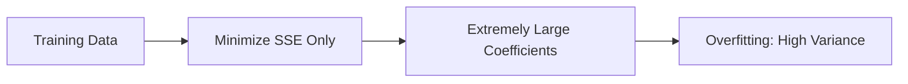
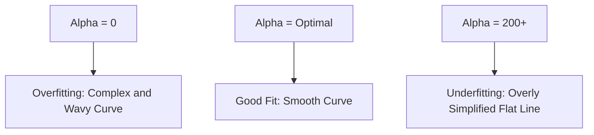

Video Link: https://www.youtube.com/watch?v=aEow1QoTLo0&list=PLKnIA16_Rmvbr7zKYQuBfsVkjoLcJgxHH&index=63

---

# Ridge Regression: Geometric Intuition and Implementation

**Ridge Regression**, also known as **L2 Regularization**, is a technique used to improve the generalization of linear models by reducing **overfitting**. By adding a penalty to the size of the model coefficients, it prevents the model from becoming overly complex and sensitive to noise in the training data.


## 1. What is Regularization?

**Regularization** is a technique used to "induce" extra information into a machine learning model to prevent it from fitting the training data too closely. It is primarily used to address the **Bias-Variance Trade-off** by slightly increasing bias to significantly decrease variance.

### **Main Types of Regularization**
*   **Ridge Regression (L2):** Adds a penalty based on the square of the coefficients.
*   **Lasso Regression (L1):** Adds a penalty based on the absolute value of the coefficients.
*   **Elastic Net:** A combination of both L1 and L2 regularization.

> [!TIP]
> **Key Takeaways**
> *   Regularization is the primary tool for fighting **Overfitting**.
> *   It works by adding a **Penalty Term** to the standard loss function.


## 2. The Problem: Overfitting in Linear Regression

In standard **Linear Regression**, the goal is to find the best-fit line $y = mx + b$ by minimizing the **Sum of Squared Errors (SSE)**.

### **The Mechanism of Overfitting**
When a dataset is small or has many features, a linear model might try to pass through every single training point to achieve zero error. To do this, the **slope ($m$)** or coefficients often become **extremely large (infinite in theory)**. While this model performs perfectly on training data, it fails to generalize to new, unseen testing data.



> [!TIP]
> **Key Takeaways**
> *   **Overfitting** happens when the model is too complex and captures noise as if it were a pattern.
> *   Large coefficients are a "red flag" for an overfitted linear model.


## 3. Ridge Regression: The Solution

**Ridge Regression** modifies the standard loss function by adding a penalty proportional to the **square of the coefficients**.

### **The Modified Loss Function**
The new objective is to minimize the following equation:
$$\text{Loss} = \sum(y_i - \hat{y}_i)^2 + \lambda \sum w^2$$

*   **$\sum(y_i - \hat{y}_i)^2$:** The standard Sum of Squared Errors (SSE).
*   **$\lambda$ (Lambda):** A **Hyperparameter** that controls the strength of the penalty.
*   **$\sum w^2$:** The sum of the squares of the coefficients (slopes).

### **The Intuition**
Imagine two possible lines for your data. Line A has a very low SSE but a massive slope. Line B has a slightly higher SSE but a much smaller, more stable slope. **Ridge Regression** will choose Line B because the penalty term makes the "cost" of Line A's large slope too high.


## 4. The Role of the Hyperparameter ($\lambda$)

The value of **$\lambda$** (referred to as `alpha` in Scikit-Learn) determines how much you want to penalize the model's complexity.

| $\lambda$ Value | Effect on Model | Result |
| :--- | :--- | :--- |
| **$\lambda = 0$** | Penalty is nullified. | Equivalent to **Standard Linear Regression**. |
| **Small $\lambda$** | Mild penalty on coefficients. | Reduced overfitting while maintaining accuracy. |
| **Large $\lambda$** | Heavy penalty on coefficients. | Coefficients shrink toward zero; leads to **Underfitting**. |
| **$\lambda = \infty$** | Penalty is absolute. | All coefficients become zero; the model becomes a flat line. |

> [!TIP]
> **Key Takeaways**
> *   $\lambda$ is a **Hyperparameter**; it must be tuned using techniques like cross-validation.
> *   As $\lambda$ increases, the model complexity decreases.


## 5. Practical Implementation (Scikit-Learn)

In `sklearn`, the hyperparameter $\lambda$ is implemented as the parameter `alpha`.

### **Basic Workflow**
```python
from sklearn.linear_model import Ridge
from sklearn.metrics import r2_score

# 1. Initialize the model with a specific alpha (lambda)
# alpha=0 is standard Linear Regression
ridge = Ridge(alpha=1.0) 

# 2. Fit the model to the training data
ridge.fit(X_train, y_train)

# 3. Predict and evaluate
y_pred = ridge.predict(X_test)
print("R2 Score:", r2_score(y_test, y_pred))
```

### **Observations**
*   **Coefficients:** When comparing `Ridge.coef_` to `LinearRegression.coef_`, you will notice that the Ridge coefficients are smaller in magnitude.
*   **Performance:** Ridge Regression often provides a slightly higher **R2 score** on the test set compared to standard linear regression, even if its training score is slightly lower.


## 6. Visualization: The Effect of Alpha



*   **Alpha = 0:** The model tries to capture every point, resulting in a high-variance, overfitted curve.
*   **Alpha = 200:** The model ignores the data's patterns entirely, resulting in a low-variance, underfitted straight line.
*   **The Goal:** Find the alpha that captures the general trend without being distracted by individual outliers.

> [!IMPORTANT]
> **Final Takeaway:** Ridge Regression is an essential "safety net" for linear models. It ensures that your model remains simple enough to work on new data by keeping the coefficients under control.
