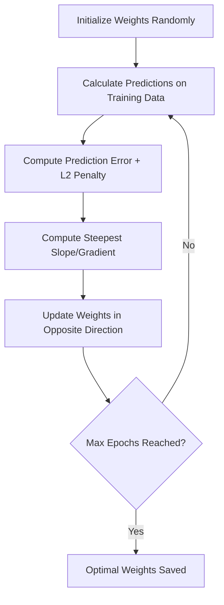

# Ridge Regression via Gradient Descent: Mathematical Formulation & Implementation

**Ridge Regression** is a regularized linear model that addresses overfitting by adding a penalty proportional to the sum of squared weights (\\(L2\\) Regularization). While Ridge Regression can be solved analytically using the closed-form **Ordinary Least Squares (OLS)** equation, it is often optimized iteratively using **Gradient Descent**. This iterative approach is highly scalable and forms the foundation of optimization in deep learning.

---

## 1. Conceptual Intuition

Standard linear regression optimizes parameters by minimizing only the prediction error on the training data. This can lead to massive coefficients that overfit to noise. 

By adding a penalty to the size of the weights, **Ridge Regression** forces the model to choose smaller, more stable weights. This slightly increases training bias but dramatically reduces variance on unseen data. **Gradient Descent** solves this regularized objective by starting with random parameter values and iteratively taking steps down the steepest slope of the error surface until it reaches the lowest point (minimum loss).



### **Why use Gradient Descent over OLS?**
*   **Dimensionality Scaling:** Calculating the matrix inverse in OLS scales cubically (\\(O(n^3)\\)), which is computationally prohibitive for datasets with thousands of features.
*   **Memory Efficiency:** Gradient descent updates weights iteratively and can process data in batches, removing the need to load massive matrices entirely into RAM.

> [!TIP]
> **Key Takeaways**
> *   Gradient Descent iteratively minimizes the regularized loss function.
> *   It works by repeatedly shifting weights in the opposite direction of the calculated gradient.
> *   It is computationally superior to the closed-form solution when handling high-dimensional datasets.

---

## 2. Mathematical Formulation & Derivation from Scratch

To optimize Ridge Regression using Gradient Descent, we must derive the gradient of the regularized loss function with respect to our weight parameters.

### **Term Definitions**
Before deriving, let us define our multi-dimensional matrices:
*   **\\(X\\) (Design/Feature Matrix):** An \\(m \times (n+1)\\) matrix containing our input features. Crucially, the first column contains all \\(1\\)s to represent the constant multiplier for the intercept term \\(w_0\\).
    \\[X = \begin{bmatrix} 1 & x_{11} & x_{12} & \dots & x_{1n} \\ 1 & x_{21} & x_{22} & \dots & x_{2n} \\ \vdots & \vdots & \vdots & \ddots & \vdots \\ 1 & x_{m1} & x_{m2} & \dots & x_{mn} \end{bmatrix}\\]
*   **\\(W\\) (Weight Vector):** An \\((n+1) \times 1\\) matrix of our parameters:
    \\[W = \begin{bmatrix} w_0 \\ w_1 \\ \vdots \\ w_n \end{bmatrix}\\]
*   **\\(Y\\) (Target Vector):** An \\(m \times 1\\) matrix of actual ground-truth labels:
    \\[Y = \begin{bmatrix} y_1 \\ y_2 \\ \vdots \\ y_m \end{bmatrix}\\]
*   **\\(\lambda\\) (Regularization Parameter):** A positive scalar hyperparameter controlling the strength of the \\(L2\\) weight penalty.

---

### **Step 1: Define the Vectorized Loss Function**
The standard linear regression loss function in vectorized form is written as:
\\[L_{Standard} = \frac{1}{2} (XW - Y)^T (XW - Y)\\]

To perform L2 regularization, we add the sum of the squared weights (\\(W^T W\\)) penalized by our hyperparameter \\(\lambda\\). For mathematical convenience during differentiation, we multiply both terms by \\(\frac{1}{2}\\):
\\[L(W) = \frac{1}{2} (XW - Y)^T (XW - Y) + \frac{1}{2} \lambda W^T W\\]

---

### **Step 2: Expand the Loss Function**
To easily differentiate, we expand the transpose of our prediction error term, noting that \\((XW - Y)^T = (W^T X^T - Y^T)\\):
\\[L(W) = \frac{1}{2} (W^T X^T - Y^T)(XW - Y) + \frac{1}{2} \lambda W^T W\\]

Multiplying the terms out:
\\[L(W) = \frac{1}{2} [W^T X^T X W - W^T X^T Y - Y^T X W + Y^T Y] + \frac{1}{2} \lambda W^T W\\]

Since \\(W^T X^T Y\\) is a scalar (\\(1 \times 1\\)), it is equal to its own transpose \\((W^T X^T Y)^T = Y^T X W\\). We can group these symmetric terms together:
\\[L(W) = \frac{1}{2} [W^T X^T X W - 2 W^T X^T Y + Y^T Y] + \frac{1}{2} \lambda W^T W\\]

---

### **Step 3: Differentiate with Respect to the Weight Vector \\(W\\)**
We take the partial derivative of the expanded loss function with respect to our vector \\(W\\):
\\[\frac{\partial L}{\partial W} = \frac{\partial}{\partial W} \left( \frac{1}{2} [W^T X^T X W - 2 W^T X^T Y + Y^T Y] + \frac{1}{2} \lambda W^T W \right)\\]

Applying matrix calculus derivative rules:
1.  \\(\frac{\partial}{\partial W} (W^T A W) = 2 A W\\) (for a symmetric matrix \\(A = X^T X\\))
2.  \\(\frac{\partial}{\partial W} (2 W^T B) = 2 B\\) (where \\(B = X^T Y\\))
3.  \\(\frac{\partial}{\partial W} (Y^T Y) = 0\\) (constant with respect to \\(W\\))
4.  \\(\frac{\partial}{\partial W} (W^T W) = 2 W\\)

Substituting these back into the equation:
\\[\frac{\partial L}{\partial W} = \frac{1}{2} [2 X^T X W - 2 X^T Y] + \frac{1}{2} (2 \lambda W)\\]

Simplifying by canceling out the constants:
\\[\frac{\partial L}{\partial W} = X^T X W - X^T Y + \lambda W\\]

This final expression represents our **gradient**:
\\[\nabla_W L = X^T (XW - Y) + \lambda W\\]

> [!TIP]
> **Key Takeaways**
> *   Applying a \\(\frac{1}{2}\\) multiplier simplifies the constants during differentiation.
> *   The gradient combines standard prediction error \\(X^T(XW - Y)\\) with the regularized penalty \\(\lambda W\\).

---

## 3. The Gradient Descent Update Rule

In Gradient Descent, parameters are updated iteratively by subtracting the gradient scaled by a **learning rate** (\\(\eta\\)). 

### **The Parameter Update Formula**
For a single parameter, the update is:
\\[w_{j}^{(new)} = w_{j}^{(old)} - \eta \frac{\partial L}{\partial w_j}\\]

To update all weights simultaneously in a vectorized operation, we use:
\\[W_{new} = W_{old} - \eta \nabla_W L\\]

Substituting our derived gradient into the update equation yields the final Ridge update rule:
\\[W_{new} = W_{old} - \eta [X^T (XW_{old} - Y) + \lambda W_{old}]\\]

---

### **Parametric Visualization**

```
   Iterative Parameter Adjustment:
   
   W_old ========> [ Calculate Gradient ] ========> W_new = W_old - η * Gradient
                         |
                         v
                [ Shrinks weights ]
```

> [!TIP]
> **Key Takeaways**
> *   All weights (including the intercept in vectorized representations) are adjusted concurrently.
> *   \\(\eta\\) acts as a scaling factor, keeping step sizes controlled to prevent divergence.

---

## 4. Vectorized Implementation from Scratch (NumPy)

Below is a complete, custom implementation of Ridge Regression using Gradient Descent, written in Python using `NumPy`.

```python
import numpy as np

class MyRidgeGD:
    def __init__(self, epochs=500, learning_rate=0.005, alpha=0.001):
        self.epochs = epochs
        self.lr = learning_rate
        self.alpha = alpha  # regularizer (lambda)
        self.theta = None   # represents our weight vector W
        self.coef_ = None
        self.intercept_ = None

    def fit(self, X_train, y_train):
        # 1. Transform features: add a column of 1s at index 0
        X_design = np.insert(X_train, 0, 1, axis=1)
        
        # 2. Initialize weights (theta) to zeros (shape: 1 + number of features)
        self.theta = np.zeros(X_design.shape)
        
        # 3. Iterative optimization loop
        for epoch in range(self.epochs):
            # Calculate predictions: X * W
            y_hat = np.dot(X_design, self.theta)
            
            # Compute Gradient: X^T * (y_hat - y) + lambda * W
            gradient = np.dot(X_design.T, (y_hat - y_train)) + self.alpha * self.theta
            
            # Update the weight vector
            self.theta = self.theta - (self.lr * gradient)
            
        # 4. Extract intercept and coefficient parameters
        self.intercept_ = self.theta
        self.coef_ = self.theta[1:]

    def predict(self, X_test):
        return np.dot(X_test, self.coef_) + self.intercept_
```

### **Code Explanation**
*   **`np.insert`:** Preprocesses the input feature matrix by inserting a column of \\(1\\)s at the start, establishing a unified matrix \\(X\\) that calculates the intercept together with features.
*   **`self.theta`:** Represents our combined weight vector \\(W\\).
*   **`gradient`:** Calculates the vector derivative of the objective function. It calculates standard error residuals using `y_hat - y_train` and adds the penalty `self.alpha * self.theta`.

> [!TIP]
> **Key Takeaways**
> *   Vectorized calculations using `np.dot` allow Python to compute the entire gradient step across all samples in one matrix calculation.
> *   Initializing parameters with zeros provides a clean baseline for descent optimization.

---

## 5. Implementation with Scikit-Learn

For production workflows, you can utilize Scikit-Learn’s built-in regularized gradient descent models.

### **1. Using `SGDRegressor`**
`SGDRegressor` implements stochastic gradient descent, meaning it updates weights row-by-row or in mini-batches, which is optimal for massive streaming datasets.
```python
from sklearn.linear_model import SGDRegressor

# penalty='l2' configures the model to apply Ridge regularization
# alpha acts as our regularization multiplier (lambda)
sgd = SGDRegressor(penalty='l2', alpha=0.01, max_iter=500, learning_rate='constant', eta0=0.005)
sgd.fit(X_train, y_train)
```

### **2. Using the `Ridge` Class with Solvers**
You can also run batch gradient descent with Scikit-Learn’s standard `Ridge` class by specifying iterative gradient-based solvers like `sag` (Stochastic Average Gradient) or `saga`.
```python
from sklearn.linear_model import Ridge

# solver='sag' uses stochastic gradient descent internally to optimize coefficients
ridge_sag = Ridge(alpha=0.01, solver='sag', max_iter=500)
ridge_sag.fit(X_train, y_train)
```

---

## 6. Summary Comparison

| Metric / Feature | Closed-Form OLS | Gradient Descent (Custom/SGD) |
| :--- | :--- | :--- |
| **Optimization Method** | Direct analytical solution. | Iterative step-by-step updates. |
| **Computational Cost** | High for wide datasets (\\(O(n^3)\\)). | Extremely scalable (\\(O(epochs \cdot m \cdot n)\\)). |
| **Hyperparameters** | \\(\lambda\\) (Regularization Strength). | \\(\lambda\\) (Regularization Strength) & \\(\eta\\) (Learning Rate). |
| **Performance** | Mathematically precise. | Approximates exact solution (highly accurate). |

> [!IMPORTANT]
> **Final Takeaway:** While analytical formulations are exact, optimizing Ridge Regression with Gradient Descent provides the scalability needed to handle modern, large-scale data science applications.
