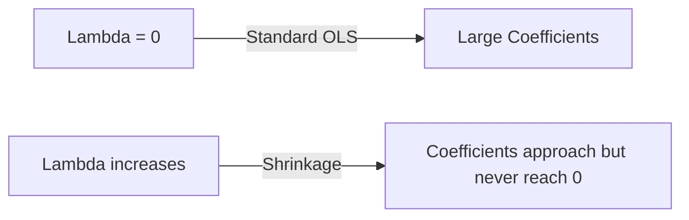

# Ridge Regression: Key Insights, Behavior, and Mathematical Intuition

**Ridge Regression**, also known as **L2 Regularization**, is a fundamental machine learning technique designed to address **overfitting** and **multicollinearity** in linear models. By adding a quadratic penalty term to the standard loss function, Ridge Regression restricts the magnitude of the model's coefficients, leading to more stable, generalizable predictions.

This guide covers the five essential takeaways of Ridge Regression, exploring their mathematical foundations, geometric properties, and practical applications.

---

## 1. Behavior of Coefficients Under Regularization (\\(\lambda \to \infty\\))

### **Intuition**
Regularization introduces a penalty on the size of the model's weights. As the penalty strength (\\(\lambda\\)) increases, the model is forced to shrink its coefficients to minimize the total loss.

### **Mathematical Explanation**
The regularized loss function in Ridge Regression is defined as:
\\[L = \text{Original Loss} + \lambda \sum_{j=1}^{p} w_j^2\\]

Where:
*   \\(\text{Original Loss}\\) is the standard Sum of Squared Errors (SSE) or Mean Squared Error (MSE).
*   \\(\lambda\\) (Lambda/Alpha) is the regularization hyperparameter (\\(\lambda \ge 0\\)).
*   \\(w_j\\) represents the coefficient (weight) of each input feature.
*   \\(\lambda \sum w_j^2\\) is the **L2 shrinkage penalty**.

Let's analyze the limits of \\(\lambda\\):
1.  **\\(\lambda = 0\\) (No Regularization):** The penalty term is nullified, and the model behaves exactly like standard **Ordinary Least Squares (OLS) Linear Regression**.
2.  **\\(\lambda \to \infty\\) (Maximum Regularization):** The penalty term dominates the loss function. To prevent the loss from exploding, the coefficients \\(w_j\\) are forced to shrink toward zero.

**The "Never Zero" Rule:** A critical property of Ridge Regression is that while coefficients shrink and get extremely close to zero, they **never become exactly zero**. This means Ridge Regression shrinks the weights but does not perform feature selection (unlike Lasso Regression).



### **Key Takeaways**
*   Increasing the regularization parameter \\(\lambda\\) forces all coefficients to shrink.
*   Ridge Regression coefficients **never reach exactly zero**, preserving all input features in the model.

---

## 2. Differential Rate of Coefficient Decay

### **Intuition**
In a model with multiple features, not all coefficients are of equal size. Ridge Regression does not shrink all coefficients at the same rate; instead, it targets larger, more dominant coefficients far more aggressively.

### **Mathematical Explanation**
Because the penalty term is quadratic (\\(\lambda \sum w_j^2\\)), the penalty paid by a coefficient is proportional to its **square**. 
*   If \\(w_1 = 1000\\) and \\(w_2 = 10\\):
    *   The squared penalty contribution for \\(w_1\\) is \\(1,000,000\\).
    *   The squared penalty contribution for \\(w_2\\) is \\(100\\).

Because of this squared relationship, the optimization algorithm reduces larger coefficients at a much faster rate than smaller ones to achieve the maximum reduction in the overall loss. As \\(\lambda\\) increases, large coefficients drop steeply and quickly converge to the same order of magnitude as the smaller coefficients.

### **Key Takeaways**
*   Coefficients with **higher initial magnitudes** decay much more rapidly than smaller ones under regularization.
*   This prevents single, high-magnitude features from disproportionately dominating the model's predictions.

---

## 3. The Bias-Variance Trade-off in Regularization

### **Intuition**
An unregularized, highly complex model (such as a high-degree polynomial) attempts to pass through every single training point, capturing random noise along with the signal (overfitting). Regularization acts as a smoothing constraint, sacrificing a tiny bit of training accuracy to achieve much better performance on unseen testing data.

### **Technical Explanation**
The generalizability of a model is governed by the balance of two errors:
\\[\text{Generalization Error} = \text{Bias}^2 + \text{Variance} + \text{Irreducible Noise}\\]

We can control this trade-off directly by adjusting the hyperparameter \\(\lambda\\):

| Regularization Strength | Model Complexity | Bias | Variance | Model State |
| :--- | :--- | :--- | :--- | :--- |
| **Low \\(\lambda\\) (e.g., \\(\lambda \to 0\\))** | High | **Low** | **High** | **Overfitting** |
| **High \\(\lambda\\) (e.g., \\(\lambda \to \infty\\))** | Low | **High** | **Low** | **Underfitting** |

```
   Error vs. Lambda Profile:
   
   Error
     ^
     |      \                       /  Bias
     |       \  Variance           /
     |        \                   /
     |---------\-----------------/-----> Lambda
     |          \   Sweet Spot  /
     |           \_____________/
```

The optimal value of \\(\lambda\\) is typically located near the intersection zone of the bias and variance curves, where both errors are minimized and the model generalizes best.

### **Key Takeaways**
*   **Low \\(\lambda\\)** leads to low bias but high variance (overfitting).
*   **High \\(\lambda\\)** leads to high bias but low variance (underfitting).
*   Tuning \\(\lambda\\) is necessary to locate the optimal "sweet spot" of minimum generalization error.

---

## 4. Mathematical Impact of \\(\lambda\\) on the Loss Function Space

### **Intuition**
To understand why the optimal coefficients shrink as \\(\lambda\\) increases, we can look at how the shape of the loss function curve physically changes.

### **Mathematical Explanation (1D Formulation)**
Consider a simple linear model with a single slope coefficient \\(m\\) and a constant intercept \\(b\\):
\\[L(m) = \sum_{i=1}^{n} (y_i - (mx_i + b))^2 + \lambda m^2\\]

Let's observe the geometric behavior of \\(L(m)\\) as \\(\lambda\\) varies:
1.  **When \\(\lambda = 0\\) (Standard OLS):** The loss curve is a standard parabola. The minimum point of this parabola represents the standard unregularized OLS solution, \\(m_{OLS}\\).
2.  **When \\(\lambda > 0\\) (Moderate Regularization):** The quadratic term \\(\lambda m^2\\) adds an upward pull. This shifts the entire parabola upward, makes it narrower, and pulls its **minimum point (vertex) closer to the origin (\\(m = 0\\))**.
3.  **When \\(\lambda \to \infty\\) (Heavy Regularization):** The parabola becomes extremely steep and compressed, forcing the minimum point to lie almost exactly at the origin (\\(m \approx 0\\)).

In higher dimensions (e.g., multiple coefficients \\(\beta_1\\) and \\(\beta_2\\)), the 3D error surface contour shifts its global minimum point closer and closer to the origin \\((0, 0)\\) as \\(\lambda\\) grows.

### **Key Takeaways**
*   The addition of the L2 penalty physically **warps the loss function landscape**.
*   As \\(\lambda\\) increases, the minimum of the loss function is mathematically pulled toward the origin, shrinking the optimal parameter weights.

---

## 5. Why is it Called "Ridge" Regression? (The Geometric View)

### **Intuition**
Ridge Regression can be mathematically reformulated as a constrained optimization problem. The regularized solution is the exact point where our unconstrained OLS loss contours meet the boundary of our weight constraint.

### **Technical Explanation**
The Ridge optimization problem can be written as a constrained minimization:
\\[\min_{\beta} \sum_{i=1}^{n} (y_i - \hat{y}_i)^2 \quad \text{subject to} \quad \sum_{j=1}^{p} \beta_j^2 \le t\\]

Where:
*   \\(\sum \beta_j^2 \le t\\) defines a **hypersphere** (a circle in 2D space) of radius \\(\sqrt{t}\\) centered at the origin.
*   This circle represents the maximum "budget" allowed for our coefficients.
*   The standard OLS solution lies outside of this circle.
*   The elliptical contours of the unconstrained loss function expand outward from the OLS solution.

The optimal regularized solution is found at the **intersection point** where the expanding elliptical contour first touches the boundary (the perimeter) of the constraint circle. Because the solution is forced to lie along this bounding perimeter, which acts mathematically as a **ridge** or constraint boundary, the technique is named **Ridge Regression**.

### **Key Takeaways**
*   The L2 constraint defines a spherical boundary (circle in 2D) centered at the origin.
*   The optimal regularized coefficients lie along the boundary (ridge) of this constraint region.

---

## 6. Practical Application & Code Reference

### **Practical Tip**
You should primarily apply Ridge Regression when your dataset has **two or more input features** (\\(p \ge 2\\)). When dealing with only a single input feature, regularization has very limited utility.

### **Evaluating Bias-Variance (Python Example)**
You can use the `mlxtend` library to analyze how changing \\(\lambda\\) affects bias and variance on your dataset:

```python
from sklearn.datasets import load_diabetes
from sklearn.model_selection import train_test_split
from sklearn.linear_model import Ridge
from mlxtend.evaluate import bias_variance_decomp

# Load the diabetes dataset and split
X, y = load_diabetes(return_X_y=True)
X_train, X_test, y_train, y_test = train_test_split(X, y, test_size=0.2, random_state=42)

# Instantiate Ridge with a specified alpha (lambda)
ridge_model = Ridge(alpha=10.0)

# Calculate expected loss, bias, and variance
avg_expected_loss, avg_bias, avg_var = bias_variance_decomp(
    ridge_model, X_train, y_train, X_test, y_test, 
    loss='mse', num_rounds=200, random_seed=42
)

print(f"Average Bias^2: {avg_bias:.2f}")
print(f"Average Variance: {avg_var:.2f}")
```

### **Code Explanation**
*   `Ridge(alpha=10.0)` initializes the Ridge model where `alpha` represents the regularization strength \\(\lambda\\).
*   `bias_variance_decomp` runs a bootstrap-style evaluation to decompose the test error into bias and variance components, allowing you to find the ideal regularization sweet spot.

---

## Summary Checklist

- [ ] **Feature Scale:** Always scale your features before applying Ridge Regression, as features with larger scales will otherwise be penalized unfairly.
- [ ] **Input Dimension:** Verify that you are applying Ridge on a dataset with \\(p \ge 2\\) features.
- [ ] **Coeffs Check:** Remember that Ridge will shrink coefficients close to zero but **never** make them exactly zero.
