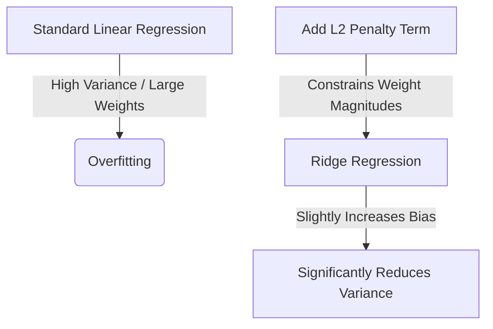

# Ridge Regression: Mathematical Formulation & Implementation from Scratch

**Ridge Regression**, also known as **L2 Regularization**, is a regularized version of linear regression. By adding a penalty term to the cost function, it forces the model coefficients (slopes) to shrink, thereby reducing model complexity and mitigating **overfitting**.

---

## 1. Core Intuition: Why Regularization?

In standard linear regression, we fit a model by minimizing the **Sum of Squared Errors (SSE)**. However, if the features are highly correlated (**multicollinearity**) or if the dataset is small, the model can become overly sensitive to the training data. This causes the coefficients ($w$) to become exceptionally large, leading to **high variance** and **overfitting**.

**Ridge Regression** solves this by adding an **L2 Penalty** (the sum of squared weights) directly to the loss function. 



### **The Regularized Loss Function (1D Intuition)**
For a single-input feature, the objective changes from minimizing standard error to minimizing the modified loss function $L$:
$$L(m, b) = \sum_{i=1}^{n} (y_i - m x_i - b)^2 + \lambda m^2$$

*   **$\lambda$ (Lambda/Alpha):** A hyperparameter controlling the regularization strength.
    *   If $\lambda = 0$, the loss is identical to **Ordinary Least Squares (OLS)**.
    *   As $\lambda \to \infty$, the penalty dominates, pushing the slope $m \to 0$.

> [!TIP]
> **Key Takeaways**
> *   Regularization purposefully introduces a small amount of **bias** to gain a massive reduction in **variance**.
> *   Large coefficients are penalized because they indicate the model is relying too heavily on specific features, capturing noise instead of signal.

---

## 2. 1D Derivation (Simple Linear Regression with Ridge)

To understand the mathematical mechanics, we derive the optimal parameters from scratch for a single-variable dataset.

### **The Objective**
Minimize the loss function $L$ with respect to the slope $m$ and intercept $b$:
$$L(m, b) = \sum_{i=1}^{n} (y_i - m x_i - b)^2 + \lambda m^2$$

---

### **Step A: Derive the Intercept ($b$)**
We take the partial derivative of $L$ with respect to $b$ and set it to $0$:
$$\frac{\partial L}{\partial b} = \frac{\partial}{\partial b} \left[ \sum_{i=1}^{n} (y_i - m x_i - b)^2 + \lambda m^2 \right] = 0$$

Using the chain rule:
$$\sum_{i=1}^{n} 2(y_i - m x_i - b)(-1) + 0 = 0$$

Divide the entire equation by $-2$:
$$\sum_{i=1}^{n} (y_i - m x_i - b) = 0$$

Distribute the summation across the terms:
$$\sum_{i=1}^{n} y_i - m \sum_{i=1}^{n} x_i - \sum_{i=1}^{n} b = 0$$

Since $\sum_{i=1}^{n} b = n \cdot b$:
$$\sum_{i=1}^{n} y_i - m \sum_{i=1}^{n} x_i - nb = 0$$

Now, divide the entire equation by $n$ to introduce the sample means ($\bar{y}$ and $\bar{x}$):
$$\frac{\sum y_i}{n} - m \frac{\sum x_i}{n} - b = 0$$
$$\bar{y} - m\bar{x} - b = 0$$
**$$b = \bar{y} - m\bar{x}$$**

*(Note: The formula for $b$ is identical to standard OLS because the regularization penalty only acts on the slope $m$)*.

---

### **Step B: Derive the Slope ($m$)**
Substitute the derived expression for $b$ ($b = \bar{y} - m\bar{x}$) back into the loss function $L$ before differentiating with respect to $m$:
$$L(m) = \sum_{i=1}^{n} [y_i - m x_i - (\bar{y} - m \bar{x})]^2 + \lambda m^2$$

Group the mean-centered terms:
$$L(m) = \sum_{i=1}^{n} [(y_i - \bar{y}) - m(x_i - \bar{x})]^2 + \lambda m^2$$

Now, take the partial derivative with respect to $m$ and set it to $0$:
$$\frac{\partial L}{\partial m} = \sum_{i=1}^{n} 2[(y_i - \bar{y}) - m(x_i - \bar{x})][-(x_i - \bar{x})] + 2\lambda m = 0$$

Divide the entire equation by $-2$:
$$\sum_{i=1}^{n} [(y_i - \bar{y}) - m(x_i - \bar{x})](x_i - \bar{x}) - \lambda m = 0$$

Distribute $(x_i - \bar{x})$ inside the summation:
$$\sum_{i=1}^{n} \left[ (y_i - \bar{y})(x_i - \bar{x}) - m(x_i - \bar{x})^2 \right] - \lambda m = 0$$

Separate the summations:
$$\sum_{i=1}^{n} (x_i - \bar{x})(y_i - \bar{y}) - m \sum_{i=1}^{n} (x_i - \bar{x})^2 - \lambda m = 0$$

Factor out $m$ from the terms:
$$\sum_{i=1}^{n} (x_i - \bar{x})(y_i - \bar{y}) = m \left[ \sum_{i=1}^{n} (x_i - \bar{x})^2 + \lambda \right]$$

Solve for $m$:
**$$m = \frac{\sum_{i=1}^{n} (x_i - \bar{x})(y_i - \bar{y})}{\sum_{i=1}^{n} (x_i - \bar{x})^2 + \lambda}$$**

> [!TIP]
> **Key Takeaways**
> *   The regularized slope formula differs from OLS solely by the addition of **$+\lambda$** in the denominator.
> *   As $\lambda$ increases, the denominator grows, driving the slope $m$ closer to $0$, stabilizing predictions.

---

## 3. $n$-Dimensional Derivation (Matrix Formulation)

In real-world applications, we deal with multiple input features ($n$-dimensions). Here, we represent our system of linear equations using matrix algebra to derive a generalized closed-form solution.

### **Term Definitions**
*   **$X$ (Feature Matrix):** Dimension $m \times (n+1)$, where $m$ is the number of rows, $n$ is the number of features, and the first column is a column of $1$s to account for the intercept.
*   **$W$ (Coefficient Vector):** Dimension $(n+1) \times 1$, where $W = [w_0, w_1, w_2, \dots, w_n]^T$ ($w_0$ is the intercept).
*   **$Y$ (Target Vector):** Dimension $m \times 1$.
*   **$\lambda$:** Regularization hyperparameter scalar.

---

### **The Matrix Loss Function**
The regularized loss function in matrix form is:
$$L(W) = (XW - Y)^T (XW - Y) + \lambda W^T W$$

Expand the transpose term $(XW - Y)^T = (W^T X^T - Y^T)$:
$$L(W) = (W^T X^T - Y^T)(XW - Y) + \lambda W^T W$$
$$L(W) = W^T X^T X W - W^T X^T Y - Y^T X W + Y^T Y + \lambda W^T W$$

Since $W^T X^T Y$ is a $1 \times 1$ scalar, it is identical to its transpose $(W^T X^T Y)^T = Y^T X W$. We can combine them:
$$L(W) = W^T X^T X W - 2 W^T X^T Y + Y^T Y + \lambda W^T W$$

---

### **Matrix Differentiation w.r.t $W$**
We differentiate the scalar loss function $L$ with respect to the vector $W$:
$$\frac{\partial L}{\partial W} = \frac{\partial}{\partial W} \left[ W^T X^T X W - 2 W^T X^T Y + Y^T Y + \lambda W^T W \right]$$

Using matrix calculus derivative identities:
1.  $\frac{\partial}{\partial W} (W^T A W) = 2AW$ *(for a symmetric matrix $A = X^T X$)*
2.  $\frac{\partial}{\partial W} (W^T B) = B$
3.  $\frac{\partial}{\partial W} (W^T W) = 2W$

Applying these identities to our loss function:
$$\frac{\partial L}{\partial W} = 2 X^T X W - 2 X^T Y + 2 \lambda W$$

Set the derivative to the zero vector to find the minimum:
$$2 X^T X W - 2 X^T Y + 2 \lambda W = 0$$

Divide by $2$ and group terms containing $W$:
$$X^T X W + \lambda W = X^T Y$$

To factor out the vector $W$, insert the **Identity Matrix ($I$)** of shape $(n+1) \times (n+1)$:
$$(X^T X + \lambda I) W = X^T Y$$

Multiply both sides by the matrix inverse $(X^T X + \lambda I)^{-1}$ to isolate $W$:
**$$W = (X^T X + \lambda I)^{-1} X^T Y$$**

---

### **The Intercept Penalty Correction**
By convention, the intercept ($w_0$) should **not** be regularized because shifting the data should not affect its penalty. To implement this restriction, we set the top-left element of the identity matrix to $0$:

$$I_{modified} = \begin{bmatrix} 0 & 0 & \dots & 0 \ 0 & 1 & \dots & 0 \ \vdots & \vdots & \ddots & \vdots \ 0 & 0 & \dots & 1 \end{bmatrix}$$

This modification leaves the intercept $w_0$ fully unpenalized during training.

> [!TIP]
> **Key Takeaways**
> *   The matrix formula adds $\lambda I$ to $X^T X$ before taking the inverse.
> *   Adding $\lambda I$ guarantees the matrix is invertible, resolving problems associated with singular matrices when features exceed samples.

---

## 4. Implementation from Scratch (Python)

We can translate this mathematical derivation directly into clean, optimized Python code using `NumPy`.

```python
import numpy as np

class MyRidge:
    def __init__(self, alpha=0.1):
        self.alpha = alpha
        self.coef_ = None
        self.intercept_ = None
        
    def fit(self, X_train, y_train):
        # 1. Add a column of 1s to handle the intercept (bias)
        X_design = np.insert(X_train, 0, 1, axis=1) #
        
        # 2. Create the modified Identity Matrix (shape: features + 1)
        I = np.eye(X_design.shape[1]) #
        I[0, 0] = 0  # Crucial: Do not penalize the intercept
        
        # 3. Apply the Normal Equation with L2 regularization
        # Formula: W = (X^T * X + lambda * I)^-1 * X^T * Y
        A = np.dot(X_design.T, X_design) + self.alpha * I #
        B = np.dot(X_design.T, y_train) #
        W = np.dot(np.linalg.inv(A), B) #
        
        # 4. Split weight vector into intercept and coefficients
        self.intercept_ = W[0] #
        self.coef_ = W[1:] #
        
    def predict(self, X_test):
        # Y_pred = X_test * Coef + Intercept
        return np.dot(X_test, self.coef_) + self.intercept_ #
```

### **Code Explanation**
*   **`X_design`:** We insert a column of `1`s at index `0` to simplify calculations by grouping the intercept term with the weights.
*   **`I = 0`:** Adjusts the identity matrix so that $w_0$ (the intercept) does not receive a penalty during weight updates.
*   **`np.linalg.inv`:** Performs the matrix inversion $(\mathbf{X}^T\mathbf{X} + \lambda \mathbf{I})^{-1}$ to solve for coefficients in a single operational step.

---

## 5. Summary Checklist

- [ ] **Linearity:** Verify that a linear model structure is appropriate for the target variable.
- [ ] **L2 Penalty:** Ridge adds $\lambda \sum w^2$ to standard SSE, restricting the magnitude of weights.
- [ ] **Intercept Rule:** Ensure that the intercept coefficient is excluded from regularization.
- [ ] **Scaling Requirement:** Always apply standard scale preprocessing (like standardization) before training a Ridge model, as features with larger scales will otherwise be penalized disproportionately.

*If you would like to explore the geometric relationships or compare your results with Scikit-Learn’s outputs under different alpha configurations, let me know and we can run some evaluations!*
