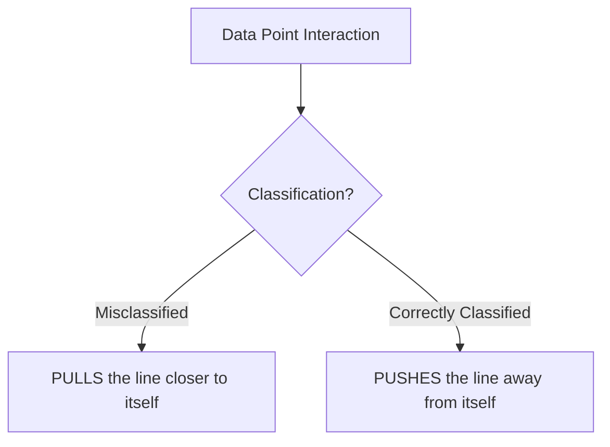
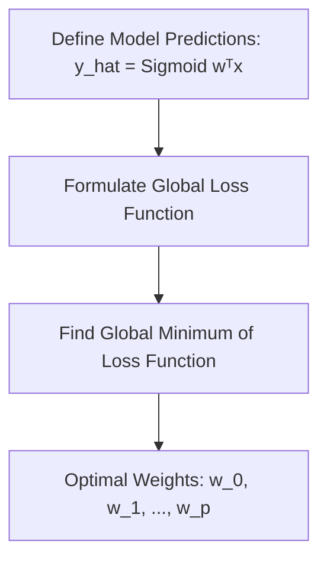
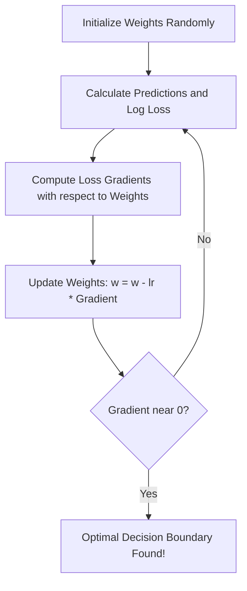

# Logistic Regression Part 3: The Sigmoid Function & Probability Gradients

This repository contains textbook-style study notes based on the lecture **"Logistic Regression Part 3 | Sigmoid Function | 100 Days of ML"**. These notes explain why the traditional Perceptron Trick fails to find the optimal classification boundary, introduce the intuitive concepts of **push and pull dynamics**, explain the mathematics of the **Sigmoid Function**, and demonstrate how mapping predictions to probabilities resolves the limitations of discrete step functions.

---

## 1. The Core Problem with the Perceptron Trick

In previous sessions, we developed the **Perceptron Trick** as an iterative heuristic to update a classification decision boundary. While simple, it has a significant real-world defect.

### Why Perceptron Updates Stop Prematurely
The weight update equation in the Perceptron algorithm is:

\\[
\mathbf{w}_{\text{new}} = \mathbf{w}_{\text{old}} + \eta (y_i - \hat{y}_i) \mathbf{x}_i
\\]

Where:
*   \\(\mathbf{w}\\) is the parameter weight vector.
*   \\(\eta\\) is the learning rate.
*   \\(\mathbf{x}_i\\) is the feature vector of the randomly sampled data point.
*   \\(y_i\\) is the actual binary class label (\\(y_i \in \{0, 1\}\\)).
*   \\(\hat{y}_i\\) is the predicted binary class label (\\(\hat{y}_i \in \{0, 1\}\\)).

Under this formulation, if a point is **correctly classified**, its predicted label \\(\hat{y}_i\\) matches its actual label \\(y_i\\). Consequently:

\\[
y_i - \hat{y}_i = 0
\\]

This reduces the update term to exactly zero:

\\[
\mathbf{w}_{\text{new}} = \mathbf{w}_{\text{old}} + 0 \implies \mathbf{w}_{\text{new}} = \mathbf{w}_{\text{old}}
\\]

Because correctly classified points do not trigger any updates, the algorithm halts the very instant it finds **any** line that separates the training data. This "good enough" line is often positioned dangerously close to one of the classes, leading to poor generalization on unseen test data.

```
       Perceptron Boundary (Unstable)             Logistic Regression Boundary (Optimal)
             CGPA                                              CGPA
              ^                                                 ^
          o  o| \                                           o  o|  \
            o |  \  x                                         o |   \   x
       -------|---\---> IQ                             ---------|----\---> IQ
          x  x|    \                                        x  x|     \
              |     x                                           |      x
     (Dangerously close to 'o' points)                 (Symmetric, maximum margin)
```

### Key Takeaways
*   The Perceptron Trick only updates weights when it encounters a **misclassified point**.
*   Once all training points are correctly classified, \\(y_i - \hat{y}_i = 0\\), halting updates and leaving the line in an arbitrary, unstable position.

---

## 2. The Solution: Push and Pull Dynamics

To find a symmetric, robust decision boundary, we must change our strategy. Instead of ignoring correctly classified points, **every single data point must have a say** in positioning the line.

### Introducing Push and Pull Forces
We redefine how data points interact with the decision boundary:
*   **Misclassified Points (Pull)**: Any point on the wrong side of the boundary must **pull** the line closer to itself to correct the error.
*   **Correctly Classified Points (Push)**: Any point on the correct side of the boundary must **push** the line away from itself to maximize the safety margin.



### The Role of Distance
The intensity (magnitude) of the push or pull force must depend on how close the point is to the decision boundary:

| Point State | Distance from Line | Behavior & Urgency | Force Magnitude |
| :--- | :--- | :--- | :--- |
| **Misclassified** | Very Close | Low urgency; the boundary is almost correct. | **Small Pull** |
| **Misclassified** | Very Far | High urgency; the boundary is severely incorrect. | **Large Pull** |
| **Correctly Classified** | Very Close | High urgency; the point is in danger of being misclassified. | **Large Push** |
| **Correctly Classified** | Very Far | Low urgency; the point is already safely in its territory. | **Small Push** |

If a line is pushed by correctly classified points from both classes, the forces will balance out, pinning the boundary directly in the center of the gap (maximizing the margin).

### Key Takeaways
*   Robust boundaries require **all** points to influence the line via push and pull forces.
*   Correctly classified points close to the boundary exert a **strong push** to maintain a safety margin.
*   Misclassified points far from the boundary exert a **strong pull** to correct large errors.

---

## 3. Transitioning from Step Function to Sigmoid Function

To implement this dynamic mathematically, we must prevent the term \\((y_i - \hat{y}_i)\\) from collapsing to exactly zero. 

### The Limitation of the Step Activation Function
The Perceptron Trick uses a **step function** to classify points. If the linear combination of inputs \\(z = \mathbf{w}^T \mathbf{x}\\) is positive, the output is \\(1\\); if negative, the output is \\(0\\). This discrete, binary output creates a discontinuous step:

```
            y_hat (Output)
              ^
          1.0 |         *-------* (z >= 0)
              |         |
              |         |
          0.0 | --------* (z < 0)
              +-------------------> z = wᵀx
```

Because the output is strictly discrete (\\(0\\) or \\(1\\)), the difference \\(y_i - \hat{y}_i\\) is either \\(0\\), \\(1\\), or \\(-1\\), leaving no room for a continuous distance-based gradient.

### Introducing the Sigmoid Function
We replace the discontinuous step function with a smooth, continuous mathematical function called the **Sigmoid Function** (or Logistic function):

\\[
S(z) = \frac{1}{1 + e^{-z}}
\\]

Where:
*   \\(z = \mathbf{w}^T \mathbf{x} = w_0 + w_1 x_1 + w_2 x_2 + \dots + w_p x_p\\).
*   \\(e\\) is Euler's constant.

```
            S(z) (Output)
              ^
          1.0 |              _--*
              |            _-
          0.5 |          -*  (z = 0)
              |        _-
          0.0 | *--_--
              +-------------------> z = wᵀx
```

### Properties of the Sigmoid Function
*   **Bounded Range**: The output is always strictly bounded between 0 and 1: \\(S(z) \in (0, 1)\\).
*   **Asymptotic Behavior**: As \\(z \to \infty\\), \\(S(z) \to 1\\). As \\(z \to -\infty\\), \\(S(z) \to 0\\).
*   **Symmetry**: At \\(z = 0\\) (directly on the decision boundary), the output is exactly \\(S(z) = 0.5\\).
*   **Squeezing Property**: No matter how large or small \\(z\\) is, Sigmoid scales it into a continuous probability value between \\(0\\) and \\(1\\).

### Key Takeaways
*   The **step function** outputs discrete values (\\(0\\) or \\(1\\)), which drops the update term to zero on correct classifications.
*   The **Sigmoid function** outputs a continuous value between \\(0\\) and \\(1\\), mapping any coordinate point to a probability.

---

## 4. Probabilistic Interpretation of the Feature Space

Replacing the step function with the Sigmoid function transforms our feature space from binary regions into a continuous **probability gradient**.

### Mapping to Class Probabilities
The output of the Sigmoid function, \\(\hat{y}_i = S(z)\\), is interpreted as the probability that a given query point \\(\mathbf{x}_i\\) belongs to the positive class (\\(y = 1\\)):

\\[
P(y_i = 1 | \mathbf{x}_i) = \hat{y}_i = S(\mathbf{w}^T \mathbf{x}_i)
\\]

Since there are only two classes (\\(0\\) and \\(1\\)), the probability that the point belongs to the negative class (\\(y = 0\\)) is:

\\[
P(y_i = 0 | \mathbf{x}_i) = 1 - \hat{y}_i = 1 - S(\mathbf{w}^T \mathbf{x}_i)
\\]

### The Spatial Probability Gradient
This formulation maps our 2D plane into structured probability bands parallel to the decision boundary:
*   **The Decision Boundary (\\(\mathbf{w}^T \mathbf{x} = 0\\))**: Along this line, \\(S(z) = 0.5\\). There is a \\(50\%\\) chance of belonging to either class.
*   **Positive Region (\\(\mathbf{w}^T \mathbf{x} > 0\\))**: As we move deeper into this region, the distance \\(z\\) increases, and \\(S(z)\\) scales up (\\(0.6 \to 0.7 \to 0.9 \to 0.99\\)), indicating a higher confidence of belonging to Class 1.
*   **Negative Region (\\(\mathbf{w}^T \mathbf{x} < 0\\))**: As we move deeper into this region, \\(z\\) becomes highly negative, and \\(S(z)\\) scales down (\\(0.4 \to 0.3 \to 0.1 \to 0.01\\)), indicating a higher confidence of belonging to Class 0.

### Key Takeaways
*   The Sigmoid function provides a clean **probabilistic interpretation** of classification.
*   Distance from the decision boundary corresponds directly to the model's confidence (probability) in its prediction.

---

## 5. Mathematical Proof of Push and Pull Mechanics

By substituting the continuous Sigmoid prediction \\(\hat{y}_i \in (0, 1)\\) into our unified update formula, we mathematically verify that all four intuitive cases of push and pull emerge automatically.

Let us analyze the updated term \\(\eta (y_i - \hat{y}_i) \mathbf{x}_i\\) using sample points.

### Case A: Positive Points (\\(y_i = 1\\))
For a positive class point, our update factor is proportional to:

\\[
y_i - \hat{y}_i = 1 - S(z)
\\]

Since \\(S(z)\\) is bounded between \\(0\\) and \\(1\\), the term \\(1 - S(z)\\) is **always positive**. Adding a positive term to \\(\mathbf{w}\\) increases the dot product \\(\mathbf{w}^T \mathbf{x}_i\\), pushing the point deeper into the positive region.

1.  **Correctly Classified but Close to the Boundary** (e.g., \\(S(z) = 0.6\\)):
    \\[1 - 0.6 = +0.4 \implies \text{Strong positive push}\\]
2.  **Correctly Classified and Safe/Far** (e.g., \\(S(z) = 0.9\\)):
    \\[1 - 0.9 = +0.1 \implies \text{Weak positive push}\\]
3.  **Misclassified and Far** (e.g., \\(S(z) = 0.15\\)):
    \\[1 - 0.15 = +0.85 \implies \text{Strong positive pull}\\]

---

### Case B: Negative Points (\\(y_i = 0\\))
For a negative class point, our update factor is proportional to:

\\[
y_i - \hat{y}_i = 0 - S(z) = -S(z)
\\]

This term is **always negative**. Subtracting a term from \\(\mathbf{w}\\) decreases the dot product \\(\mathbf{w}^T \mathbf{x}_i\\), pushing the point deeper into the negative region.

1.  **Correctly Classified but Close to the Boundary** (e.g., \\(S(z) = 0.4\\)):
    \\[-S(z) = -0.4 \implies \text{Strong negative push}\\]
2.  **Correctly Classified and Safe/Far** (e.g., \\(S(z) = 0.1\\)):
    \\[-S(z) = -0.1 \implies \text{Weak negative push}\\]
3.  **Misclassified and Far** (e.g., \\(S(z) = 0.85\\)):
    \\[-S(z) = -0.85 \implies \text{Strong negative pull}\\]

### Summary of Mathematical Dynamics

| True Class (\\(y_i\\)) | Predicted Probability (\\(\hat{y}_i\\)) | Error Term (\\(y_i - \hat{y}_i\\)) | Boundary Action | Force Strength |
| :---: | :---: | :---: | :--- | :--- |
| **\\(1\\)** | \\(0.15\\) (Misclassified) | \\(+0.85\\) | Pull towards point | **Very Strong** |
| **\\(1\\)** | \\(0.60\\) (Correct, Close) | \\(+0.40\\) | Push away from point | **Moderate** |
| **\\(1\\)** | \\(0.90\\) (Correct, Safe) | \\(+0.10\\) | Push away from point | **Very Weak** |
| **\\(0\\)** | \\(0.85\\) (Misclassified) | \\(-0.85\\) | Pull towards point | **Very Strong** |
| **\\(0\\)** | \\(0.40\\) (Correct, Close) | \\(-0.40\\) | Push away from point | **Moderate** |
| **\\(0\\)** | \\(0.10\\) (Correct, Safe) | \\(-0.10\\) | Push away from point | **Very Weak** |

This confirms that the Sigmoid function elegantly satisfies all of our geometric push-and-pull requirements with a single formula.

### Key Takeaways
*   The continuous value of \\(y_i - \hat{y}_i\\) is **never zero**, ensuring that correctly classified points continue to refine the boundary.
*   The math automatically scales the update magnitude based on the point's distance and correctness.

---

## 6. Python Implementation

Replacing the step function with the Sigmoid function in Python is straightforward.

### Code Snippet Comparison

```python
import numpy as np

def sigmoid(z):
    """
    Applies the continuous Sigmoid activation function.
    Maps any real value z to a probability between 0 and 1.
    """
    return 1 / (1 + np.exp(-z))

def perceptron_with_sigmoid(X, y, epochs=1000, lr=0.1):
    """
    Modified Perceptron algorithm using Sigmoid probabilities.
    """
    # Insert bias column (x_0 = 1)
    X = np.insert(X, 0, 1, axis=1)
    weights = np.ones(X.shape)
    
    for epoch in range(epochs):
        # Select a random data point
        index = np.random.randint(0, X.shape)
        x_i = X[index]
        y_i = y[index]
        
        # Calculate continuous probability prediction
        z = np.dot(weights, x_i)
        y_hat_i = sigmoid(z)
        
        # Update weights using continuous error
        weights = weights + lr * (y_i - y_hat_i) * x_i
        
    return weights, weights[1:]
```

### Explaining the Code
*   `sigmoid(z)`: Evaluates the formula \\(\frac{1}{1 + e^{-z}}\\) using vectorized operations via `np.exp`.
*   `y_hat_i = sigmoid(z)`: Rather than assigning a discrete class \\(0\\) or \\(1\\), the model outputs a decimal probability (e.g., \\(0.78\\)), indicating a \\(78\%\\) placement probability.
*   `weights + lr * (y_i - y_hat_i) * x_i`: The weight update relies on the fractional error. Since \\(y_i - \hat{y}_i\\) is never exactly \\(0\\), the weights are adjusted on every iteration, leading to continuous refinement.

---

## 7. The Remaining Gap: Transition to True Logistic Regression

While implementing the Sigmoid function significantly improves the decision boundary compared to the standard step-based Perceptron, it still does not yield a perfect classification model.

Comparing the boundaries:
1.  **Step-based Perceptron (Red)**: Stops updating abruptly, resulting in a poor boundary.
2.  **Sigmoid-based Perceptron (Brown)**: Continuously refines the boundary by incorporating push/pull mechanics, resulting in a cleaner line.
3.  **True Logistic Regression (Black)**: The optimal boundary generated by libraries like Scikit-Learn.

Although our Sigmoid-based Perceptron is much closer to Scikit-Learn's solution, they are still not identical. This remaining gap exists because Scikit-Learn does not rely on random point-by-point heuristics. Instead, it defines a global **Loss Function** (Binary Cross-Entropy / Log Loss) across the entire dataset and minimizes it systematically using optimization solvers. This formal optimization process is the focus of true Logistic Regression.

### Key Takeaways
*   The Sigmoid-based Perceptron is a major upgrade over the step function, but it is still heuristic-driven.
*   **True Logistic Regression** optimizes a global cost function across the entire dataset, guaranteeing the mathematically optimal boundary.


---

# Logistic Regression Part 4: Loss Function & Binary Cross-Entropy Derivation

This repository contains comprehensive, textbook-style reference notes based on the lecture **"Logistic Regression Part 4 | Loss Function | Maximum Likelihood | Binary Cross Entropy"**. 

These notes explain why simple point-by-point updates fail to find the optimal decision boundary, introduce the probabilistic concept of **Maximum Likelihood**, and walk through the step-by-step mathematical derivation of **Binary Cross-Entropy (Log Loss)** from scratch.

---

## 1. The Necessity of a Loss Function in Machine Learning

In previous sections, we saw that replacing the step function with the **Sigmoid function** in our Perceptron algorithm led to minor improvements in the decision boundary. However, the resulting line was still not the mathematically optimal boundary produced by professional libraries like Scikit-Learn.

### Why Heuristic Updates Fail
The Sigmoid-based Perceptron Trick uses a stochastic, point-by-point heuristic:
* It loops through the dataset, randomly selects a point, and either **pushes** or **pulls** the boundary line.
* While it can eventually find *a* boundary that separates the classes, it has no mathematical framework to define what makes a line the **best** possible boundary.
* Because the updates are driven by a random number generator picking points, there is no guarantee of finding the most robust, maximum-margin separation.

### The Machine Learning Paradigm
To find the mathematically optimal solution, we must abandon heuristic update loops and follow the standard machine learning workflow:

1.  **Define a Loss Function (Error Function)**: Create a continuous mathematical equation that quantifies exactly how much error the model is committing across the entire dataset.
2.  **Optimize the Loss Function**: Find the set of parameter weights that minimizes this error function. The weights at this global minimum represent our optimal model coefficients.



### Key Takeaways
* Heuristic update rules can find a valid separating line, but they cannot guarantee the **optimal** boundary.
* Machine learning relies on defining a global **loss function** and using mathematical optimization to find the weights that minimize it.

---

## 2. The Maximum Likelihood Principle

To construct a loss function for classification, we use a fundamental probabilistic concept called **Maximum Likelihood Estimation (MLE)**. 

### The Concept of Likelihood
Instead of asking "How far are the points from the line?", we ask a probabilistic question: **"Given a candidate decision boundary, what is the probability (likelihood) of observing our actual training labels?"**

We want to find the boundary that maximizes this likelihood.

### A 4-Point Toy Example
Let us analyze a small dataset containing four training points to build our mathematical intuition:
* **Point 1**: Actual class is Green (\\(y_1 = 1\\))
* **Point 2**: Actual class is Red (\\(y_2 = 0\\))
* **Point 3**: Actual class is Green (\\(y_3 = 1\\))
* **Point 4**: Actual class is Red (\\(y_4 = 0\\))

We evaluate two candidate models (Model 1 and Model 2) to see which one has a higher likelihood of generating these classes.

```
Model 1 (Suboptimal Boundary)                Model 2 (Perfect Boundary)
       Green (y=1)  Red (y=0)                       Green (y=1)  Green (y=1)
          o            x                               o            o
    -----------/-----------                      ---------------------------
              /                                              /
             /                                              /
            /                                              /
           o            x                                 x            x
       Green (y=1)  Red (y=0)                       Red (y=0)    Red (y=0)
```

We use our Sigmoid-based model to calculate the predicted probability of each point belonging to the positive class (\\(\hat{y}_i = P(y_i = 1)\\)):

#### Model 1 Predicted Probabilities:
* **Point 1 (Green)**: \\(P(\text{Green}) = 0.7 \implies P(\text{Red}) = 0.3\\)
* **Point 2 (Red)**: \\(P(\text{Green}) = 0.6 \implies P(\text{Red}) = 0.4\\)
* **Point 3 (Green)**: \\(P(\text{Green}) = 0.4 \implies P(\text{Red}) = 0.6\\)
* **Point 4 (Red)**: \\(P(\text{Green}) = 0.2 \implies P(\text{Red}) = 0.8\\)

To find the **Likelihood** of Model 1, we multiply the probabilities of each point belonging to its **actual** class:
* For Point 1 (Green), we use \\(P(\text{Green}) = 0.7\\).
* For Point 2 (Red), we use \\(P(\text{Red}) = 0.4\\).
* For Point 3 (Green), we use \\(P(\text{Green}) = 0.4\\).
* For Point 4 (Red), we use \\(P(\text{Red}) = 0.8\\).

Assuming the observations are independent, we calculate the joint probability (Likelihood) by multiplying these individual terms:

\\[
\text{Likelihood}_{\text{Model 1}} = 0.7 \times 0.4 \times 0.4 \times 0.8 = 0.0896
\\]

#### Model 2 Predicted Probabilities:
Model 2 separates the classes perfectly, so its probabilities align much better with the actual classes:
* **Point 1 (Green)**: \\(P(\text{Green}) = 0.7 \implies P(\text{Red}) = 0.3\\)
* **Point 2 (Green)**: \\(P(\text{Green}) = 0.6 \implies P(\text{Red}) = 0.4\\)
* **Point 3 (Red)**: \\(P(\text{Green}) = 0.4 \implies P(\text{Red}) = 0.6\\)
* **Point 4 (Red)**: \\(P(\text{Green}) = 0.3 \implies P(\text{Red}) = 0.7\\)

We calculate the Likelihood of Model 2:

\\[
\text{Likelihood}_{\text{Model 2}} = 0.7 \times 0.6 \times 0.6 \times 0.7 = 0.1764
\\]

### Comparing the Models
\\[
\text{Likelihood}_{\text{Model 2}} (0.1764) > \text{Likelihood}_{\text{Model 1}} (0.0896)
\\]

Model 2 yields a significantly higher likelihood than Model 1, mathematically proving that it is the superior model. Our goal is to find the weights \\(\mathbf{w}\\) that maximize this joint probability product:

\\[
\text{Maximize} \quad \prod_{i=1}^{n} P(y_i | \mathbf{x}_i)
\\]

### Key Takeaways
* **Maximum Likelihood Estimation** evaluates a candidate boundary by calculating the joint probability of observing our actual training labels.
* We find the optimal model coefficients by maximizing this joint probability product.

---

## 3. The Product Problem and the Logarithmic Solution

While maximizing the product of probabilities is mathematically sound, it presents a major computational problem in practice.

### The Numerical Underflow Issue
Probabilities are always real numbers bounded between 0 and 1:

\\[
P(y_i) \in
\\]

In real-world datasets, we train models on thousands or millions of samples (\\(n \ge 10,000\\)). Multiplying thousands of tiny decimal values together creates an extraordinarily small number:

\\[
0.5 \times 0.5 \times \dots \times 0.5 \to 0.0000000 \dots
\\]

Computers represent decimal values using floating-point numbers. When a number becomes too small, it triggers **numerical underflow**, rounding the value to exactly `0.0`. Once underflow occurs, we can no longer compare different models, making optimization impossible.

### The Logarithm Remedy
We can solve this by converting the **multiplication product** into an **addition sum**. We do this by applying a natural logarithm to our likelihood equation, leveraging the fundamental log product rule:

\\[
\log(a \cdot b) = \log(a) + \log(b)
\\]

Taking the logarithm of the likelihood (known as the **Log-Likelihood**) transforms our optimization objective:

\\[
\text{Log-Likelihood} = \log\left( \prod_{i=1}^{n} P(y_i | \mathbf{x}_i) \right) = \sum_{i=1}^{n} \log\left(P(y_i | \mathbf{x}_i)\right)
\\]

Adding logarithms is computationally stable and completely eliminates the risk of numerical underflow.

### Key Takeaways
* Multiplying thousands of small probabilities leads to **numerical underflow** (rounding to 0) in computer hardware.
* Applying the natural logarithm converts the multiplication product into a stable sum of log values, preserving our ability to optimize.

---

## 4. Negative Log-Likelihood & Cross-Entropy

Using Log-Likelihood introduces another mathematical detail we must address.

### The Problem with Negative Log Values
Because probabilities are strictly bounded between 0 and 1, their logarithms are **always negative**:

\\[
\log(p) < 0 \quad \text{for} \quad p \in (0, 1)
\\]

For example:
* \\(\log(0.9) \approx -0.105\\)
* \\(\log(0.5) \approx -0.693\\)
* \\(\log(0.1) \approx -2.302\\)

Optimizing negative numbers can be confusing, and standard optimization solvers are designed to **minimize loss** (errors) rather than maximize utility (likelihood).

### Converting to a Minimization Problem
To align with standard optimization practices, we multiply our log-likelihood terms by **\\(-1\\)**. This operation does two things:
1. It flips all negative values to positive values.
2. It transforms our goal from maximizing log-likelihood to **minimizing** the resulting positive value.

This negative sum of log probabilities is called **Cross-Entropy** (or Log Loss).

\\[
\text{Cross-Entropy} = \sum_{i=1}^{n} -\log\left(P(y_i | \mathbf{x}_i)\right)
\\]

Let us verify how this penalizes model mistakes:
* If a point's true class is positive and our model predicts a high probability of \\(0.9\\):
  \\[
  \text{Loss} = -\log(0.9) \approx 0.105 \quad (\text{Very Small Loss})
  \\]
* If our model makes a poor prediction of \\(0.1\\) for that same positive point:
  \\[
  \text{Loss} = -\log(0.1) \approx 2.302 \quad (\text{Very Large Loss})
  \\]

```
    Loss (Negative Log)
      ^
      | \
      |  \
  High|   \  <- Steep penalty for wrong predictions
  Loss|    \
      |     \
      |      \__
   Low|         \___
  Loss|             \---* (Probability = 1.0)
      +------------------------------------> Predicted Probability of True Class
```

Minimizing this positive loss function forces our model to make correct, high-confidence predictions.

### Key Takeaways
* Logarithms of probabilities are always negative.
* Multiplying by \\(-1\\) converts the objective into a positive **minimization** task, known as **Cross-Entropy** or **Log Loss**.
* The negative log function penalizes incorrect predictions exponentially, forcing the model to find the most accurate decision boundary.

---

## 5. Deriving the Unified Binary Cross-Entropy Formula

We need to write a single, unified mathematical equation for our loss function that can handle both positive (\\(y_i = 1\\)) and negative (\\(y_i = 0\\)) classes automatically.

### The Challenge
For any given data point \\(\mathbf{x}_i\\), we calculate the prediction \\(\hat{y}_i\\) using the Sigmoid function:

\\[
\hat{y}_i = S(\mathbf{w}^T \mathbf{x}_i) = \frac{1}{1 + e^{-\mathbf{w}^T \mathbf{x}_i}}
\\]

This predicted value represents the probability of the point belonging to the positive class:
* Probability of positive class (\\(y_i = 1\\)): \\(P(y_i = 1 | \mathbf{x}_i) = \hat{y}_i\\)
* Probability of negative class (\\(y_i = 0\\)): \\(P(y_i = 0 | \mathbf{x}_i) = 1 - \hat{y}_i\\)

Our loss equation must apply \\(-\log(\hat{y}_i)\\) when the actual class \\(y_i = 1\\), and apply \\(-\log(1 - \hat{y}_i)\\) when the actual class \\(y_i = 0\\). A simple list of log values is insufficient because the formula must be differentiable across all points.

### The Unified Formula
We combine both conditions into a single, elegant algebraic expression for the loss of a single point \\(L_i\\):

\\[
L_i = - \left[ y_i \log(\hat{y}_i) + (1 - y_i) \log(1 - \hat{y}_i) \right]
\\]

### Verification of the Unified Formula
Let us prove that this single equation behaves correctly for both classification states:

#### Case 1: The Point belongs to the Positive Class (\\(y_i = 1\\))
Substitute \\(y_i = 1\\) into our unified equation:

\\[
L_i = - \left[ (1) \log(\hat{y}_i) + (1 - 1) \log(1 - \hat{y}_i) \right]
\\]
\\[
L_i = - \left[ \log(\hat{y}_i) + (0) \log(1 - \hat{y}_i) \right]
\\]
\\[
L_i = - \log(\hat{y}_i)
\\]

*(Correct! Matches the expected positive log probability term).*

#### Case 2: The Point belongs to the Negative Class (\\(y_i = 0\\))
Substitute \\(y_i = 0\\) into our unified equation:

\\[
L_i = - \left[ (0) \log(\hat{y}_i) + (1 - 0) \log(1 - \hat{y}_i) \right]
\\]
\\[
L_i = - \left[ 0 + (1) \log(1 - \hat{y}_i) \right]
\\]
\\[
L_i = - \log(1 - \hat{y}_i)
\\]

*(Correct! Matches the expected negative log probability term).*

---

### The Global Binary Cross-Entropy Loss Function
To find the total error across our entire dataset, we sum the losses of all \\(n\\) data points and divide by \\(n\\) to find the mean error. Factoring out the negative sign gives us the final, global **Binary Cross-Entropy Loss** (or **Log Loss**) formula:

\\[
\text{Loss}_{\text{LogLoss}} = -\frac{1}{n} \sum_{i=1}^{n} \left[ y_i \log(\hat{y}_i) + (1 - y_i) \log(1 - \hat{y}_i) \right]
\\]

Where:
* \\(n\\) is the total number of data points.
* \\(y_i\\) is the actual target class label (0 or 1).
* \\(\hat{y}_i\\) is the predicted probability that the point belongs to class 1, calculated using the Sigmoid of our linear combination:
  \\[
  \hat{y}_i = \frac{1}{1 + e^{-\mathbf{w}^T \mathbf{x}_i}}
  \\]

This equation is the exact objective function used to train standard Logistic Regression models.

### Key Takeaways
* The algebraic trick \\(y_i \log(\hat{y}_i) + (1 - y_i) \log(1 - \hat{y}_i)\\) acts as a mathematical switch, applying the correct loss term based on the actual class label.
* **Binary Cross-Entropy (Log Loss)** is the average negative log probability across the entire dataset.
* This global function serves as our single source of truth for measuring classification error.

---

## 6. The Optimization Challenge: No Closed-Form Solution

Now that we have successfully derived our loss function, our final task is to find the weights \\(\mathbf{w}\\) that minimize it.

### The Limits of Analytical Solutions
In standard **Linear Regression** (using Mean Squared Error), we can solve for our weights analytically. We take the derivative of the loss function, set it to exactly zero, and solve the algebraic equation to find our coefficients in a single step (known as a **closed-form solution**).

\\[
\frac{\partial \text{MSE}}{\partial \mathbf{w}} = 0 \implies \mathbf{w} = (X^T X)^{-1} X^T y
\\]

However, because the Logistic Regression loss function contains the non-linear Sigmoid equation nested inside logarithmic terms, taking the derivative and setting it to zero results in a transcendental equation. This equation **cannot be solved algebraically**.

\\[
\frac{\partial \text{Loss}_{\text{LogLoss}}}{\partial \mathbf{w}} = 0 \implies \text{No closed-form solution exists!}
\\]

### Resolving with Gradient Descent
Because we cannot solve for our optimal weights in a single step, we must use an iterative optimization algorithm:
1. We initialize our weight vector \\(\mathbf{w}\\) with random values.
2. We calculate the gradient (slope) of the Log Loss function at our current position.
3. We take a small step in the opposite direction of the gradient (downhill) to update our weights.
4. We repeat this process until the gradient approaches zero, indicating we have arrived at the global minimum of the loss function.

This optimization process is called **Gradient Descent** and is the engine that powers standard Logistic Regression models.



### Key Takeaways
* Unlike Linear Regression, Logistic Regression's loss function **does not have a closed-form (analytical) solution**.
* We must use iterative optimization methods like **Gradient Descent** to find the optimal weights.
* Gradient Descent systematically steps downhill along the loss surface until it reaches the minimum, yielding the most robust separating line.

----


