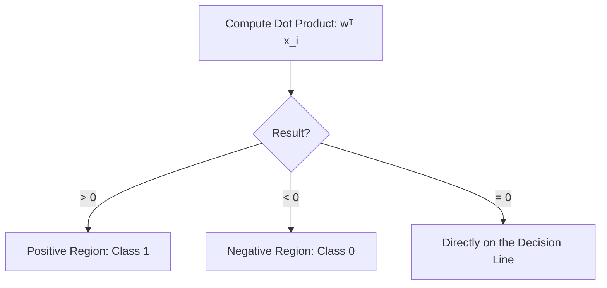
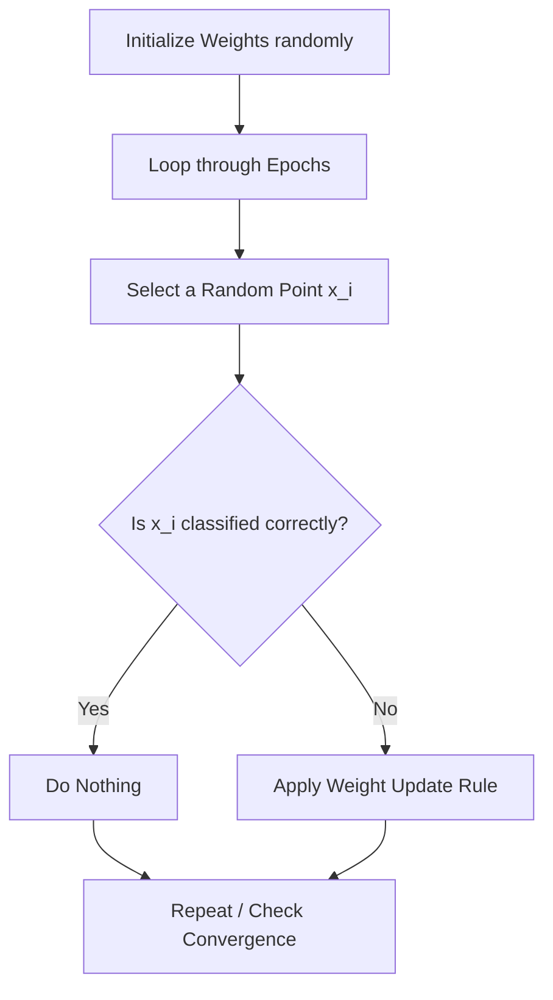

# Logistic Regression Part 1: The Perceptron Trick & Classification Foundations

This reference guide provides a clean, textbook-style explanation of the geometric perspective of classification, the **Perceptron Trick**, and the unified mathematical derivation of its update rule.

---

## 1. Introduction to Logistic Regression & Deep Learning Connection

**Logistic Regression** is one of the most fundamental and widely used algorithms for **classification** in machine learning. Despite the word "Regression" in its name, it is used to predict categorical outcomes (such as whether a student gets placed or not) rather than continuous values.

### Why Logistic Regression is Essential
* **Foundational Block for Deep Learning**: The basic building block of deep neural networks is the **Perceptron**. The mathematical structure of a Perceptron shares an almost identical foundation with Logistic Regression. Understanding the intuition behind Logistic Regression is the gateway to mastering deep learning.
* **Two Perspectives**: There are two main ways to formulate and explain Logistic Regression:
  1. **Geometric Perspective**: Focused on finding a separating line or decision boundary in space.
  2. **Probabilistic Perspective**: Focused on maximum likelihood estimation, log-odds, and probability.

This document explores the **Geometric Perspective** through the intuitive mechanics of the **Perceptron Trick**.

### Key Takeaways
* **Logistic Regression** is designed for classification tasks, not regression.
* It forms a conceptual bridge to deep learning due to its similarity to the **Perceptron** algorithm.

---

## 2. Prerequisites & Core Assumptions

Before applying Logistic Regression, the dataset must satisfy a primary requirement: **Linear Separability**.

### Linear Separability
A dataset is **linearly separable** if the different classes can be split cleanly by a linear boundary:
* **2D Space (Two Features)**: A straight **line** splits the two classes.
* **3D Space (Three Features)**: A flat **plane** splits the classes.
* **Higher-Dimensional Space (\\(p\\) Features)**: A **hyperplane** splits the classes.

```
Linearly Separable (Linear Boundary OK)       Non-Linearly Separable (Linear Boundary Fails)
            CGPA                                         CGPA
             ^                                            ^
             |   o   o                                    |   o   x   o
             |     o                                      |   x   o   x
       ------/-------> IQ                           ------/-------> IQ
             |   x   x                                    |   o   x   o
             |     x                                      |   x   o   x
```

If the dataset is highly non-linear, a standard linear boundary cannot separate the classes, and Logistic Regression will perform poorly.

### Key Takeaways
* **Linear Separability** means a straight line or hyperplane can cleanly partition different classes.
* If data is inherently non-linear, Logistic Regression's linear assumption will lead to suboptimal results.

---

## 3. Geometric Formulation of the Decision Boundary

In standard **Linear Regression**, we write a straight line using the slope-intercept form:

\\[
y = mx + c
\\]

However, in classification, we represent the decision boundary using the **general form of a linear equation**:

\\[
Ax + By + C = 0
\\]

### Representation in Multi-Dimensional Feature Space
For a dataset with \\(p\\) input features \\(x_1, x_2, \dots, x_p\\), we assign a coefficient or **weight** (\\(w_j\\)) to each feature and add an intercept or **bias** (\\(w_0\\)):

\\[
w_1 x_1 + w_2 x_2 + w_3 x_3 + \dots + w_p x_p + w_0 = 0
\\]

To simplify this expression, we introduce a dummy feature \\(x_0 = 1\\) for every observation, allowing us to represent the parameters and features as vectors:

\\[
\mathbf{w} = \begin{bmatrix} w_0 \\ w_1 \\ w_2 \\ \vdots \\ w_p \end{bmatrix}, \quad \mathbf{x} = \begin{bmatrix} x_0 \\ x_1 \\ x_2 \\ \vdots \\ x_p \end{bmatrix} \quad (\text{where } x_0 = 1)
\\]

This allows us to write the decision boundary equation compactly using a vector **dot product**:

\\[
\sum_{j=0}^{p} w_j x_j = \mathbf{w}^T \mathbf{x} = 0
\\]

### Key Takeaways
* Classification decision boundaries are represented in the general form \\(w_1 x_1 + w_2 x_2 + w_0 = 0\\) rather than \\(y = mx + c\\).
* Using vector dot-product notation (\\(\mathbf{w}^T \mathbf{x} = 0\\)) allows the model to scale seamlessly to any number of dimensions.

---

## 4. How to Identify Regions (Positive vs. Negative)

Any decision boundary splits the coordinate system into two half-spaces: a **positive region** and a **negative region**. Substituting a query point \\(\mathbf{x}_i\\) into our model equation tells us which side of the boundary the point falls on:

* **Positive Side (\\(\hat{y}_i = 1\\))**: 

  \\[
  \mathbf{w}^T \mathbf{x}_i > 0
  \\]

* **Negative Side (\\(\hat{y}_i = 0\\))**: 

  \\[
  \mathbf{w}^T \mathbf{x}_i < 0
  \\]

* **On the Boundary**: 

  \\[
  \mathbf{w}^T \mathbf{x}_i = 0
  \\]



### Key Takeaways
* Checking the sign of \\(\mathbf{w}^T \mathbf{x}_i\\) determines which class prediction (\\(\hat{y}_i \in \{0, 1\}\\)) the model outputs for point \\(\mathbf{x}_i\\).
* The boundary line itself is the set of points where the dot product is exactly zero.

---

## 5. The Perceptron Trick: Intuitive Explanation

The **Perceptron Trick** is an iterative method to find the optimal decision boundary coefficients \\(\mathbf{w}\\).



### The Step-by-Step Mechanism
1. **Initialize**: Start with completely random values for the weight vector \\(\mathbf{w}\\), which draws a random boundary line in our feature space.
2. **Loop (Epochs)**: Run an optimization loop for a defined number of epochs.
3. **Random Selection**: In each step, randomly select a single training point \\(\mathbf{x}_i\\).
4. **Classification Check**: Determine if the selected point is correctly classified by the current line.
   * **Case A: Correctly Classified**: If a positive point lies in the positive region (\\(\mathbf{w}^T \mathbf{x}_i > 0\\)), or a negative point lies in the negative region (\\(\mathbf{w}^T \mathbf{x}_i < 0\\)), do nothing.
   * **Case B: Misclassified**: If the point is in the wrong region, update the weight vector \\(\mathbf{w}\\) to pull the boundary line closer to the misclassified point.

### Directly Upgrading the Weights
To shift the boundary line toward a misclassified point, we apply direct vector mathematics:

* **Positive Point in Negative Region**: We need to increase \\(\mathbf{w}^T \mathbf{x}_i\\). We do this by **adding** the point's feature vector directly to the weights:

  \\[
  \mathbf{w}_{\text{new}} = \mathbf{w}_{\text{old}} + \mathbf{x}_i
  \\]

* **Negative Point in Positive Region**: We need to decrease \\(\mathbf{w}^T \mathbf{x}_i\\). We do this by **subtracting** the point's feature vector directly from the weights:

  \\[
  \mathbf{w}_{\text{new}} = \mathbf{w}_{\text{old}} - \mathbf{x}_i
  \\]

### Controlling Adjustments with the Learning Rate (\\(\eta\\))
Adding or subtracting the raw feature vector \\(\mathbf{x}_i\\) causes massive, erratic shifts in the decision boundary. To ensure stable, gradual convergence, we scale the update using a small step size called the **Learning Rate (\\(\eta\\))** (typically \\(\eta = 0.01\\) or \\(\eta = 0.1\\)):

* **Positive Misclassification**: 

  \\[
  \mathbf{w}_{\text{new}} = \mathbf{w}_{\text{old}} + \eta \mathbf{x}_i
  \\]

* **Negative Misclassification**: 

  \\[
  \mathbf{w}_{\text{new}} = \mathbf{w}_{\text{old}} - \eta \mathbf{x}_i
  \\]

### Key Takeaways
* The Perceptron Trick updates the boundary line only when it encounters misclassified points.
* Adding or subtracting feature vectors translates and rotates the decision boundary in the direction of the error.
* The **learning rate** (\\(\eta\\)) keeps boundary adjustments small and controlled.

---

## 6. Mathematical Derivation of the Unified Update Rule

Handling different misclassifications using conditional branches is inefficient in vector-based computing. We can derive a single, **unified mathematical update rule** that covers all scenarios.

Let:
* \\(y_i \in \{0, 1\}\\) be the **actual label** of the data point \\(\mathbf{x}_i\\).
* \\(\hat{y}_i \in \{0, 1\}\\) be the **predicted label** produced by the current weight vector \\(\mathbf{w}\\) (\\(\hat{y}_i = 1\\) if \\(\mathbf{w}^T \mathbf{x}_i \ge 0\\), and \\(\hat{y}_i = 0\\) if \\(\mathbf{w}^T \mathbf{x}_i < 0\\)).

We propose the following **unified update equation**:

\\[
\mathbf{w}_{\text{new}} = \mathbf{w}_{\text{old}} + \eta (y_i - \hat{y}_i) \mathbf{x}_i
\\]

### Mathematical Proof by Cases
Let us prove that this single vector equation matches our conceptual update rules across all four possible classification states:

#### State 1: Positive Point, Correctly Classified
* Actual class: \\(y_i = 1\\)
* Model prediction: \\(\hat{y}_i = 1\\)
* Substituting into the unified equation:

  \\[
  \mathbf{w}_{\text{new}} = \mathbf{w}_{\text{old}} + \eta (1 - 1) \mathbf{x}_i
  \\]

  \\[
  \mathbf{w}_{\text{new}} = \mathbf{w}_{\text{old}} + 0 \implies \mathbf{w}_{\text{new}} = \mathbf{w}_{\text{old}}
  \\]

* *Result*: No change to the weights. (Correctly matches Case A)

#### State 2: Negative Point, Correctly Classified
* Actual class: \\(y_i = 0\\)
* Model prediction: \\(\hat{y}_i = 0\\)
* Substituting into the unified equation:

  \\[
  \mathbf{w}_{\text{new}} = \mathbf{w}_{\text{old}} + \eta (0 - 0) \mathbf{x}_i
  \\]

  \\[
  \mathbf{w}_{\text{new}} = \mathbf{w}_{\text{old}} + 0 \implies \mathbf{w}_{\text{new}} = \mathbf{w}_{\text{old}}
  \\]

* *Result*: No change to the weights. (Correctly matches Case A)

#### State 3: Positive Point, Misclassified as Negative
* Actual class: \\(y_i = 1\\)
* Model prediction: \\(\hat{y}_i = 0\\)
* Substituting into the unified equation:

  \\[
  \mathbf{w}_{\text{new}} = \mathbf{w}_{\text{old}} + \eta (1 - 0) \mathbf{x}_i
  \\]

  \\[
  \mathbf{w}_{\text{new}} = \mathbf{w}_{\text{old}} + \eta \mathbf{x}_i
  \\]

* *Result*: Weight vector adds the scaled coordinates. (Correctly matches Case B)

#### State 4: Negative Point, Misclassified as Positive
* Actual class: \\(y_i = 0\\)
* Model prediction: \\(\hat{y}_i = 1\\)
* Substituting into the unified equation:

  \\[
  \mathbf{w}_{\text{new}} = \mathbf{w}_{\text{old}} + \eta (0 - 1) \mathbf{x}_i
  \\]

  \\[
  \mathbf{w}_{\text{new}} = \mathbf{w}_{\text{old}} - \eta \mathbf{x}_i
  \\]

* *Result*: Weight vector subtracts the scaled coordinates. (Correctly matches Case B)

### Conclusion of Derivation
The term \\((y_i - \hat{y}_i)\\) acts as an elegant mathematical switch:
* If predictions are correct, it evaluates to \\(0\\), bypassing any updates.
* If predictions are wrong, it evaluates to \\(+1\\) or \\(-1\\), automatically adding or subtracting the coordinates to steer the boundary in the right direction.

### Key Takeaways
* The unified Perceptron update rule is \\(\mathbf{w}_{\text{new}} = \mathbf{w}_{\text{old}} + \eta (y_i - \hat{y}_i) \mathbf{x}_i\\).
* This single expression eliminates conditional coding branches, allowing clean, vector-optimized execution.

---

## 7. The Completed Perceptron Algorithm

By combining our boundary check with the unified update rule, we get the final training algorithm:

### The Pseudocode Flow
```python
# Initialize weights and learning rate
w = np.zeros(num_features)
eta = 0.1

for epoch in range(total_epochs):
    # Select a random student data point (x_i, y_i)
    x_i, y_i = select_random_sample(dataset)
    
    # Compute prediction (y_hat_i) using the current decision boundary
    dot_product = np.dot(w, x_i)
    y_hat_i = 1 if dot_product >= 0 else 0
    
    # Apply unified update rule
    w = w + eta * (y_i - y_hat_i) * x_i
```

### Convergence Criteria
How does the algorithm decide when to stop training?
1. **Fixed Epochs**: Run the loop for a pre-defined number of iterations (e.g., \\(1,000\\) times).
2. **Zero-Error Convergence**: Check the entire training dataset after each epoch. If the number of misclassified points reaches exactly zero, terminate early.

### Limitation of the Perceptron Trick
Although the Perceptron Trick is easy to build, it has a significant limitation: **it stops updating the moment it finds any valid separating boundary**. It does not guarantee finding the mathematically *best* (optimal) boundary that maximizes the safety margin between classes. Solving for the optimal decision boundary requires minimizing a continuous loss function using gradient descent, which is the focus of true Logistic Regression.

### Key Takeaways
* The Perceptron algorithm converges once a pre-defined epoch limit is reached or when all points are correctly classified.
* **Crucial Limitation**: The Perceptron Trick finds *any* line that separates the classes, which may not be the *most optimal* boundary.


--- 


```markdown
# Logistic Regression Part 2: Implementing the Perceptron Trick in Python

This repository contains clean, professional, and beginner-friendly reference notes for the lecture **"Logistic Regression Part 2 | Perceptron Trick Code"**. It covers the complete Python implementation of the Perceptron Trick from scratch, explains how to plot the decision boundary line, examines the convergence animation, and discusses the fundamental flaws of the Perceptron Trick compared to professional classification models like **Logistic Regression** (such as Scikit-Learn's implementation).

---

## 1. Step-by-Step Implementation from Scratch

The goal of this implementation is to translate the geometric **Perceptron Trick** algorithm into a working Python function.

### The Algorithm Workflow
1.  **Prepare Features**: Insert a column of ones at the front of our feature matrix \\(X\\) to serve as the bias term multiplier (\\(x_0 = 1\\)).
2.  **Initialize Parameters**: Set all initial weights (including the bias weight) to 1.
3.  **Define Learning Rate**: Select a small step size \\(\eta\\) (e.g., \\(0.1\\) or \\(0.01\\)) to control training stability.
4.  **Optimization Loop**:
    *   Iterate for a fixed number of epochs (e.g., \\(1000\\) iterations).
    *   In each epoch, randomly select a single data point.
    *   Calculate the dot product of weights and features: \\(\mathbf{w}^T \mathbf{x}\\).
    *   Apply the step function to generate prediction \\(\hat{y} \in \{0, 1\}\\).
    *   Update weights using the unified rule: \\(\mathbf{w}_{\text{new}} = \mathbf{w}_{\text{old}} + \eta (y_i - \hat{y}_i) \mathbf{x}_i\\).

---

## 2. Python Code Implementation

Here is the clean, modular Python implementation of the Perceptron Trick using **NumPy**:

```python
import numpy as np

def step_function(z):
    """
    Applies the step activation function.
    Returns 1 if the input is greater than or equal to 0, otherwise 0.
    """
    return 1 if z >= 0 else 0

def perceptron_trick(X, y, epochs=1000, lr=0.1):
    """
    Trains a linear decision boundary using the Perceptron Trick.
    
    Parameters:
    - X: numpy array of shape (n_samples, n_features) representing the inputs.
    - y: numpy array of shape (n_samples,) representing the target classes (0 or 1).
    - epochs: number of iterations to run the algorithm.
    - lr: learning rate (step size η).
    
    Returns:
    - intercept: the bias term (w_0).
    - coefficients: the feature weights (w_1, w_2).
    """
    # Step 1: Insert a column of 1s at index 0 for the bias term (x_0 = 1)
    X = np.insert(X, 0, 1, axis=1)
    
    # Step 2: Initialize weights to 1 for each column in the modified X
    # w_0 corresponds to bias, w_1 and w_2 correspond to features
    weights = np.ones(X.shape)
    
    # Step 3: Run the iterative learning loop
    for epoch in range(epochs):
        # Select a random data point from the dataset
        random_index = np.random.randint(0, X.shape)
        x_i = X[random_index]
        y_i = y[random_index]
        
        # Calculate the raw output (dot product)
        dot_product = np.dot(weights, x_i)
        
        # Predict the class using the step function
        y_hat_i = step_function(dot_product)
        
        # Apply the unified weight update rule
        weights = weights + lr * (y_i - y_hat_i) * x_i
        
    # Return the split parameters: intercept (w_0) and weights (w_1, w_2)
    intercept = weights
    coefficients = weights[1:]
    
    return intercept, coefficients
```

### Explaining the Code
*   `np.insert(X, 0, 1, axis=1)`: Transforms the feature matrix by adding a column of \\(1\\)s at the very beginning. This maps the intercept coefficient \\(w_0\\) directly into the dot product equation as \\(w_0 \cdot 1\\).
*   `np.random.randint(0, X.shape)`: Randomly samples a single student/observation's index from our training set to run our feedback check.
*   `np.dot(weights, x_i)`: Computes the linear sum \\(w_0 + w_1 x_1 + w_2 x_2\\).
*   `weights + lr * (y_i - y_hat_i) * x_i`: Executes the **unified update rule**. If the prediction is correct, the change term evaluates to \\(0\\), leaving weights untouched. If incorrect, it adds or subtracts the scaled input features.

### Key Takeaways
*   Inserting \\(x_0 = 1\\) simplifies calculations by joining the bias (\\(w_0\\)) and feature weights (\\(w_1, w_2\\)) into a single vector.
*   The update loop runs on randomly sampled individual data points, making this an online, stochastic update method.

---

## 3. Plotting the Decision Boundary Line

Once the model has converged, we have the coefficients for our linear equation:

\\[
w_1 x_1 + w_2 x_2 + w_0 = 0
\\]

To plot this decision boundary as a line on a standard 2D scatter plot, we must convert it into the classic slope-intercept form (\\(y = mx + c\\)), where \\(x_1\\) acts as our \\(x\\)-axis and \\(x_2\\) acts as our \\(y\\)-axis:

\\[
w_2 x_2 = -w_1 x_1 - w_0
\\]

\\[
x_2 = -\frac{w_1}{w_2} x_1 - \frac{w_0}{w_2}
\\]

Comparing this directly to \\(y = mx + c\\):
*   **Slope (\\(m\\))**:
    \\[
    m = -\frac{w_1}{w_2}
    \\]
*   **Intercept (\\(c\\))**:
    \\[
    c = -\frac{w_0}{w_2}
    \\]

### Python Calculation for Plotting
```python
# Extract parameters from the trained model
intercept, coefficients = perceptron_trick(X, y)

w0 = intercept
w1 = coefficients
w2 = coefficients

# Convert general form coefficients into slope (m) and intercept (c)
slope = -w1 / w2
y_intercept = -w0 / w2

# Generate x values across the feature range to plot the boundary line
x_vals = np.linspace(-3, 3, 100)
y_vals = slope * x_vals + y_intercept
```

### Key Takeaways
*   The general linear boundary $w_1 x_1 + w_2 x_2 + w_0 = 0$ is converted to $y = mx + c$ using $m = -\frac{w_1}{w_2}$ and $c = -\frac{w_0}{w_2}$.
*   This conversion allows us to easily render the model's decision line over a 2D feature scatter plot.

---

## 4. The Convergence Animation and Behavior

Analyzing the boundary line's behavior over time reveals the physical properties of the Perceptron Trick:

*   **No Errors, No Shifts**: For several consecutive epochs, the line may remain completely static. This occurs because the randomly selected points are already correctly classified, resulting in a weight adjustment of zero.
*   **The Pull Force**: When a misclassified point is selected, the algorithm applies a translational and rotational force to the line. If a positive point was misclassified in the negative region, the line is pulled toward that point.
*   **Early Halting**: The algorithm stops adjusting the moment it successfully clears the last misclassified training point. It does not look for a cleaner, safer, or more balanced line.

```
Initial Random Line          Selecting Misclassified Point          Final Separated State
     o   o  /                     o   o                            o   o   
       o   /   x                    o   * (pulled!)                  o    \  x
  --------/--------->          ---------\--------->             -------\--------->
     x   /                       x       \                         x    \
        /                                 x                               x
```

### Key Takeaways
*   The line only moves when it encounters a misclassified point.
*   Once all training points are correctly classified, the Perceptron algorithm stops updating, leaving the line in its final, arbitrary state.

---

## 5. The Major Flaw of the Perceptron Trick vs. Logistic Regression

While the Perceptron Trick is simple, it has a critical weakness in real-world applications: **it does not search for the optimal decision boundary**.

### The "Good Enough" Margin Problem
If a dataset is cleanly separable with wide margins, there are infinite possible straight lines that can separate the classes. 

*   **The Perceptron Trick**: This algorithm stops the moment it finds **any** line that separates the classes. This line often ends up extremely close to one class of data points. If new test data is introduced with even slight variations, this close line is highly likely to misclassify the new points (leading to poor generalization).
*   **Logistic Regression**: Professional implementations (such as Scikit-Learn's `LogisticRegression` class) do not stop at the first separating line. They mathematically maximize the margin between the boundary and both classes, finding the **optimal, symmetric dividing line** that runs directly through the center of the gap.

```
       Perceptron Boundary (Unstable)             Logistic Regression Boundary (Optimal)
             CGPA                                              CGPA
              ^                                                 ^
          o  o| \                                           o  o|  \
            o |  \  x                                         o |   \   x
       -------|---\---> IQ                             ---------|----\---> IQ
          x  x|    \                                        x  x|     \
              |     x                                           |      x
     (Dangerously close to 'o' points)                 (Symmetric, maximum margin)
```

### Demonstrating the Defect in Code
If we train both models on a dataset with wide class separation (e.g., setting the class separation parameter `class_sep=2.0` or higher in `make_classification`), the difference is striking:
1.  **Our Perceptron Trick** stops early and places a boundary line directly up against the border of one class.
2.  **Scikit-Learn's Logistic Regression** positions its decision boundary symmetrically, leaving an equal, balanced margin on both sides. This creates a much more robust model that generalizes better to unseen test data.

### Key Takeaways
*   The Perceptron Trick suffers from the **"good enough" margin problem** because it stops updating as soon as training error reaches zero.
*   **Logistic Regression** optimizes a continuous probability curve to maximize the classification margin, providing superior generalization and preventing overfitting.
```
