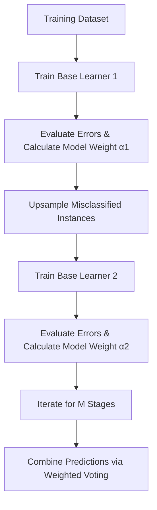

# Geometric Intuition of the AdaBoost Classification Algorithm

## 1. Introduction & Overview

**AdaBoost** (short for **Adaptive Boosting**) is a foundational ensemble machine learning algorithm introduced over 25 years ago. Historically, AdaBoost played a major role in computer vision tasks, such as face detection, before deep learning architectures became widespread. Today, boosting algorithms remain among the top-performing approaches for tabular classification tasks.

AdaBoost operates as a **stagewise additive method**. Rather than building independent base models in parallel (as in Bagging or Random Forests), AdaBoost constructs an ensemble sequentially. Each subsequent base model focuses explicitly on correcting the errors made by its predecessors by re-weighting misclassified instances.



### Key Takeaways

* **Adaptive Boosting**: Iteratively improves predictions by training sequential models that adapt to previous errors.
* **Stagewise Additive Method**: Combines simple base classifiers step-by-step into a high-performing ensemble.
* **Sequential Dependency**: Base models are dependent on the error distribution produced by prior iterations.

---

## 2. Fundamental Concepts & Terminology

Before examining the geometric mechanics of AdaBoost, three core foundational concepts must be established:

### A. Weak Learners

A **weak learner** is a base machine learning model whose predictive performance is only slightly better than random guessing. For a binary classification problem, a weak learner achieves an accuracy just above $50%$:

$$
\text{Accuracy}_{\text{weak learner}} > 0.50
$$

While an individual weak learner performs poorly on its own, combining a sequence of weak learners creates a high-accuracy **strong learner**.

### B. Decision Stumps

Although AdaBoost can theoretically use various base algorithms (including neural networks), the standard and most effective weak learner used in practice is a **decision stump**.

A **decision stump** is a Decision Tree constrained to a maximum depth of 1 (`max_depth = 1`). It consists of a single split node and two leaf nodes.

| Property              | Standard Decision Tree                 | Decision Stump                          |
| --------------------- | -------------------------------------- | --------------------------------------- |
| **Tree Depth**        | Multi-level (`max_depth > 1`)          | Single split (`max_depth = 1`)          |
| **Decision Boundary** | Complex multi-step axis-aligned splits | Single linear axis-aligned boundary     |
| **Model Complexity**  | High (susceptible to overfitting)      | Extremely low (high bias, low variance) |

Geometrically, a decision stump evaluates a single feature against a threshold, creating a decision boundary parallel to one of the coordinate axes (e.g., parallel to the `CGPA` or `IQ` axis). The optimal split for a stump is chosen by maximizing **information gain** (or entropy reduction).

```text
       Decision Stump (Axis-Aligned Split)

       IQ
        ^
        |       +  |  -
        |       +  |  -
        |  +    +  |  -     -
        |----------+-------------- Threshold
        |       +  |  -
        +----------------------------> CGPA
```

### C. Target Label Encoding

In standard binary classification algorithms, class labels are frequently encoded as $y_i \in {0, 1}$. However, AdaBoost explicitly uses symmetrical binary target labels:

$$
y_i \in \{-1, +1\}
$$

* Positive instances are represented as $+1$.
* Negative instances are represented as $-1$.

This formulation simplifies the mathematical aggregation of weighted predictions using the $\text{sign}()$ function.

---

### Key Takeaways

* AdaBoost relies on **weak learners**, which perform marginally better than random chance ($> 50%$).
* A **decision stump** is a one-level decision tree (`max_depth = 1`) that splits data along a single feature axis.
* Target labels are encoded as $y_i \in {-1, +1}$.

---

## 3. Geometric Mechanics & Step-by-Step Execution

Consider a binary classification problem predicting student placement (`Placement = +1` vs. `Placement = -1`) based on two continuous features: `CGPA` and `IQ`.

### Step 1: Initial Weak Learner & Error Identification

1. All training instances are initially assigned equal importance weights.
2. The algorithm evaluates candidate decision stumps along the `CGPA` and `IQ` axes to find the split providing maximum entropy reduction.
3. Let $h_1(x)$ be the first decision stump.
4. $h_1(x)$ partitions the feature space into two regions. Because $h_1(x)$ is a weak learner, it inevitably misclassifies certain samples (e.g., three positive samples placed in the negative region).

### Step 2: Sample Upsampling & Importance Re-weighting

To force the next weak learner to address these errors:

1. The misclassified instances undergo **upsampling** (increasing their sample weight/importance in the dataset).
2. A model performance weight $\alpha_1$ is calculated for $h_1(x)$ based on its total error rate. Higher accuracy yields a higher $\alpha_1$ value.

### Step 3: Iterative Stage Refinement

1. In Stage 2, the algorithm trains a second decision stump $h_2(x)$ on the re-weighted dataset.
2. Because the misclassified points from Stage 1 now carry higher weight, $h_2(x)$ prioritizes establishing a boundary that correctly classifies them.
3. $h_2(x)$ correctly classifies those points but may make new errors elsewhere.
4. The algorithm calculates performance weight $\alpha_2$ for $h_2(x)$ and upsamples the newly misclassified instances.
5. This process continues iteratively for $M$ decision stumps $(h_1, h_2, \dots, h_M)$.

---

### Key Takeaways

* Misclassified samples are **upsampled** between stages to shift focus onto difficult instances.
* Each weak learner $h_m(x)$ is assigned a specific performance weight $\alpha_m$ proportional to its accuracy.
* Unlike Bagging (where all models carry equal voting weight), Boosting assigns variable voting power $\alpha_m$ to each constituent model.

---

## 4. Mathematical Formulation & Prediction Rule

### Combined Model Hypothesis

After $M$ stages, AdaBoost yields a set of weak hypotheses $h_1(x), h_2(x), \dots, h_M(x)$ alongside their respective model weights $\alpha_1, \alpha_2, \dots, \alpha_M$.

The unnormalized ensemble score is expressed as a linear combination:

$$
f(x) = \sum_{m=1}^{M} \alpha_m h_m(x)
$$

### Final Decision Rule

To map the continuous score $f(x)$ back to discrete class predictions ${-1, +1}$, the $\text{sign}()$ function is applied:

$$
H(x) = \text{sign}\left(\sum_{m=1}^{M} \alpha_m h_m(x)\right)
$$

Where:

* $h_m(x) \in {-1, +1}$ is the prediction of the $m$-th decision stump.
* $\alpha_m \in \mathbb{R}$ is the model weight assigned to the $m$-th decision stump.
* $H(x) \in {-1, +1}$ is the final ensemble class prediction.

---

### Worked Numerical Example

Consider a trained AdaBoost ensemble consisting of $M = 3$ decision stumps:

* **Stump 1 ($h_1$):** Weight $\alpha_1 = 2.0$
* **Stump 2 ($h_2$):** Weight $\alpha_2 = 10.0$
* **Stump 3 ($h_3$):** Weight $\alpha_3 = 1.0$

We evaluate a query instance $x_q = (\text{CGPA} = 7.5, \text{IQ} = 100)$:

1. $h_1(x_q) = -1$
2. $h_2(x_q) = +1$
3. $h_3(x_q) = -1$

#### Step-by-Step Calculation

$$
f(x_q) = \alpha_1 h_1(x_q) + \alpha_2 h_2(x_q) + \alpha_3 h_3(x_q)
$$

$$
f(x_q) = (2.0 \times -1) + (10.0 \times +1) + (1.0 \times -1)
$$

$$
f(x_q) = -2.0 + 10.0 - 1.0 = +7.0
$$

Applying the sign decision rule:

$$
H(x_q) = \text{sign}(+7.0) = +1
$$

**Result:** The ensemble predicts `Placement = +1` (Placed). Even though two out of three models predicted $-1$, Stump 2 carried dominant weight ($\alpha_2 = 10.0$) due to its high accuracy, overriding the votes of lower-weighted models.

---

### Key Takeaways

* The final prediction is a **weighted majority vote** of all base models.
* The decision rule applies $H(x) = \text{sign}\left(\sum \alpha_m h_m(x)\right)$.
* A single highly accurate model with a large $\alpha$ can outweigh multiple weaker models.

---

## 5. Geometric Boundary Synthesis

Individually, a single decision stump can only produce a straight, axis-aligned decision line. However, when multiple stumps are weighted and combined via

$$
H(x) = \text{sign}\left(\sum_{m=1}^{M} \alpha_m h_m(x)\right)
$$

their overlapping linear boundaries synthesize a complex, step-wise non-linear boundary.

```text
  Single Stump Boundary          Combined Ensemble Boundary
       (Depth = 1)                   (Non-Linear Region)

   IQ                            IQ
    |                             |      +-------+
    |       |                     |      | +   + |  -
    |  +    |  -                  |  -   |   +   |     -
    |  +    |  -                  |      +-------+  -
    +--------------> CGPA         +------------------> CGPA
```

As the number of stages $M \to \infty$, the composite decision boundary adapts to non-linear structures in the feature space, approaching optimal classification performance.

---

### Key Takeaways

* AdaBoost constructs complex **non-linear decision boundaries** by superimposing simple axis-aligned splits.
* Increasing the number of weak learners $M$ allows the decision surface to approximate intricate geometric regions.

