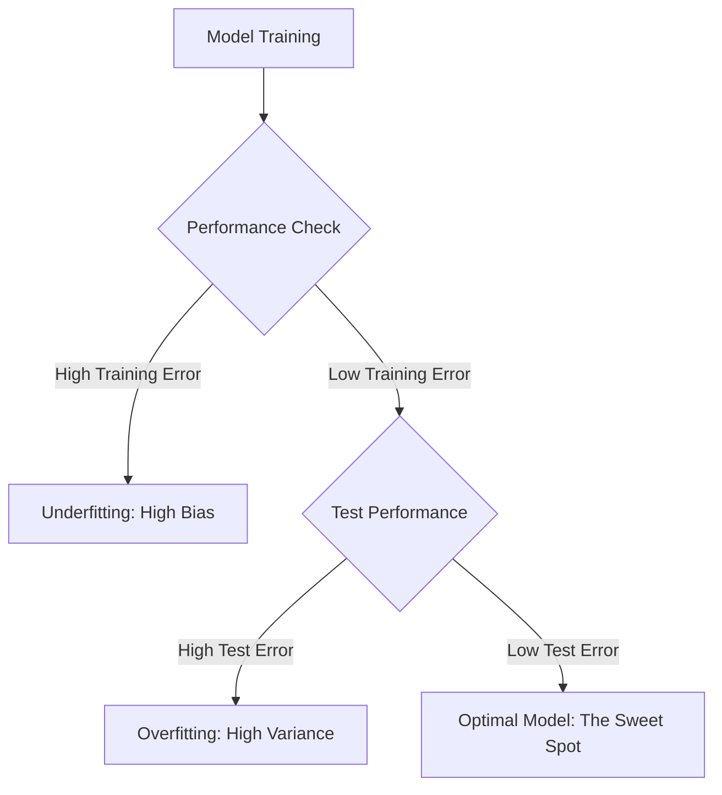

# Bias-Variance Trade-off: Understanding Model Performance

In machine learning, the **Bias-Variance Trade-off** is a fundamental concept used to describe a model's ability to generalize to new data. It involves balancing two types of errors that prevent supervised learning algorithms from generalizing beyond their training sets.

---

## 1. Bias: The Error of Simplification

### **Intuition**
Imagine trying to predict a complex, curved relationship using a simple straight line. Because the line is too "rigid," it can never capture the true pattern of the data, no matter how much training you provide. This inability to capture the underlying relationship is **Bias**.

### **Technical Explanation**
**Bias** represents the difference between the average prediction of our model and the correct value which we are trying to predict.
*   **High Bias:** The model is too simple and makes strong assumptions (e.g., assuming data is linear when it is actually quadratic).
*   **Low Bias:** The model is flexible enough to capture the complex relationships within the training data.

> [!TIP]
> **Key Takeaways**
> *   High bias leads to **Underfitting**.
> *   Models with high bias perform poorly on both **Training** and **Testing** data.

---

## 2. Variance: The Error of Sensitivity

### **Intuition**
Think of a student who memorizes every single word of a specific textbook. They will score 100% on a test if the questions are identical to the book, but they will fail if the questions are slightly different. This "over-sensitivity" to specific training details is **Variance**.

### **Technical Explanation**
**Variance** refers to the model's sensitivity to small fluctuations in the training set. It measures how much the model's predictions would change if it were trained on a different part of the same data.
*   **High Variance:** The model captures the **noise** along with the signal. It performs exceptionally well on training data but fails to generalize to new, unseen data.
*   **Low Variance:** The model's predictions are stable and do not change drastically with different training samples.

> [!TIP]
> **Key Takeaways**
> *   High variance leads to **Overfitting**.
> *   The hallmark of high variance is a significant gap between **Training Error** (low) and **Test Error** (high).

---

## 3. Underfitting vs. Overfitting

Models are generally categorized based on where they sit on the bias-variance spectrum.

| Feature | Underfitting | Overfitting |
| :--- | :--- | :--- |
| **Bias** | **High** (Model is too simple). | **Low** (Model is very complex). |
| **Variance** | **Low**. | **High**. |
| **Training Performance** | Poor. | Excellent. |
| **Testing Performance** | Poor. | Poor. |
| **Cause** | Model fails to learn the relationship. | Model "memorizes" data and noise. |

---

## 4. The Bias-Variance Trade-off

The ultimate goal in machine learning is to find a model that has **Low Bias** and **Low Variance**, allowing it to perform accurately and consistently.

### **The Relationship**
As you increase model complexity (e.g., adding more features or using more complex algorithms):
1.  **Bias Decreases:** The model becomes better at understanding the training data.
2.  **Variance Increases:** The model becomes more prone to capturing random noise.

### **Finding the "Sweet Spot"**
The **Total Error** of a model is a combination of `Bias^2 + Variance + Irreducible Noise`. To minimize total error, you must find the balance where the reduction in bias is not outweighed by an increase in variance.

*   **Simple Models:** Often have high bias and low variance.
*   **Complex Models:** Often have low bias and high variance.

> [!IMPORTANT]
> **Final Takeaway:** Every machine learning practitioner must navigate this trade-off to ensure their model doesn't just "memorize" (overfit) or "ignore" (underfit) the critical patterns in the data.
